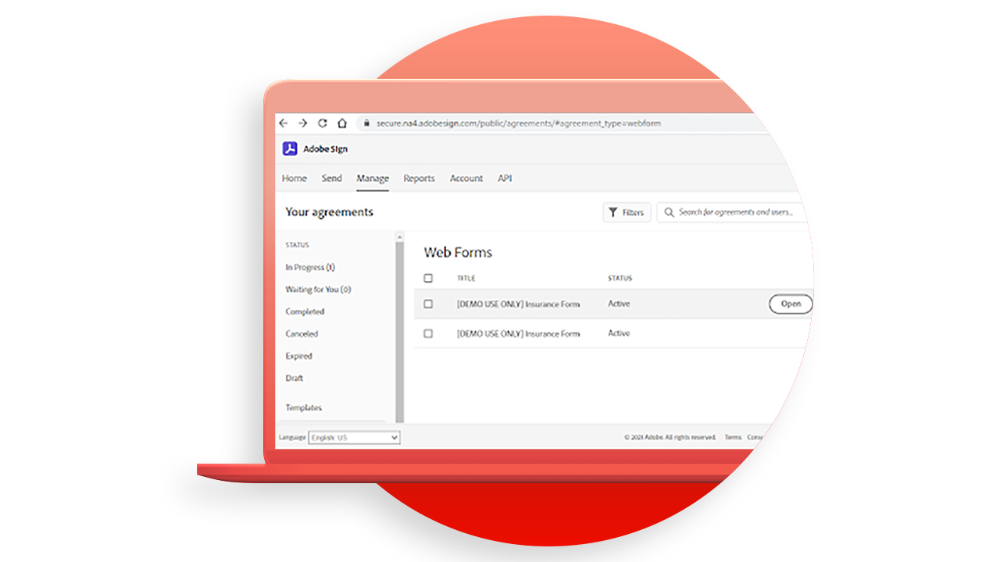
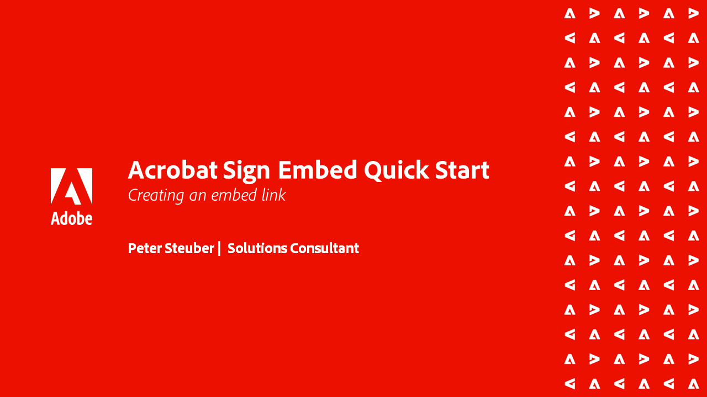

# Acrobat Sign API教程

Acrobat Sign API 允许您创建应用程序，并将 Acrobat Sign UI 和功能嵌入到应用程序中。

## 开始使用

<table style="table-layout:fixed">
<tr>
   <td>
    
    

    <a href="signapi.md"><strong>开始使用</strong></a>
    

    <em>了解如何将Sign API包含在您的应用程序中以收集签名和其他信息</em>
     
  </td>
  <td>
    
    

     
  </td>
  <td>
    
    

     
  </td>
  <td>
    
    

     
  </td>
</tr>
</table>

## Acrobat Sign嵌入快速入门指南

了解如何开始将OEM版本的Acrobat Sign嵌入您的应用程序。 本指南专门面向在应用程序中构建和嵌入签名流程的OEM合作伙伴。

<table style="table-layout:fixed">
<tr>
 <td>
   
    

   <a href="sign-up-developer-account.md"><strong>注册开发人员帐户</strong></a>
    

    <em>了解如何注册Acrobat Sign的开发人员帐户，该帐户已完全启用Sign和API功能</em>
     
  </td>
  <td>
   
    

   <a href="creating-your-application.md"><strong>创建应用程序</strong></a>
    

    <em>了解如何在Acrobat Sign中创建应用程序</em>
     
  </td>
   <td>
   
    

   <a href="creating-an-embed-link.md"><strong>创建嵌入链接</strong></a>
    

    <em>了解如何为OAuth创建嵌入链接，应用程序可通过此方式获取用户权限</em>
     
  </td>
  <td>
   
    

   <a href="generating-an-access-token.md"><strong>生成访问令牌</strong></a>
    

    <em>了解如何生成可与Acrobat Sign API一起使用的访问令牌</em>
     
  </td>
</tr>
<tr>
  <td>
   
    

   <a href="creating-a-transient-document.md"><strong>创建临时文档</strong></a>
    

    <em>了解如何创建可与Acrobat Sign AP一起使用的临时文档</em>
     
  </td>
  <td>
    
    

     
  </td>
   <td>
    
    

     
  </td>
  <td>
    
    

     
  </td>
</tr>
</table>
