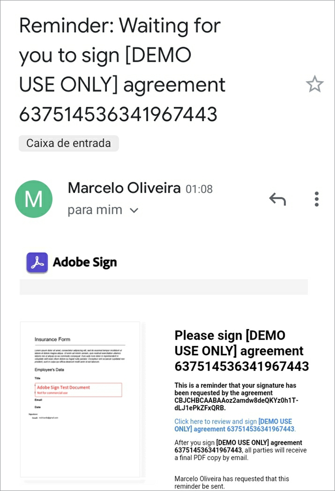

# Adobe Sign API入门


[Acrobat Sign API](https://www.adobe.io/apis/documentcloud/sign.html) 是改进签署协议管理方式的好方法。 开发人员可以轻松地将其系统与Sign API集成，后者提供一种可靠、轻松的方式来上传文档、发送文档以供签名、发送提醒和收集电子签名。

## 您可以学到的内容

此实际操作教程解释了开发人员如何使用Sign API增强通过创建于 [!DNL Adobe Acrobat Services]的 [!DNL Acrobat Services] 包括 [Adobe PDF Services API](https://www.adobe.io/apis/documentcloud/dcsdk/pdf-tools.html), [Adobe PDF Embed API](https://www.adobe.io/apis/documentcloud/viesdk) （免费）和 [Adobe文档生成API](https://www.adobe.io/apis/documentcloud/dcsdk/doc-generation.html)的

更具体地说，了解如何在您的应用程序中包括Acrobat Sign API以收集签名和其他信息，如保险表单上的员工信息。 使用具有简化HTTP请求和响应的一般步骤。 您可以用自己喜欢的语言实现这些请求。 您可以使用PDF [[!DNL Acrobat Services] API](https://www.adobe.io/apis/documentcloud/dcsdk/)，将其作为电子邮件上传至Sign API [transient](https://www.adobe.io/apis/documentcloud/sign/docs.html#!adobedocs/adobe-sign/master/overview/terminology.md) 文档，并使用协议或 [小组件](https://www.adobe.io/apis/documentcloud/sign/docs.html#!adobedocs/adobe-sign/master/overview/terminology.md) 工作流程。

## 创建PDF文档

首先创建Microsoft Word模板并将其保存为PDF。 或者，您也可以使用Document Generation API自动化管道，以便上传在Word中创建的模板，然后生成PDF文档。 文档生成API是 [!DNL Acrobat Services], [免费使用6个月，然后按需付费，每个文档交易仅需0.05美元](https://www.adobe.io/apis/documentcloud/dcsdk/pdf-pricing.html)的

在本例中，模板只是一个简单的文档，其中包含了几个可填写的签名者字段。 现在为字段命名，然后在本教程中插入实际的字段。


## 发现有效的API访问点

在使用Sign API之前， [创建免费的开发人员帐户](https://acrobat.adobe.com/ca/en/sign/developer-form.html) 要访问API，请测试您的文档交换和执行情况，并测试电子邮件发送功能。

Adobe在全球范围内以许多称为“分区”的部署单元分发Acrobat Sign API。 每个分区都为客户帐户提供服务，如NA1、NA2、NA3、EU1、JP1、AU1、IN1等。 分区名称对应于地理位置。 这些分片组成API端点的基本URI（访问点）。

要访问Sign API，您必须首先发现您帐户的正确访问点，根据您的位置，可以是api.na1.adobesign.com、api.na4.adobesign.com、api.eu1.adobesign.com或其他。

```
  GET /api/rest/v6/baseUris HTTP/1.1
  Host: https://api.adobesign.com
  Authorization: Bearer {YOUR-INTEGRATION-KEY-HERE}
  Accept: application/json

  Response Body (example):

  {
    "apiAccessPoint": "https://api.na4.adobesign.com/", 
    "webAccessPoint": "https://secure.na4.adobesign.com/" 
  }
```

在上面的示例中，是以值作为访问点的响应。

>[!IMPORTANT]
>
>在这种情况下，您对Sign API发出的所有后续请求都必须使用该访问点。 如果您使用的接入点无法服务您所在的区域，则会收到错误。

## 上传临时文档

Adobe Sign允许您创建不同的流程，为签名或数据收集准备文档。 无论您的应用程序流程如何，您都必须首先上传一个文档，该文档将仅在七天内可用。 随后API调用必须引用此临时文档。

文档使用POST请求上载到 `/transientDocuments` 端点。 多部分请求包括文件名、文件流和文档文件的MIME（媒体）类型。 端点响应包含标识文档的ID。

此外，您的应用程序可以为Acrobat Sign指定回调URL，以便ping它，并在签名过程完成时通知该应用程序。


```
  POST /api/rest/v6/transientDocuments HTTP/1.1
  Host: {YOUR-API-ACCESS-POINT}
  Authorization: Bearer {YOUR-INTEGRATION-KEY-HERE}
  x-api-user: email:your-api-user@your-domain.com
  Content-Type: multipart/form-data
  File-Name: "Insurance Form.pdf"
  File: "[path]\Insurance Form.pdf"
  Accept: application/json

  Response Body (example):

  {
     "transientDocumentId": "3AAA...BRZuM"
  }
```

## 创建Web表单

Web表单（以前称为签名Widget）是托管文档，任何具有访问权限的人员都可以对其进行签名。 Web表单的示例包括注册表、弃权书以及许多人联机访问和签署的其他文档。

要使用Sign API创建新的Web表单，必须先上传临时文档。 POST请求 `/widgets` 端点使用返回的 `transientDocumentId` 的

在此示例中，Web表单为 `ACTIVE`，但您可以在三种不同状态之一中创建它：

* DRAFT — 以增量方式构建Web表单

* 编辑 — 在Web表单中添加或编辑表单字段

* ACTIVE — 立即托管Web表单

还必须定义表单参与者的信息。 在 `memberInfos` 属性包含参与者的数据，例如电子邮件。 目前，该集合不支持多个成员。 但是，由于Web表单签名者的电子邮件在创建Web表单时是未知的，因此该电子邮件应留空，如下例所示。 在 `role` 属性定义中的成员所承担的角色 `memberInfos` （如签名者和审批人）。

```
  POST /api/rest/v6/widgets HTTP/1.1
  Host: {YOUR-API-ACCESS-POINT}
  Authorization: Bearer {YOUR-INTEGRATION-KEY-HERE}
  x-api-user: email:your-api-user@your-domain.com
  Content-Type: application/json

  Request Body:

  {
    "fileInfos": [
      {
      "transientDocumentId": "YOUR-TRANSIENT-DOCUMENT-ID"
      }
     ],
    "name": "Insurance Form",
      "widgetParticipantSetInfo": {
          "memberInfos": [{
              "email": ""
          }],
      "role": "SIGNER"
      },
      "state": "ACTIVE"
  }

  Response Body (example):

  {
     "id": "CBJ...PXoK2o"
  }
```

您可以将Web表单创建为 `DRAFT` 或 `AUTHORING`，然后在表单通过应用程序管道时更改其状态。 要更改Web表单状态，请参阅 [PUT/widgets/{widgetId}/state](https://secure.na4.adobesign.com/public/docs/restapi/v6#!/widgets/updateWidgetState) 端点。

## 正在读取Web表单托管URL

下一步是发现托管Web表单的URL。 /widgets端点会检索Web表单数据的列表，包括您转发给用户的Web表单的托管URL，以便收集签名和其他表单数据。

此端点将返回一个列表，因此您可以根据特定表单的ID在 `userWidgetList` 在获取托管Web表单的URL之前：

```
  GET /api/rest/v6/widgets HTTP/1.1
  Host: {YOUR-API-ACCESS-POINT}
  Authorization: Bearer {YOUR-INTEGRATION-KEY-HERE}
  Accept: application/json

  Response Body:

  {
    "userWidgetList": [
      {
        "id": "CBJCHB...FGf",
        "name": "Insurance Form",
        "groupId": "CBJCHB...W86",
        "javascript": "<script type='text/javascript' ...
        "modifiedDate": "2021-03-13T15:52:41Z",
        "status": "ACTIVE",
        "Url":
        "https://secure.na4.adobesign.com/public/esignWidget?wid=CBFCIB...Rag*",
        "hidden": false
      },
      {
        "id": "CBJCHB...I8_",
        "name": "Insurance Form",
        "groupId": "CBJCHBCAABAAyhgaehdJ9GTzvNRchxQEGH_H1ya0xW86",
        "javascript": "<script type='text/javascript' language='JavaScript'
        src='https://sec
        "modifiedDate": "2021-03-13T02:47:32Z",
        "status": "ACTIVE",
        "Url":
        "https://secure.na4.adobesign.com/public/esignWidget?wid=CBFCIB...AAB",
        "hidden": false
      },
      {
        "id": "CBJCHB...Wmc",
```

## 管理Web表单

此表单是PDF文档，用户可填写。 但是，您仍需要告诉表单的编辑器，用户必须填写哪些字段以及它们在文档中的位置：


上面的文档尚未显示字段。 在定义哪些字段收集签名者的信息及其大小和位置时，会添加这些字段。

现在，转到 [Web表单](https://secure.na4.adobesign.com/public/agreements/#agreement_type=webform) 选项卡，然后找到您创建的表单。


单击 **编辑** 以打开文档编辑页面。 可用的预定义字段位于右侧面板中。


编辑器允许您拖放文本和签名字段。 在添加了所有必要的字段后，您可以调整这些字段的大小并将其对齐以修饰表单。 最后，单击 **保存** 以创建表单。


## 发送Web表单以供签名

完成Web表单后，您必须将其提交，以便用户可以填写并签名。 保存表单后，您可以查看和复制URL和嵌入的代码。

**复制Web表单URL**:使用此URL将用户发送到此协议的托管版本以供审阅和签名。 例如：

[https://secure.na4.adobesign.com/public/esignWidget?wid=CBFCIBAA3...巴布*](https://secure.na4.adobesign.com/public/esignWidget?wid=CBFCIBAA3AAABLblqZhCndYscuKcDMPiVfQlpaGPb-5D7ebE9NUTQ6x6jK7PIs8HCtTzr3HOx8U6D5qqbabw*)

**复制Web表单嵌入代码**:通过复制此代码并将其粘贴到您的HTML，将协议添加到您的网站。

例如：

```
<iframe
src="https://secure.na4.adobesign.com/public/esignWidget?wid=CBFC
...yx8*&hosted=false" width="100%" height="100%" frameborder="0"
style="border: 0;
overflow: hidden; min-height: 500px; min-width: 600px;"></iframe>
```


当您的用户访问托管版本的表单时，他们会审阅首次上传并放置了指定字段的临时文档。


然后，用户填写字段并签署表单。


接下来，您的用户使用以前存储的签名或使用新的签名签署文档。


当用户单击 **应用**,Adobe会指示他们打开电子邮件并确认签名。 签名将保持挂起状态，直到确认到达为止。


此身份验证添加了多重身份验证，并增强了签名流程的安全性。


## 读取完成的Web表单

现在是时候获取用户填写的表单数据了。 在 `/widgets/{widgetId}/formData` 端点会在用户签署表单时检索用户在交互式表单中输入的数据。

```
GET /api/rest/v6/widgets/{widgetId}/formData HTTP/1.1
Host: {YOUR-API-ACCESS-POINT}
Authorization: Bearer {YOUR-INTEGRATION-KEY-HERE}
Accept: text/csv
```

生成的CSV文件流包含表单数据。

```
Response Body:
"Agreement
name","completed","email","role","first","last","title","company","agreementId",
"email verified","web form signed/approved"
"Insurance Form","","myemail@email.com","SIGNER","John","Doe","My Job Title","My
Company Name","","","2021-03-07 19:32:59"
```

## 创建协议

作为Web表单的替代方案，您可以创建协议。 以下部分演示了使用Sign API管理协议的一些简单步骤。

将文档发送给指定的收件人进行签名或审批会创建一个协议。 您可以使用API跟踪协议的状态和完成情况。

您可以使用 [临时文档](https://helpx.adobe.com/sign/kb/how-to-send-an-agreement-through-REST-API.html), [库文档](https://www.adobe.io/apis/documentcloud/sign/docs.html#!adobedocs/adobe-sign/master/samples/send_using_library_doc.md)或URL。 在此示例中，协议基于 `transientDocumentId`，就像先前创建的Web表单一样。

```
POST /api/rest/v6/agreements HTTP/1.1
Host: {YOUR-API-ACCESS-POINT}
Authorization: Bearer {YOUR-INTEGRATION-KEY-HERE}
x-api-user: email:your-api-user@your-domain.com
Content-Type: application/json
Accept: application/json
Request Body:
{
    "fileInfos": [
      {
      "transientDocumentId": "{transientDocumentId}"
      }
     ],
    "name": "{agreementName}",
    "participantSetsInfo": [
      {
      "memberInfos": [
          {
          "email": "{signerEmail}"
          }
        ],
        "order": 1,
        "role": "SIGNER"
      }
    ],
    "signatureType": "ESIGN",
    "state": "IN_PROCESS"
  }
```

在此示例中，协议创建为IN_PROCESS，但您可以在三种不同状态之一中创建它：

* 草稿 — 在发送协议之前以增量方式构建协议

* 编辑 — 在协议中添加或编辑表单字段

* IN_PROCESS — 立即发送协议

要更改协议状态，请使用 `PUT /agreements/{agreementId}/state` endpoint以执行以下允许的状态过渡之一：

* 草稿到编辑

* AUTHORING到IN_PROCESS

* IN_PROCESS TO CANCELLED

在 `participantSetsInfo` 上述属性为预期参与协议的人员提供电子邮件以及他们执行的操作（签名、批准、确认等）。 在上面的示例中，只有一个参与者：签名者。 每个文档的书面签名最多限为四个。

与Web表单不同，当您创建协议时，Adobe会自动发送协议以供签名。 端点返回协议的唯一标识符。


```
  Response Body:

  {
     id (string): The unique identifier of the agreement
  }
```

## 检索有关协议成员的信息

创建协议后，您可以使用 `/agreements/{agreementId}/members` 端点以检索有关协议成员的信息。 例如，您可以检查参与者是否已签署协议。

```
GET /api/rest/v6/agreements/{agreementId}/members HTTP/1.1
Host: {YOUR-API-ACCESS-POINT}
Authorization: Bearer {YOUR-INTEGRATION-KEY-HERE}
Accept: application/json
```

生成的JSON响应正文包含有关参与者的信息。

```
  Response Body:

  {
     "participantSets":[
        {
           "memberInfos":[
              {
                 "id":"CBJ...xvM",
                 "email":"participant@email.com",
                 "self":false,
                 "securityOption":{
                    "authenticationMethod":"NONE"
                 },
                 "name":"John Doe",
                 "status":"ACTIVE",
                 "createdDate":"2021-03-16T03:48:39Z",
                 "userId":"CBJ...vPv"
              }
           ],
           "id":"CBJ...81x",
           "role":"SIGNER",
           "status":"WAITING_FOR_MY_SIGNATURE",
           "order":1
        }
     ],
```

## 发送协议提醒

根据业务规则，截止日期可能会阻止参与者在指定日期后签署协议。 如果协议有到期日期，您可以在该日期临近时提醒参与者。

根据您在调用 `/agreements/{agreementId}/members` 端点在最后一部分，您可以向所有尚未签署协议的参与者发送电子邮件提醒。

POST请求 `/agreements/{agreementId}/reminders` 端点会为由 `agreementId` 参数。

```
POST /agreements/{agreementId}/reminders HTTP/1.1
Host: {YOUR-API-ACCESS-POINT}
Authorization: Bearer {YOUR-INTEGRATION-KEY-HERE}
x-api-user: email:your-api-user@your-domain.com
Content-Type: application/json
Accept: application/json
  Request Body:

  {
    "recipientParticipantIds": [{agreementMemberIdList}],
    "agreementId": "{agreementId}",
    "note": "This is a reminder that you haven't signed the agreement yet.",
    "status": "ACTIVE"
  }

  Response Body:

  {
     id (string, optional): An identifier of the reminder resource created on the
     server. If provided in POST or PUT, it will be ignored
  }
```

您发布提醒后，用户会收到一封电子邮件，其中包含协议的详细信息和协议链接。



## 读取已完成的协议

与Web表单一样，您可以阅读收件人已签名协议的详细信息。 在 `/agreements/{agreementId}/formData` 端点会检索用户在签署Web表单时输入的数据。

```
GET /api/rest/v6/agreements/{agreementId}/formData HTTP/1.1
Host: {YOUR-API-ACCESS-POINT}
Authorization: Bearer {YOUR-INTEGRATION-KEY-HERE}
Accept: text/csv
Response Body:
"completed","email","role","first","last","title","company","agreementId"
"2021-03-16 18:11:45","myemail@email.com","SIGNER","John","Doe","My Job Title","My
Company Name","CBJCHBCAABAA5Z84zy69q_Ilpuy5DzUAahVfcNZillDt"
```

## 后续步骤

Acrobat Sign API允许您管理文档、Web表单和协议。 使用Web表单和协议创建的简化而完整的工作流程以一种通用方式完成，使开发人员能使用任何语言实施它们。

有关Sign API工作方式的概述，您可以在 [API使用开发人员指南](https://www.adobe.io/apis/documentcloud/sign/docs.html#!adobedocs/adobe-sign/master/api_usage.md)的 本文档包含有关整个文章采取的许多步骤的简短文章，以及其他相关主题。

Acrobat Sign API通过多个层提供 [单用户和多用户电子签名计划](https://acrobat.adobe.com/cn/zh-Hans/sign/pricing/plans.html)，因此您可以选择最适合您需求的定价模型。 现在，您了解将Sign API集成到应用程序是多么简单，接下来您可能对 [Acrobat Sign Webhooks](https://www.adobe.io/apis/documentcloud/sign/docs.html#!adobedocs/adobe-sign/master/webhooks.md)即基于推的编程模型。 Webhook可让您注册一个HTTP URL，每当发生事件时，Sign API都会为其执行POST回调请求，而不是要求您的应用程序在Acrobat Sign事件中执行频繁的检查。 Webhook可为您的应用程序提供实时和即时更新，从而实现可靠的编程。

请查看 [即付即用定价](https://www.adobe.io/apis/documentcloud/dcsdk/pdf-pricing.html)、免费试用期为6个月的Adobe PDF Services API以及免费的Adobe PDF Embed API终止时的情况。

要将诸如自动文档创建和文档签名等令人兴奋的功能添加到您的应用程序，请开始使用 [[!DNL Adobe Acrobat Services]](https://www.adobe.io/apis/documentcloud/dcsdk/gettingstarted.html)的
