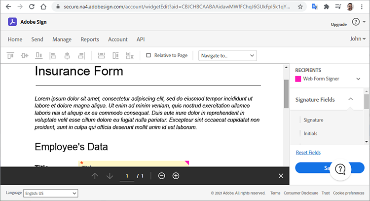
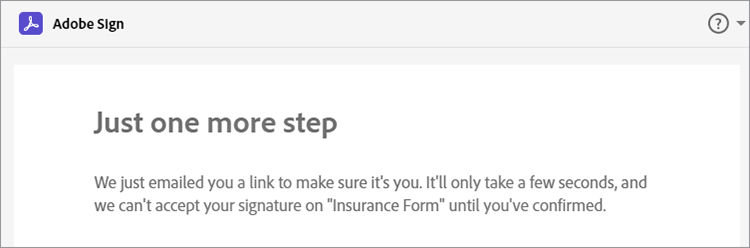

# Adobe Sign API快速入门


[ACROBAT SIGN API](https://www.adobe.io/apis/documentcloud/sign.html) 是增强管理已签名协议的方式的好方法。 开发人员可以轻松地将他们的系统与Sign API集成，从而提供可靠且简单的方法上传文档、发送文档以供签名、发送提醒和收集电子签名。

## 您可以学到的内容

本实际操作教程介绍开发人员如何使用Sign API增强用创建的应用程序和工作流 [!DNL Adobe Acrobat Services]. [!DNL Acrobat Services] 包括 [Adobe PDF Services API](https://www.adobe.io/apis/documentcloud/dcsdk/pdf-tools.html)， [Adobe PDF Embed API](https://www.adobe.io/apis/documentcloud/viesdk) （免费）以及 [Document Generation APIAdobe](https://www.adobe.io/apis/documentcloud/dcsdk/doc-generation.html).

更具体地说，了解如何在应用程序中包含Acrobat Sign API以收集签名和其他信息，例如保险表单上的员工信息。 使用带有简化HTTP请求和响应的常规步骤。 您可以使用自己喜欢的语言实现这些请求。 PDF您可以结合使用 [[!DNL Acrobat Services] API](https://www.adobe.io/apis/documentcloud/dcsdk/)，将其作为上传到Sign API [瞬时](https://www.adobe.io/apis/documentcloud/sign/docs.html#!adobedocs/adobe-sign/master/overview/terminology.md) 使用协议或协议请求最终用户签名 [小组件](https://www.adobe.io/apis/documentcloud/sign/docs.html#!adobedocs/adobe-sign/master/overview/terminology.md) 工作流。

## 创建PDF文档

首先创建一个Microsoft Word模板，然后将其另存为PDF。 或者，您可以使用Document Generation API自动化您的管道，以上传在Word中创建的模板，然后生成PDF文档。 Document Generation API属于 [!DNL Acrobat Services]， [6个月免费，然后按需付费，每次文档交易额仅为0.05美元](https://www.adobe.io/apis/documentcloud/dcsdk/pdf-pricing.html).

在此示例中，模板只是一个简单的文档，需要填写几个签名者字段。 暂时为字段命名，然后在本教程中插入实际字段。


## 正在发现有效的API访问点

在使用Sign API之前， [创建免费的开发人员帐户](https://acrobat.adobe.com/ca/en/sign/developer-form.html) 要访问API，请测试文档交换和执行情况，并测试电子邮件发送功能。

Adobe在全球各地以称为“分片”的许多部署单位分发Acrobat Sign API。 每个分区均为客户帐户提供服务，例如NA1、NA2、NA3、EU1、JP1、AU1、IN1等。 分区名称与地理位置相对应。 这些碎片构成了API端点的基本URI（访问点）。

要访问Sign API，您必须首先找到您帐户的正确访问点，可以是api.na1.adobesign.com、api.na4.adobesign.com、api.eu1.adobesign.com或其他访问API，具体取决于您的位置。

```
  GET /api/rest/v6/baseUris HTTP/1.1
  Host: https://api.adobesign.com
  Authorization: Bearer {YOUR-INTEGRATION-KEY-HERE}
  Accept: application/json

  Response Body (example):

  {
    "apiAccessPoint": "https://api.na4.adobesign.com/", 
    "webAccessPoint": "https://secure.na4.adobesign.com/" 
  }
```

在上面的示例中，是使用值作为接入点的响应。

>[!IMPORTANT]
>
>在这种情况下，您向Sign API提出的所有后续请求都必须使用该访问点。 如果您使用的接入点不适用于您所在的地区，则会收到错误消息。

## 上传临时文档

Adobe Sign允许您创建不同的流，以便为签名或数据收集准备文档。 无论应用程序采用何种流程，您都必须首先上传文档，该文档仅七天可用。 随后API调用必须引用此临时文档。

文档将使用POST请求上传到 `/transientDocuments` 端点。 多部分请求由文件名、文件流和文档文件的MIME（媒体）类型组成。 终结点响应包含标识文档的ID。

此外，您的应用程序可以为Acrobat Sign指定ping的回调URL，并在签名过程完成后通知应用程序。


```
  POST /api/rest/v6/transientDocuments HTTP/1.1
  Host: {YOUR-API-ACCESS-POINT}
  Authorization: Bearer {YOUR-INTEGRATION-KEY-HERE}
  x-api-user: email:your-api-user@your-domain.com
  Content-Type: multipart/form-data
  File-Name: "Insurance Form.pdf"
  File: "[path]\Insurance Form.pdf"
  Accept: application/json

  Response Body (example):

  {
     "transientDocumentId": "3AAA...BRZuM"
  }
```

## 创建Web表单

Web表单（以前称为签名构件）是任何有权访问的人都可以签名的托管文档。 Web表单的示例包括注册表、弃权以及许多人在线访问和签署的其他文档。

要使用Sign API创建新的Web表单，您必须首先上传临时文档。 POST请求 `/widgets` 终结点使用返回的 `transientDocumentId` .

在此示例中，Web表单是 `ACTIVE`，但您可以在以下三种不同状态之一创建它：

* 草稿 — 以增量方式构建Web表单

* 编辑 — 在Web表单中添加或编辑表单字段

* ACTIVE — 立即托管Web表单

还必须定义有关表单参与者的信息。 该 `memberInfos` 属性包含参与者的数据，例如电子邮件。 目前，此集不支持多个成员。 但是，由于Web表单签名者的电子邮件在Web表单创建时未知，因此该电子邮件应留空，如下例所示。 该 `role` 属性定义成员在中担任的角色 `memberInfos` （例如签名者和审批者）。

```
  POST /api/rest/v6/widgets HTTP/1.1
  Host: {YOUR-API-ACCESS-POINT}
  Authorization: Bearer {YOUR-INTEGRATION-KEY-HERE}
  x-api-user: email:your-api-user@your-domain.com
  Content-Type: application/json

  Request Body:

  {
    "fileInfos": [
      {
      "transientDocumentId": "YOUR-TRANSIENT-DOCUMENT-ID"
      }
     ],
    "name": "Insurance Form",
      "widgetParticipantSetInfo": {
          "memberInfos": [{
              "email": ""
          }],
      "role": "SIGNER"
      },
      "state": "ACTIVE"
  }

  Response Body (example):

  {
     "id": "CBJ...PXoK2o"
  }
```

您可以将Web表单创建为 `DRAFT` 或 `AUTHORING`，然后在表单通过应用程序管道时更改其状态。 要更改Web表单状态，请参阅 [PUT/widgets/{widgetId}/state](https://secure.na4.adobesign.com/public/docs/restapi/v6#!/widgets/updateWidgetState) 端点。

## 读取Web表单托管URL

下一步是发现Web表单的URL。 /widgets端点检索Web表单数据的列表，包括转发给用户的Web表单的托管URL，以收集签名和其他表单数据。

此终结点返回一个列表，因此您可以按ID在 `userWidgetList` 在获取托管Web表单的URL之前：

```
  GET /api/rest/v6/widgets HTTP/1.1
  Host: {YOUR-API-ACCESS-POINT}
  Authorization: Bearer {YOUR-INTEGRATION-KEY-HERE}
  Accept: application/json

  Response Body:

  {
    "userWidgetList": [
      {
        "id": "CBJCHB...FGf",
        "name": "Insurance Form",
        "groupId": "CBJCHB...W86",
        "javascript": "<script type='text/javascript' ...
        "modifiedDate": "2021-03-13T15:52:41Z",
        "status": "ACTIVE",
        "Url":
        "https://secure.na4.adobesign.com/public/esignWidget?wid=CBFCIB...Rag*",
        "hidden": false
      },
      {
        "id": "CBJCHB...I8_",
        "name": "Insurance Form",
        "groupId": "CBJCHBCAABAAyhgaehdJ9GTzvNRchxQEGH_H1ya0xW86",
        "javascript": "<script type='text/javascript' language='JavaScript'
        src='https://sec
        "modifiedDate": "2021-03-13T02:47:32Z",
        "status": "ACTIVE",
        "Url":
        "https://secure.na4.adobesign.com/public/esignWidget?wid=CBFCIB...AAB",
        "hidden": false
      },
      {
        "id": "CBJCHB...Wmc",
```

## 管理Web表单

此表单是供用户填写的PDF文档。 但是，您仍需要告诉表单的编辑者，用户必须填写哪些字段，以及这些字段在文档中的位置：


上面的文档尚未显示字段。 在定义哪些字段收集签名者信息以及其大小和位置时，会添加这些字段。

现在，转到 [Web表单](https://secure.na4.adobesign.com/public/agreements/#agreement_type=webform) 选项卡，然后找到您创建的表单。


点击 **编辑** 以打开文档编辑页面。 右侧面板中提供了可用的预定义字段。



编辑器允许您拖放文本和签名字段。 添加完所有必需的字段后，可以调整字段大小并对齐字段以完善表单。 最后，单击 **保存** 创建表单。


## 发送Web表单以供签名

完成Web表单后，您必须提交表单，以便用户可以填写并签名。 保存表单后，您可以查看和复制URL和嵌入的代码。

**复制Web表单URL**：使用此URL将用户发送到此协议的托管版本以供审阅和签名。 例如：

[https://secure.na4.adobesign.com/public/esignWidget?wid=CBFCIBAA3...babw\*](https://secure.na4.adobesign.com/public/esignWidget?wid=CBFCIBAA3AAABLblqZhCndYscuKcDMPiVfQlpaGPb-5D7ebE9NUTQ6x6jK7PIs8HCtTzr3HOx8U6D5qqbabw*)

**复制Web表单嵌入代码**：通过复制此代码并将其粘贴到您的HTML中，将协议添加到您的网站。

例如：

```
<iframe
src="https://secure.na4.adobesign.com/public/esignWidget?wid=CBFC
...yx8*&hosted=false" width="100%" height="100%" frameborder="0"
style="border: 0;
overflow: hidden; min-height: 500px; min-width: 600px;"></iframe>
```


您的用户访问表单的托管版本时，将审阅首次上传的临时文档，其中按照指定的位置放置了字段。


然后，用户填写这些字段并签署表单。


接下来，您的用户使用以前存储的签名或新签名对文档进行签名。


用户单击时 **应用**，Adobe指示他们打开电子邮件并确认签名。 在确认到达之前，签名将一直处于待处理状态。



此身份验证添加了多重身份验证并增强了签名过程的安全性。


## 读取已完成的Web表单

现在该获取用户填写的表单数据了。 该 `/widgets/{widgetId}/formData` 终结点检索用户在签署表单时在交互式表单中输入的数据。

```
GET /api/rest/v6/widgets/{widgetId}/formData HTTP/1.1
Host: {YOUR-API-ACCESS-POINT}
Authorization: Bearer {YOUR-INTEGRATION-KEY-HERE}
Accept: text/csv
```

生成的CSV文件流包含表单数据。

```
Response Body:
"Agreement
name","completed","email","role","first","last","title","company","agreementId",
"email verified","web form signed/approved"
"Insurance Form","","myemail@email.com","SIGNER","John","Doe","My Job Title","My
Company Name","","","2021-03-07 19:32:59"
```

## 创建协议

作为Web表单的替代方法，您可以创建协议。 以下部分演示了使用Sign API管理协议的一些简单步骤。

将文档发送给指定的收件人以供签名或审批会创建协议。 您可以使用API跟踪协议的状态和完成情况。

您可以使用 [临时文档](https://helpx.adobe.com/sign/kb/how-to-send-an-agreement-through-REST-API.html)， [库文档](https://www.adobe.io/apis/documentcloud/sign/docs.html#!adobedocs/adobe-sign/master/samples/send_using_library_doc.md)或URL。 在此示例中，协议基于 `transientDocumentId`，就像之前创建的Web表单一样。

```
POST /api/rest/v6/agreements HTTP/1.1
Host: {YOUR-API-ACCESS-POINT}
Authorization: Bearer {YOUR-INTEGRATION-KEY-HERE}
x-api-user: email:your-api-user@your-domain.com
Content-Type: application/json
Accept: application/json
Request Body:
{
    "fileInfos": [
      {
      "transientDocumentId": "{transientDocumentId}"
      }
     ],
    "name": "{agreementName}",
    "participantSetsInfo": [
      {
      "memberInfos": [
          {
          "email": "{signerEmail}"
          }
        ],
        "order": 1,
        "role": "SIGNER"
      }
    ],
    "signatureType": "ESIGN",
    "state": "IN_PROCESS"
  }
```

在此示例中，协议创建为IN_PROCESS，但您可以在以下三种不同状态之一创建协议：

* 草稿 — 在发送协议之前逐步构建协议

* 编辑 — 在协议中添加或编辑表单字段

* IN_PROCESS — 立即发送协议

要更改协议状态，请使用 `PUT /agreements/{agreementId}/state` 终结点以执行下面允许的状态转换之一：

* 草稿以供创作

* 创作到IN_PROCESS

* IN_PROCESS到CANCELLED

该 `participantSetsInfo` 上述属性可提供希望参与协议的人员及其执行的操作（签名、批准、确认等）的电子邮件。 在上面的示例中，只有一个参与者：签名者。 书面签名限制为每个文档四个签名。

与Web表单不同，当您创建协议时，Adobe会自动发送协议以请求签名。 该端点返回协议的唯一标识符。


```
  Response Body:

  {
     id (string): The unique identifier of the agreement
  }
```

## 检索有关协议成员的信息

创建协议后，您可以使用 `/agreements/{agreementId}/members` 用于检索有关协议成员信息的终结点。 例如，您可以检查参与者是否已签署协议。

```
GET /api/rest/v6/agreements/{agreementId}/members HTTP/1.1
Host: {YOUR-API-ACCESS-POINT}
Authorization: Bearer {YOUR-INTEGRATION-KEY-HERE}
Accept: application/json
```

生成的JSON响应正文包含有关参与者的信息。

```
  Response Body:

  {
     "participantSets":[
        {
           "memberInfos":[
              {
                 "id":"CBJ...xvM",
                 "email":"participant@email.com",
                 "self":false,
                 "securityOption":{
                    "authenticationMethod":"NONE"
                 },
                 "name":"John Doe",
                 "status":"ACTIVE",
                 "createdDate":"2021-03-16T03:48:39Z",
                 "userId":"CBJ...vPv"
              }
           ],
           "id":"CBJ...81x",
           "role":"SIGNER",
           "status":"WAITING_FOR_MY_SIGNATURE",
           "order":1
        }
     ],
```

## 发送协议提醒

根据业务规则，截止日期可能会阻止参与者在特定日期之后签署协议。 如果协议有过期日期，您可以在该日期临近时提醒参与者。

根据您在致电 `/agreements/{agreementId}/members` 终结点位于最后一部分中，您可以向仍未签署协议的所有参与者发送电子邮件提醒。

POST请求 `/agreements/{agreementId}/reminders` 端点为协议中由标识的指定参与者创建提醒 `agreementId` 参数。

```
POST /agreements/{agreementId}/reminders HTTP/1.1
Host: {YOUR-API-ACCESS-POINT}
Authorization: Bearer {YOUR-INTEGRATION-KEY-HERE}
x-api-user: email:your-api-user@your-domain.com
Content-Type: application/json
Accept: application/json
  Request Body:

  {
    "recipientParticipantIds": [{agreementMemberIdList}],
    "agreementId": "{agreementId}",
    "note": "This is a reminder that you haven't signed the agreement yet.",
    "status": "ACTIVE"
  }

  Response Body:

  {
     id (string, optional): An identifier of the reminder resource created on the
     server. If provided in POST or PUT, it will be ignored
  }
```

在您发布提醒后，用户将收到一封电子邮件，其中包含协议详细信息和指向协议的链接。


## 读取已完成的协议

与Web表单一样，您可以阅读有关收件人已签名协议的详细信息。 该 `/agreements/{agreementId}/formData` 终结点检索用户在签署Web表单时输入的数据。

```
GET /api/rest/v6/agreements/{agreementId}/formData HTTP/1.1
Host: {YOUR-API-ACCESS-POINT}
Authorization: Bearer {YOUR-INTEGRATION-KEY-HERE}
Accept: text/csv
Response Body:
"completed","email","role","first","last","title","company","agreementId"
"2021-03-16 18:11:45","myemail@email.com","SIGNER","John","Doe","My Job Title","My
Company Name","CBJCHBCAABAA5Z84zy69q_Ilpuy5DzUAahVfcNZillDt"
```

## 后续步骤

通过Acrobat Sign API，您可以管理文档、Web表单和协议。 使用Web表单和协议创建的简化而完整的工作流以通用方式完成，使开发人员可使用任何语言实现它们。

有关Sign API工作方式的概述，您可以在以下位置找到示例 [API使用开发人员指南](https://www.adobe.io/apis/documentcloud/sign/docs.html#!adobedocs/adobe-sign/master/api_usage.md). 本文档包含有关整篇文章中遵循的许多步骤的简短文章以及其他相关主题。

Acrobat Sign API可通过多层提供 [单用户和多用户电子签名计划](https://acrobat.adobe.com/cn/zh-Hans/sign/pricing/plans.html)，以便选择最符合您需求的定价模式。 既然您已经了解将Sign API集成到应用程序中有多么简单，那么您可能会对以下其他功能感兴趣 [Acrobat Sign Webhook](https://www.adobe.io/apis/documentcloud/sign/docs.html#!adobedocs/adobe-sign/master/webhooks.md)，这是一个基于推送的编程模型。 Webhook并不要求您的应用程序在Acrobat Sign事件中执行频繁检查，而是允许您注册一个HTTP URL，以便在每次事件发生时Sign API都会为其执行POST回调请求。 Webhook可为您的应用程序提供实时和即时更新，从而实现强大的编程。

查看 [即付即用定价](https://www.adobe.io/apis/documentcloud/dcsdk/pdf-pricing.html)，用于您的六个月的免费Adobe PDF Services API试用和免费的Adobe PDF Embed API到期的情况。

要将自动文档创建和文档签名等出色功能添加到您的应用程序，请开始使用 [[!DNL Adobe Acrobat Services]](https://www.adobe.io/apis/documentcloud/dcsdk/gettingstarted.html).
