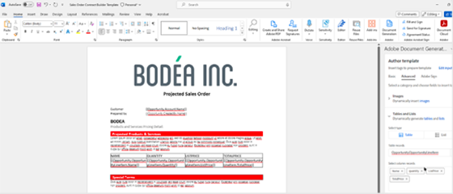

# Document Generation API教程

Document Generation API可从WordPDF和JSON数据中创建模板和Word文档。

>[!NOTE]
>
>Document Generation API包含在PDF服务API中。

<table style="table-layout:fixed">
<tr>
 <td>
   
  </td>
  <td>
    
    

     
  </td>
   <td>
    
    

     
  </td>
  </td>
   <td>
    
    

     
  </td>
</tr>
</table>

## 创建模板

Document Generation API接受文档模板（带有模板标记）以及输入数据，以便生成最终文档。 最终文档是通过基于与数据输入对应的实际值将文档模板中的所有模板标签替换为动态内容生成的。

<table style="table-layout:fixed">
<tr>
 <td>
   
    

   <a href="taggeroverview.md"><strong>AdobeDocument Generation Tagger概述</strong></a>
    

    <em>概要了解专为AdobeDocument Generation API而设计的AdobeDocument Generation Tagger</em>
     
  </td>
  <td>
   
    

   <a href="taggeraddtexttags.md"><strong>添加文本标记</strong></a>
    

    <em>了解如何使用AdobeDocument Generation Tagger将文本标记添加到Microsoft Word模板，以便与AdobeDocument Generation API配合使用</em>
     
  </td>
  <td>
   
    

   <a href="taggeraddimagetags.md"><strong>添加图像标记</strong></a>
    

    <em>了解如何使用Document Generation Tagger将图像标记添加到Microsoft WordAdobe，以便使用Document Generation API将图像动态推送到Adobe</em>
     
  </td>
  <td>
   
    

   <a href="taggertables.md"><strong>添加表和列表标记</strong></a>
    

    <em>了解如何使用AdobeDocument Generation Tagger将表和列表标记添加到Microsoft Word模板，以使用AdobeDocument Generation API根据数据动态添加表或列表行</em>
     
  </td>
</tr>
<tr>
  <td>
   
    

   <a href="taggercalculations.md"><strong>设置数值计算标签</strong></a>
    

    <em>了解如何使用AdobeDocument Generation Tagger在Microsoft Word模板中设置数值计算标记，以便使用AdobeDocument Generation API计算数据值的聚合或算法</em>
     
  </td>
  <td>
   
    

   <a href="taggerconditional.md"><strong>设置条件内容</strong></a>
    

    <em>了解如何使用AdobeDocument Generation Tagger在Microsoft Word模板中设置章节，以便使用AdobeDocument Generation API根据数据动态包含或排除文档章节</em>
     
  </td>
  <td>
    
    

     
  </td>
   <td>
    
    

     
  </td>
</tr>
</table>
