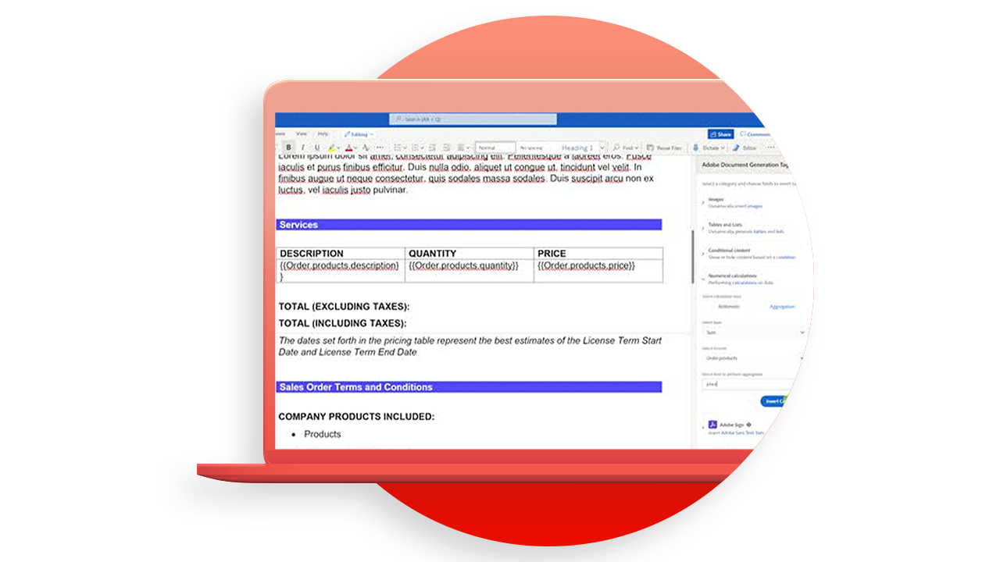

# 文档生成API教程

文档生成API可根据WordPDF和JSON数据创建Word和Word文档。

>[!NOTE]
>
>文档生成API包含在PDF服务API中。

## 创建模板

文档生成API接受文档模板（带有模板标签）以及输入数据来生成最终文档。 最后文档是通过基于与数据输入相对应的实际值，用动态内容替换文档模板中的所有模板标签来生成的。

<table style="table-layout:fixed">
<tr>
 <td>
   
    

   <a href="taggeroverview.md"><strong>“Adobe文档生成标记”概述</strong></a>
    

    <em>简要了解Adobe文档生成标签，该标签专为Adobe文档生成API而设计</em>
     
  </td>
  <td>
   
    

   <a href="taggeraddtexttags.md"><strong>添加文本标记</strong></a>
    

    <em>了解如何使用Adobe文档生成标记将文本标记添加到Microsoft Word模板，以便与Adobe文档生成API一起使用</em>
     
  </td>
  <td>
   
    

   <a href="taggeraddimagetags.md"><strong>添加图像标签</strong></a>
    

    <em>了解如何使用Microsoft Document Generation Tagger将图像标签添加到AdobeWord模板，以便使用Adobe文档生成API将图像动态推送到文档中</em>
     
  </td>
  <td>
   
    

   <a href="taggertables.md"><strong>添加表和列表标签</strong></a>
    

    <em>了解如何使用Adobe文档生成标记将表和列表标记添加到Microsoft Word模板，以便使用Adobe文档生成API根据数据动态添加表或列表行</em>
     
  </td>
</tr>
<tr>
  <td>
   
    

   <a href="taggercalculations.md"><strong>设置数值计算标签</strong></a>
    

    <em>了解如何在Microsoft WordAdobe中使用Adobe文档生成标记设置数字计算标记，以使用模板文档生成API计算数据值的聚合或算法</em>
     
  </td>
  <td>
   
    

   <a href="taggerconditional.md"><strong>设置条件内容</strong></a>
    

    <em>了解如何使用Adobe文档生成标记在Microsoft Word模板中设置章节，以便使用Adobe文档生成API根据数据动态包含或排除文档的各章节</em>
     
  </td>
  <td>
    
    

     
  </td>
   <td>
    
    

     
  </td>
</tr>
</table>
