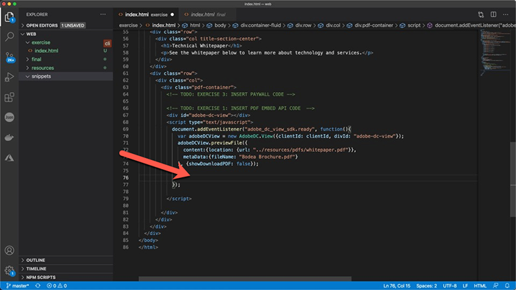
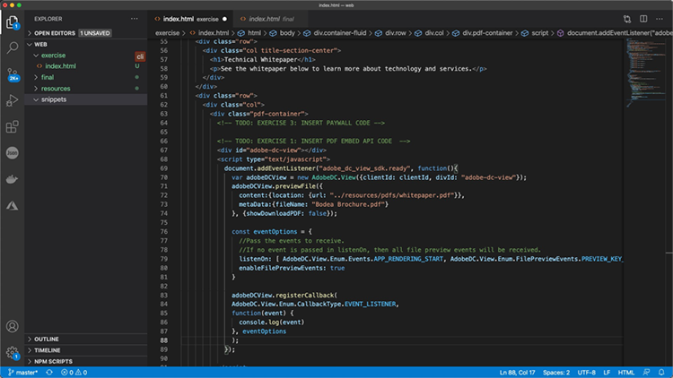
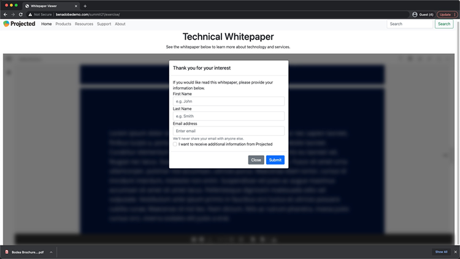

# 控制您的PDF在线体验并收集分析

您的组织是否会将PDF发布在您的网站上？ 了解如何使用Adobe PDF Embed API控制外观、启用协作以及收集有关用户如何与PDF交互的分析（包括花费在页面和搜索上的时间）。 要开始学习这个4部分实际操作教程，请选择&#x200B;*PDFEmbed API入门*。

<table style="table-layout:fixed">
<tr>
  <td>
    <a href="controlpdfexperience.md#part1">
        
    </a>
    <div>
    <a href="controlpdfexperience.md#part1"><strong>第1部分：PDFEmbed API入门</strong></a>
    </div>
  </td>
  <td>
    <a href="controlpdfexperience.md#part2">
        
    </a>
    <div>
    <a href="controlpdfexperience.md#part2"><strong>第2部分：将PDFEmbed API添加到网页</strong></a>
    </div>
  </td>
  <td>
   <a href="controlpdfexperience.md#part3">
      
   </a>
    <div>
    <a href="controlpdfexperience.md#part3"><strong>第3部分：访问分析API</strong></a>
    </div>
  </td>
  <td>
   <a href="controlpdfexperience.md#part4">
      
   </a>
    <div>
    <a href="controlpdfexperience.md#part4"><strong>第4部分：根据事件添加交互性</strong></a>
    </div>
  </td>
</tr>
</table>

## 第1部分：PDFEmbed API快速入门 {#part1}

在第1部分中，了解如何开始使用第1-3部分所需的一切。 您将从获取API凭据开始。

**您需要**

* 教程资源[下载](https://github.com/benvanderberg/adobe-pdf-embed-api-tutorial)
* Adobe ID [在此处获取一个](https://account.adobe.com/zh-Hans/)
* Web服务器（节点JS、PHP等）
* HTML/JavaScript/CSS工作知识

**我们正在使用的内容**

* 基本Web服务器（节点）
* Visual Studio代码
* GitHub

### 获取凭据

1. 转到[Adobe.io网站](https://developer.adobe.com/)。
1. 在“构建引人入胜的文档体验”下单击&#x200B;**[!UICONTROL 了解详情]**。

   

   此操作将带您进入[!DNL Adobe Acrobat Services]主页。

1. 在导航栏中单击&#x200B;**[!UICONTROL 开始使用]**。

   您将在&#x200B;**开始使用[!DNL Acrobat Services] API**&#x200B;中看到&#x200B;**创建新凭据**&#x200B;或&#x200B;**管理现有凭据**&#x200B;的选项。

1. 单击&#x200B;**[!UICONTROL 创建新凭据]**&#x200B;下的&#x200B;**[!UICONTROL 开始使用]**&#x200B;按钮。

   

1. 选择&#x200B;**[!UICONTROL PDF嵌入API]**&#x200B;单选按钮，并在下一个窗口中添加所选的凭据名称和应用程序域。

   >[!NOTE]
   >
   >这些凭据只能在此列出的应用程序域中使用。 您可以使用您选择的任何域。

   

1. 单击&#x200B;**[!UICONTROL 创建凭据]**。

   向导的最后一页为您提供了客户端凭据详细信息。 将此窗口保持打开状态，以便您可以返回此窗口并复制客户端ID（API密钥）供以后使用。

1. 单击&#x200B;**[!UICONTROL 查看文档]**&#x200B;以转到包含有关如何使用此API的详细信息的文档。

   

## 第2部分：将PDFEmbed API添加到网页 {#part2}

在第2部分中，您将了解如何轻松地将PDFEmbed API嵌入到网页中。 为此，您将使用Adobe PDF Embed API在线演示创建我们的代码。

### 获取练习代码

我们创建了代码供您使用。 虽然您可以使用自己的代码，但演示将在教程资源的上下文中进行。 在[此处](https://github.com/benvanderberg/adobe-pdf-embed-api-tutorial)下载示例代码。

1. 转到[[!DNL Adobe Acrobat Services] 网站](https://developer.adobe.com/document-services/homepage/)。

   ![[!DNL Adobe Acrobat Services]网站的屏幕截图](assets/ControlPDF_6.png)

1. 在导航栏中单击&#x200B;**[!UICONTROL API]**，然后转到下拉链接中的&#x200B;**[!UICONTROL PDF嵌入API]**&#x200B;页面。

   

1. 单击&#x200B;**[!UICONTROL 尝试演示]**。

   此时会弹出一个新窗口，其中包含PDFEmbed API的开发人员沙盒。

   

   您可以在此处查看不同查看模式的选项。

1. 单击“Full Window”（全窗口）、“Sized Container”（容器大小）、“In-Line”（行中）和“Lightbox”（灯箱）的不同查看模式。

   

1. 单击&#x200B;**[!UICONTROL 全窗口]**&#x200B;查看模式，然后单击&#x200B;**[!UICONTROL 自定义]**&#x200B;按钮以打开和关闭选项。

   

1. 禁用&#x200B;**[!UICONTROL 下载]** PDF选项。
1. 单击“**[!UICONTROL 生成代码]**”按钮查看代码预览。
1. 从第1部分的“客户端凭据”窗口中复制&#x200B;**[!UICONTROL 客户端ID]**。

   

1. 在您的代码编辑器中打开&#x200B;**[!UICONTROL Web]** -> **[!UICONTROL 资源]** -> **[!UICONTROL js]** -> **[!UICONTROL dc-config.js]**&#x200B;文件。

   可以看到客户端ID变量存在。

1. 在双引号之间粘贴您的客户端凭据，以将clientID设置为您的凭据。

1. 返回到开发人员沙箱代码预览。

1. 复制具有Adobe脚本的第二行：

   ```
   <script src=https://documentccloud.adobe.com/view-sdk/main.js></script>
   ```

   

1. 转到代码编辑器并打开&#x200B;**[!UICONTROL Web]** -> **[!UICONTROL 练习]** -> **[!UICONTROL index.html]**&#x200B;文件。

1. 将脚本代码粘贴到第18行文件的`<head>`中，注释下方写有： **TODO：练习1：插入EMBED API脚本标记**。

   

1. 返回到开发人员沙箱代码预览，并复制具有以下项的第一行代码：

   ```
   <div id="adobe-dc-view"></div>
   ```

   

1. 转到代码编辑器并再次打开&#x200B;**[!UICONTROL Web]** -> **[!UICONTROL 练习]** -> **[!UICONTROL index.html]**&#x200B;文件。

1. 将`<div>`代码粘贴到第67行文件`<body>`的&#x200B;**TODO：练习1：插入PDF嵌入API代码**&#x200B;注释下。

   

1. 返回到开发人员沙箱代码预览，并复制以下`<script>`的代码行：

   ```
   <script type="text/javascript">
       document.addEventListener("adobe_dc_view_sdk.ready",             function(){ 
           var adobeDCView = new AdobeDC.View({clientId:                     "<YOUR_CLIENT_ID>", divId: "adobe-dc-view"});
           adobeDCView.previewFile({
               content:{location: {url: "https://documentcloud.                adobe.com/view-sdk-demo/PDFs/Bodea Brochure.                    pdf"}},
               metaData:{fileName: "Bodea Brochure.pdf"}
           }, {showDownloadPDF: false});
       });
   </script>
   ```

1. 转到代码编辑器并再次打开&#x200B;**[!UICONTROL Web]** -> **[!UICONTROL 练习]** -> **[!UICONTROL index.html]**&#x200B;文件。

1. 将`<script>`代码粘贴到第68行文件`<body>`的`<div>`标记下。

1. 修改同一&#x200B;**index.html**&#x200B;文件的第70行，以包含以前创建的clientID变量。

   

1. 修改同一&#x200B;**index.html**&#x200B;文件的第72行，以更新PDF文件的位置以使用本地文件。

   **/resources/pdfs/whitepaper.pdf**&#x200B;的教程文件中有一个可用。

1. 保存修改后的文件并通过浏览到&#x200B;**`<your domain>`/summit21/web/exercise/**&#x200B;来预览网站。

   您应在浏览器中看到以全窗口模式渲染的技术白皮书。

## 第3部分：访问分析API {#part3}

现在，您已成功创建了一个具有PDFEmbed API渲染PDF的网页，在第3部分中，您现在可以探索如何使用JavaScript事件来测量分析，以了解用户如何使用PDF。

### 查找文档

作为PDFEmbed API的一部分，还有许多不同的JavaScript事件。 您可以从[!DNL Adobe Acrobat Services]文档访问它们。

1. 导航到[文档](https://developer.adobe.com/document-services/docs/overview)站点。
1. 查看作为API的一部分提供的不同事件类型。 这些对于参考很有帮助，对您未来的项目也很有帮助。

   

1. 复制网站上列出的示例代码。

   以此为基础编写代码，然后进行修改。

   

   ```
   const eventOptions = {
     //Pass the PDF analytics events to receive.
      //If no event is passed in listenOn, then all PDF         analytics events will be received.
   listenOn: [ AdobeDC.View.Enum.PDFAnalyticsEvents.    PAGE_VIEW, AdobeDC.View.Enum.PDFAnalyticsEvents.DOCUMENT_DOWNLOAD],
     enablePDFAnalytics: true
   }
   
   
   adobeDCView.registerCallback(
     AdobeDC.View.Enum.CallbackType.EVENT_LISTENER,
     function(event) {
       console.log("Type " + event.type);
       console.log("Data " + event.data);
     }, eventOptions
   );
   ```

1. 在&#x200B;**index.html**&#x200B;中查找您之前添加的类似以下内容的代码部分，并将上述代码附加到该代码之后：

   

1. 在Web浏览器中加载页面，然后打开控制台，以在您与PDF查看器交互时查看不同事件的控制台输出。

   

   

### 添加用于捕捉事件的开关

现在，您已将事件输出到console.log ，让我们根据哪些事件来更改行为。 为此，您将使用交换机示例。

1. 导航到&#x200B;**snippets/eventsSwitch.js**，并在教程代码中复制文件的内容。

   

1. 将代码粘贴到事件侦听器函数中。

   

1. 确认在加载页面且与PDF查看器交互时，控制台正确输出。

### Adobe Analytics

如果要将Adobe Analytics支持添加到查看器中，可以按照网站上记录的说明进行操作。

>[!IMPORTANT]
>
>您的网页需要在页眉的页面上加载Adobe Analytics。

导航到[Adobe Analytics文档](https://www.adobe.com/devnet-docs/dcsdk_io/viewSDK/howtodata.html#adobe-analytics)，并检查您的网页上是否已启用Adobe Analytics。 按照说明设置报告包。

### Google Analytics


Adobe PDF Embed API提供与Adobe Analytics的开箱即用集成。 但是，由于所有事件都可以作为JavaScript事件提供，因此可以通过捕获PDF事件并使用ga()函数将事件添加到Adobe Analytics来与Google Analytics集成。

1. 导航到&#x200B;**snippets/eventsSwitchGA.js**，了解如何与Google Analytics集成。
1. 如果您使用Adobe Analytics跟踪您的网页并且该网页已嵌入在网页上，请查看并使用此代码示例。

   

## 第4部分：根据事件添加交互元素 {#part4}

在第4部分中，您将了解如何在PDF查看器顶部分层显示付费墙，在您滚动过第二页后会显示此付费墙。

### 付费墙示例

导航到此[付费墙后面的PDF示例](https://www3.technologyevaluation.com/research/white-paper/the-forrester-wave-digital-decisioning-platforms-q4-2020.html)。 在本示例中，您将学习在PDF查看体验的基础上添加交互元素。

### 添加付费墙代码

1. 访问snippets/paywallCode.html并复制内容。
1. 在exercise/index.html中搜索`<!-- TODO: EXERCISE 3: INSERT PAYWALL CODE -->`。

   

1. 在注释后粘贴复制的代码。
1. 转到&#x200B;**snippets/paywallCode.js**&#x200B;并复制内容。

   

1. 将代码粘贴到该位置。

### 试用付费墙演示

现在您可以观看演示。

1. 在您的网站上重新加载&#x200B;**index.html**。
1. 向下滚动到页面> 2.
1. 显示第二页之后询问用户的对话框。

   

## 其他资源

可在[此处](https://developer.adobe.com/document-services/docs/overview)找到其他资源。
