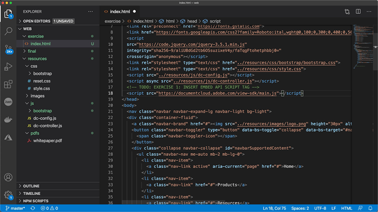
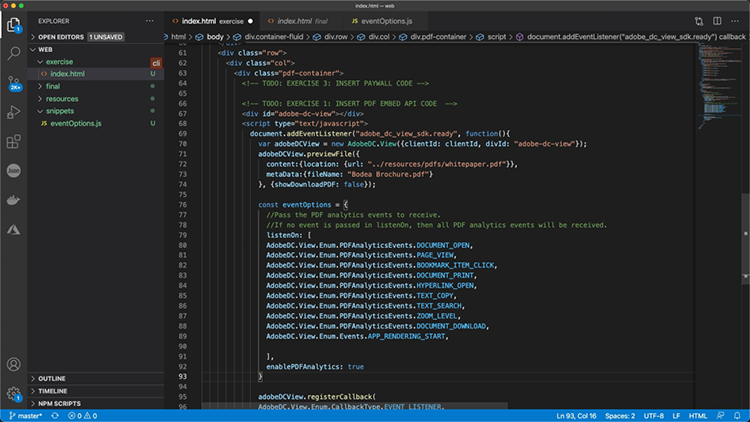

# 控制您的PDF在线体验并收集分析

您的组织是否在您的网站上发布PDF? 了解如何使用Adobe PDF Embed API控制外观、启用协作，并收集关于用户与PDF交互方式的分析，包括花在页面和搜索上的时间。 要开始这个由4个部分组成的动手教程，请选择 *开始使用PDF嵌入API*&#x200B;的

<table style="table-layout:fixed">
<tr>
  <td>
    <a href="controlpdfexperience.md#part1">
        
    </a>
    <div>
    <a href="controlpdfexperience.md#part1"><strong>第1部分：开始使用PDF嵌入API</strong></a>
    </div>
  </td>
  <td>
    <a href="controlpdfexperience.md#part2">
        
    </a>
    <div>
    <a href="controlpdfexperience.md#part2"><strong>第二部分：将PDF嵌入API添加到网页</strong></a>
    </div>
  </td>
  <td>
   <a href="controlpdfexperience.md#part3">
      
   </a>
    <div>
    <a href="controlpdfexperience.md#part3"><strong>第三部分：访问分析API</strong></a>
    </div>
  </td>
  <td>
   <a href="controlpdfexperience.md#part4">
      
   </a>
    <div>
    <a href="controlpdfexperience.md#part4"><strong>第四部分：根据事件添加交互性</strong></a>
    </div>
  </td>
</tr>
</table>

## 第1部分：开始使用PDF嵌入API {#part1}

第1部分，了解如何开始使用第1-3部分所需的全部功能。 首先获取API凭据。

**您需要的内容**

* 教程资源 [下载](https://github.com/benvanderberg/adobe-pdf-embed-api-tutorial)
* Adobe ID [在此处获取一个](https://accounts.adobe.com/cn/)
* Web服务器（Node JS、PHP等）
* 有关HTML/JavaScript/CSS的工作知识

**我们正在使用的内容**

* 基本Web服务器（节点）
* Visual Studio代码
* GitHub

### 获取凭据

1. 转到 [Adobe.io网站](https://www.adobe.io/)的
1. 单击 **[!UICONTROL 了解详情]** 在“构建引人入胜的文档体验”下。

   

   这会将您转到 [!DNL Adobe Acrobat Services] 页面。

1. 单击 **[!UICONTROL 开始使用]** 按钮。

   您将在页面中看到一个选项 **开始使用 [!DNL Acrobat Services] API** 来 **创建新凭据** 或 **管理现有凭据**&#x200B;的

1. 单击 **[!UICONTROL 开始使用]** 按钮 **[!UICONTROL 创建新凭据]**&#x200B;的

   

1. 选择 **[!UICONTROL PDF嵌入API]** 单选按钮，然后在下一个窗口中添加您选择的凭据名称和应用程序域。

   >[!NOTE]
   >
   >这些凭据仅可用于此处列出的应用程序域。 您可以使用您选择的任何域。

   

1. 单击 **[!UICONTROL 创建凭据]**&#x200B;的

   向导的最后一页提供了您的客户端凭据详细信息。 请将此窗口保持打开状态，以便您可以返回该窗口并复制客户端ID（API密钥），供以后使用。

1. 单击 **[!UICONTROL 查看文档]** 要转到文档，其中包含有关如何使用此API的详细信息。

   

## 第二部分：将PDF嵌入API添加到网页 {#part2}

在第二部分中，您将学习如何轻松将PDF嵌入API嵌入网页。 为此，您将使用Adobe PDF Embed API在线演示来创建我们的代码。

### 获取练习代码

我们为您创建了一个可供您使用的代码。 虽然您可以使用自己的代码，但演示将位于教程资源的上下文中。 下载示例代码 [此处](https://github.com/benvanderberg/adobe-pdf-embed-api-tutorial)的

1. 转到 [[!DNL Adobe Acrobat Services] 网站](https://www.adobe.io/apis/documentcloud/dcsdk/)的

   ![屏幕截图 [!DNL Adobe Acrobat Services] 网站](assets/ControlPDF_6.png)

1. 单击 **[!UICONTROL API]** ，然后转到 **[!UICONTROL PDF嵌入API]** 页面。

   

1. 单击 **[!UICONTROL 试用演示]**&#x200B;的

   将弹出一个新窗口，其中包含用于PDF嵌入API的开发人员沙箱。

   

   您可以在此处查看不同查看模式的选项。

1. 单击“全屏”、“大小容器”、“内嵌式”和“灯箱”的不同查看模式。

   

1. 单击 **[!UICONTROL 完整窗口]** 查看模式，然后单击 **[!UICONTROL 自定义]** 按钮打开和关闭选项。

   

1. 禁用 **[!UICONTROL 下载]** PDF选项。
1. 单击 **[!UICONTROL 生成代码]** 按钮来查看代码预览。
1. 复制 **[!UICONTROL 客户端ID]** 来自第1部分的“客户端凭据”窗口。

   

1. 打开 **[!UICONTROL Web]** -> **[!UICONTROL 资源]** -> **[!UICONTROL js]** -> **[!UICONTROL dc-config.js]** 代码编辑器中的文件。

   您将看到clientID变量在这里。

1. 将您的客户端凭据粘贴到双引号之间，以将clientID设置为您的凭据。

1. 返回开发人员沙箱代码预览。

1. 复制包含脚本的第Adobe行：

   ```
   <script src=https://documentccloud.adobe.com/view-sdk/main.js></script>
   ```

   

1. 转到代码编辑器并打开 **[!UICONTROL Web]** -> **[!UICONTROL 练习]** -> **[!UICONTROL index.html]** 文件。

1. 将脚本代码粘贴到 `<head>` 第18行文件注释中注明： **待办事项：练习1:插入嵌入API脚本标签**&#x200B;的

   

1. 返回开发人员沙箱代码预览并复制第一行包含以下内容的代码：

   ```
   <div id="adobe-dc-view"></div>
   ```

   

1. 转到代码编辑器并打开 **[!UICONTROL Web]** -> **[!UICONTROL 练习]** -> **[!UICONTROL index.html]** 文件。

1. 粘贴 `<div>` 代码到 `<body>` 第67行文件上注明 **待办事项：练习1:插入PDF嵌入API代码**&#x200B;的

   

1. 返回开发人员沙箱代码预览，并复制 `<script>` 提示：

   ```
   <script type="text/javascript">
       document.addEventListener("adobe_dc_view_sdk.ready",             function(){ 
           var adobeDCView = new AdobeDC.View({clientId:                     "<YOUR_CLIENT_ID>", divId: "adobe-dc-view"});
           adobeDCView.previewFile({
               content:{location: {url: "https://documentcloud.                adobe.com/view-sdk-demo/PDFs/Bodea Brochure.                    pdf"}},
               metaData:{fileName: "Bodea Brochure.pdf"}
           }, {showDownloadPDF: false});
       });
   </script>
   ```

1. 转到代码编辑器并打开 **[!UICONTROL Web]** -> **[!UICONTROL 练习]** -> **[!UICONTROL index.html]** 文件。

1. 粘贴 `<script>` 代码到 `<body>` 第68行文件的 `<div>` 标记。

1. 修改同一行的第70行 **index.html** 文件，以包含先前创建的clientID变量。

   

1. 修改同一行的第72行 **index.html** 文件，用于更新PDF文件的位置以使用本地文件。

   教程文件中有一个可用的 **/resources/pdfs/whitepaper.pdf**&#x200B;的

1. 浏览至 **`<your domain>`/summit21/web/exercise/**&#x200B;的

   您应该在浏览器中以“全窗口”模式查看技术白皮书渲染。

## 第三部分：访问分析API {#part3}

现在，您已成功创建了一个网页，其中包含呈现PDF的PDF嵌入API，在第3部分中，您现在可以探索如何使用JavaScript事件来测量分析，以了解用户如何使用PDF。

### 查找文档

作为PDF嵌入API的一部分，有许多不同的JavaScript事件可用。 您可以从 [!DNL Adobe Acrobat Services] 文档。

1. 导航至 [文档](https://www.adobe.io/apis/documentcloud/dcsdk/docs.html) 站点。
1. 查看作为API一部分提供的不同事件类型。 这些参考信息不仅可以帮助参考，还有助于您以后的项目。

   

1. 复制网站上列出的示例代码。

   将此作为代码的基础并进行修改。

   

   ```
   const eventOptions = {
     //Pass the PDF analytics events to receive.
      //If no event is passed in listenOn, then all PDF         analytics events will be received.
   listenOn: [ AdobeDC.View.Enum.PDFAnalyticsEvents.    PAGE_VIEW, AdobeDC.View.Enum.PDFAnalyticsEvents.DOCUMENT_DOWNLOAD],
     enablePDFAnalytics: true
   }
   
   
   adobeDCView.registerCallback(
     AdobeDC.View.Enum.CallbackType.EVENT_LISTENER,
     function(event) {
       console.log("Type " + event.type);
       console.log("Data " + event.data);
     }, eventOptions
   );
   ```

1. 找到您之前添加的如下代码部分，并将上面的代码追加到中的此代码之后 **index.html**:

   

1. 在Web浏览器中加载该页面，并打开控制台，以便在与PDF查看器交互时查看不同事件的控制台输出。

   

   

### 添加用于捕获事件的开关

现在您已经将事件输出到console.log，让我们根据哪些事件来更改行为。 为此，您将使用交换机示例。

1. 导航至 **snippets/eventsSwitch.js** 并复制教程代码中的文件内容。

   

1. 将代码粘贴到事件侦听器函数中。

   

1. 确认在加载页面时控制台正确输出，并且与PDF查看器交互。

### Adobe Analytics

如果要将Adobe Analytics支持添加到查看器中，您可以按照网站上提供的说明进行操作。

>[!IMPORTANT]
>
>您的网页需要已经将Adobe Analytics加载到页眉中的页面上。

导航至 [Adobe Analytics文档](https://www.adobe.com/devnet-docs/dcsdk_io/viewSDK/howtodata.html#adobe-analytics) 并查看网页上是否已经启用了Adobe Analytics。 按照说明设置reportSuite。

### Google Analytics


Adobe PDF Embed API提供与Adobe Analytics的现成集成。 但是，由于所有Google Analytics都可用作JavaScript事件，因此通过捕获PDF事件并使用ga()函数将事件添加到Adobe Analytics，可以与JavaScript事件集成。

1. 导航至 **snippets/eventsSwitchGA.js** 以了解如何与Google Analytics集成。
1. 如果使用Adobe Analytics跟踪您的网页，并且该网页已嵌入到该网页中，请查看并使用此代码作为示例。

   

## 第四部分：根据事件添加交互性 {#part4}

第4部分中，您将了解如何在您的PDF查看器上方分层放置一条付费墙，在您滚动浏览完第二页后会显示它。

### Paywall示例

导航至此 [墙后PDF示例](https://www3.technologyevaluation.com/research/white-paper/the-forrester-wave-digital-decisioning-platforms-q4-2020.html)的 在本例中，您将学习如何在PDF查看体验的基础上添加交互性。

### 添加付费专区代码

1. 转到snippets/paywallCode.html并复制内容。
1. 搜索 `<!-- TODO: EXERCISE 3: INSERT PAYWALL CODE -->` 在exercise/index.html中。

   

1. 将复制的代码粘贴到注释之后。
1. 转到 **snippets/paywallCode.js** 然后复制内容。

   

1. 将代码粘贴到该位置。

### 使用Paywall试用演示

现在您可以观看演示。

1. 重新加载 **index.html** 您的网站。
1. 向下滚动到大于2的页面。
1. 显示第二页之后显示挑战用户的对话框。

   

## 其他资源

可以找到其他资源 [此处](https://www.adobe.io/apis/documentcloud/dcsdk/docs.html)的
