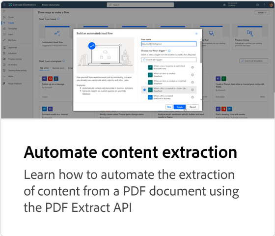

# Adobe PDF Extract API教程

使用由Adobe Sensei机器学习提供支持的Web服务，解锁任何PDF的结构和内容元素。

>[!NOTE]
>
>PDF提取API包含在PDF服务API中。

<table style="table-layout:fixed">
<tr>
 <td>
   
  </td>
  <td>
   
    

   <a href="https://experienceleague.adobe.com/docs/adobe-developers-live-events/events/2021/oct2021/parsing-pdf.html"><strong>分析PDF：与使用PDF提取API处理JSON数据一样简单</strong></a>
    

    <em>了解Adobe PDF Services API中的PDF提取服务如何能够像解析JSON一样轻松解析PDF</em>
     
  </td>
  <td>
    
    

     
  </td>
</tr>
</table>
