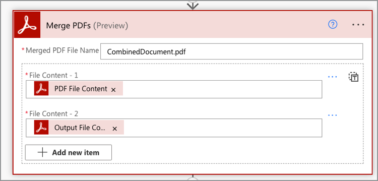

# 在Microsoft Power Automate中创建您的第一个工作流

了解如何创建您的第一个流 [Microsoft Power Automate](https://flow.microsoft.com/zh-cn/) 使用 [Adobe PDF Services](https://us.flow.microsoft.com/zh-cn/connectors/shared_adobepdftools/adobe-pdf-services/) 连接器。

在本实际操作教程中，学习如何：

* 将Word文档转换为PDF
* 将PDF文档合并为一个PDF
* 使用密码ProtectPDF文档

## 准备工作

### 您需要的

* **Adobe PDF Services的试用或生产凭据**
详细了解如何在Microsoft Power Automate中获取和配置凭据 [此处](https://experienceleague.adobe.com/docs/document-services/tutorials/pdfservices/getting-credentials-power-automate.html).
* **带有高级连接器的Microsoft Power Automate**
了解如何检查Power Automate的许可级别 [此处](https://docs.microsoft.com/en-us/power-platform/admin/power-automate-licensing/types).
* **OneDrive**
本教程中使用了OneDrive存储连接器，但可使用任何存储连接器替代。

### 范例文件

这里有两种 [示例文件](assets/sample-assets.zip) 您需要解压缩并上传到OneDrive：

* WordDocument01.docx
* WordDocument02.docx

### 获取凭据

要完成本教程，您需要已在Microsoft Power Automate for Adobe PDF Services中配置您的凭据。 如果您尚未完成此步骤，请参见 [此处提供了相关说明](https://experienceleague.adobe.com/docs/document-services/tutorials/pdfservices/getting-credentials-power-automate.html).

## 第1部分：创建新流并将Word转换为PDF

### 创建工作流

在此部分中，您将在以下位置创建新流： [Microsoft Power Automate](https://flow.microsoft.com/zh-cn/) 使用即时流，添加参数，从OneDrive获取文件，然后将其转换为PDF。

1. 导航至 [Microsoft Power Automate](https://flow.microsoft.com/zh-cn/) 并使用您的凭据登录。
1. 在侧边栏中选择 **[!UICONTROL 创建]**.

   

1. 选择 **[!UICONTROL 瞬时工作流]**.
1. 为工作流命名。
1. 下 *选择如何触发此工作流*，选择 **[!UICONTROL 手动触发工作流]**.
1. 选择&#x200B;**[!UICONTROL 创建]**。

### 获取文件的文件内容

接下来，获取示例文件的文件内容。

>[!PREREQUISITES]
>
>如果您尚未上传 [示例文件](assets/sample-assets.zip) 解压缩到OneDrive中，然后上传这些文件。


1. 向内 [Power Automate](https://flow.microsoft.com/zh-cn/)，选择 **[!UICONTROL +新建步骤]**.
1. 搜索 *OneDrive* 在搜索栏中。
1. 通过选择选择您的工作或个人OneDrive帐户 **[!UICONTROL OneDrive for Business]** 或 **[!UICONTROL OneDrive]**.
1. 搜索 *获取文件内容* 在搜索栏中。
1. 在 **[!UICONTROL 文件]** 字段中，选择文件夹图标以导航至 *WordDocument01.docx* 文件。

   

### 将文件转换为PDF

现在您已经有了文件内容，可以将文档转换为PDF。

1. 向内 [Power Automate](https://flow.microsoft.com/zh-cn/)，选择 **[!UICONTROL +新建步骤]**.
1. 搜索 *Adobe PDF Services* 在搜索栏中。
1. 选择 **[!UICONTROL Adobe PDF Services]**.
1. 搜索 *将Word转换为PDF* 在搜索栏中。
1. 向内 **[!UICONTROL 文件名]**，根据需要命名文件，但文件必须以 *.docx*. 要将文档从Word转换为PDF，此扩展名是必需的。
1. 将光标放在 **[!UICONTROL 文件内容]** 字段。
1. 使用 **[!UICONTROL 动态内容]** 面板，选择 **[!UICONTROL 文件内容]**.

   

### 将文件保存到OneDrive

文档生成后，将文件保存回OneDrive中。

1. 向内 [Microsoft Power Automate](https://flow.microsoft.com/zh-cn/)，选择 **[!UICONTROL +新建步骤]**.
1. 搜索 *OneDrive* 在搜索栏中。
1. 通过选择选择您的工作或个人OneDrive帐户 **[!UICONTROL OneDrive for Business]** 或 **[!UICONTROL OneDrive]**.
1. 搜索 *获取文件内容* 在搜索栏中。
1. 搜索 *创建文件* 在搜索栏中。
1. 选择 **[!UICONTROL 创建文件]**.
1. 在 **[!UICONTROL 文件夹路径]** 字段中，选择文件夹图标以指定文件在OneDrive中的保存位置。
1. 向内 **[!UICONTROL 文件名]**，根据需要命名文件，但文件必须以 *.docx*. 要将文档从Word转换为PDF，此扩展名是必需的。
1. 在 **[!UICONTROL 文件内容]** 字段，使用 **[!UICONTROL 动态内容]** 面板以插入“PDF文件内容”变量。

### Try流

1. 在左上角，选择 **[!UICONTROL Untitled]** 以重命名工作流。
1. 选择&#x200B;**[!UICONTROL 保存]**。
1. 选择 **[!UICONTROL 测试]**.
1. 选择 **[!UICONTROL 手动]** 然后 **[!UICONTROL 保存和测试]**.
1. 选择&#x200B;**[!UICONTROL “继续”]**。
1. 选择 **[!UICONTROL 运行流]**.

在OneDrive文件夹中，您现在应该会看到转换后的PDF。


## 第2部分：从模板生成动态文档

下一部分构建于第1部分，并使用 *从Word生成文档* 用于将数据动态合并到文档中的模板。

### 审阅文档模板

打开 *WordDocument02_.docx* 从OneDrive中的示例文件获取。 Word文档包含多个不同的文本标记，这些标记表示数据填充到文档中的位置。

### 添加要触发的参数

要将动态数据推送到文档中，您需要为触发器创建一些参数以提示输入值。

1. 编辑工作流时，请选择 **[!UICONTROL 手动触发工作流]** 以展开操作。
1. 选择 **[!UICONTROL 添加输入]**.
1. 选择 **[!UICONTROL 文本]**.
1. 为字段命名 *名字*.

重复步骤2-4以添加以下字段：

* 姓氏
* 薪金


### 获取模板的文件内容

要生成文档，您首先需要获取Word模板的文件内容。

1. 在Power Automate中，选择+ **[!UICONTROL 新步骤]**.
1. 搜索 *OneDrive* 在搜索栏中。
1. 通过选择选择您的工作或个人OneDrive帐户 **[!UICONTROL OneDrive for Business]** 或 **[!UICONTROL OneDrive]**.
1. 搜索 *获取文件内容* 在搜索栏中。
1. 在 **[!UICONTROL 文件]** 字段中，选择文件夹图标以导航至 *WordDocument02.docx* 文件。


### 从模板生成文档

1. 在Power Automate中，选择 **[!UICONTROL +新建步骤]**.
1. 搜索 *Adobe PDF Services* 在搜索栏中。
1. 选择 **[!UICONTROL Adobe PDF Services]**.
1. 选择 **[!UICONTROL 从Word模板生成文档]** 操作。
1. 在 **[!UICONTROL 模板文件名]** 字段，根据需要为文件命名，但其结尾必须是 *.docx*.

#### 合并数据

使用 *从Word模板生成文档* 操作，您可以使用动态内容将数据从工作流中以前的任何不同变量合并到文档中。

将下面的JSON数据复制到 **合并数据** 字段：

```
{
    "FirstName": "",
    "LastName": "",
    "Salary": ""
}
```

1. 将光标放在“ ”的两个引号之间的字段中 *FirstName* 值。
1. 使用 **[!UICONTROL 动态内容]** 面板，插入 *名字* 手动触发流操作的值。

   

1. 对重复步骤7-8 **[!UICONTROL LastName]** 和 **[!UICONTROL 薪金]** 字段。
1. 在 **[!UICONTROL 模板文件内容]** 字段，请使用 **[!UICONTROL 动态内容]** 面板以插入 **[!UICONTROL 文件内容]** 值来自 *获取文件内容* 步骤。


>[!TIP]
>
>该 *从Word模板生成文档* 操作使用AdobeDocument Generation API。 如果您想详细了解如何创建模板，以下是一些资源：
>
>* [了解有关AdobeDocument Generation的更多信息](https://developer.adobe.com/document-services/apis/doc-generation/)
>* [适用于Microsoft Word的AdobeDocument Generation Tagger](https://appsource.microsoft.com/en-US/product/office/WA200002654)
>* [AdobeDocument Generation API文档](https://developer.adobe.com/cn/document-services/docs/overview/document-generation-api/)

### 将文件保存到OneDrive

生成文档后，您可以将文件保存回OneDrive。

1. 在Power Automate中，选择 **+ [!UICONTROL 新步骤]**.
1. 搜索 *OneDrive* 在搜索栏中。
1. 通过选择选择您的工作或个人OneDrive帐户 **[!UICONTROL OneDrive for Business]** 或 **[!UICONTROL OneDrive]**.
1. 搜索 *创建文件* 在搜索栏中。
1. 选择 **[!UICONTROL 创建文件]**.
1. 在 **[!UICONTROL 文件夹路径]** 字段中，选择文件夹图标以指定文件在OneDrive中的保存位置。
1. 在 **[!UICONTROL 文件名]** 字段，设置文件的名称。 由于输出为PDF，因此您的文件名必须以.pdf扩展名结尾。
1. 使用 **[!UICONTROL 动态内容]** 面板以将“PDF文件内容”变量插入 **[!UICONTROL 文件内容]** 字段。

### Try流


1. 选择&#x200B;**[!UICONTROL 保存]**。
1. 选择 **[!UICONTROL 测试]**.
1. 选择 **[!UICONTROL 手动]** 然后 **[!UICONTROL 保存和测试]**.
1. 选择&#x200B;**[!UICONTROL “继续”]**。
1. 输入以下项的值 *名字*， *姓氏*&#x200B;和 *薪金*.
1. 选择 **[!UICONTROL 运行流]**.

在OneDrive文件夹中，现在可以看到从WordPDF生成的文档。 在OneDrive中打开PDF文档时，您会看到数据合并到文本标记位置。


## 第3部分：将PDF合二为一

生成一个Word文档并将其转换为PDF后，下一步就是将多个PDF文档组合在一起。

>[!NOTE]
>
>在之前的操作中，您将文档的一个副本保存为OneDrive中的文件。 为了使用合并PDF等工具，您无需将文件保存到OneDrive。 相反，您可以将输出从一个操作直接传递到下一个操作，这比在每个操作后存储到OneDrive更好。 但出于演示目的，您正在将这些文件保存到OneDrive。

### 添加合并PDF步骤

1. 编辑工作流时，请选择 **[!UICONTROL +下一步]** 在工作流末尾添加操作。
1. 搜索 *Adobe PDF Services* 在搜索栏中。
1. 选择 **[!UICONTROL Adobe PDF Services]**.
1. 选择 **[!UICONTROL 合并PDF]** 操作。
1. 在 **[!UICONTROL 合并PDF文件名]** 字段中，输入所需的文件名(即&#x200B;*CombinedDocument.pdf*)。
1. 在 **[!UICONTROL 文件内容–1]** 字段，请使用 **[!UICONTROL 动态内容]** 面板以插入 *PDF文件内容* 值来自 **[!UICONTROL 将Word转换为PDF]** 步骤。
1. 要添加下一个文档，请选择 **+ [!UICONTROL 添加新项目]**.
1. 在 **[!UICONTROL 文件内容 — 2]** 字段，请使用 **[!UICONTROL 动态内容]** 面板以插入 **[!UICONTROL 输出文件内容]** 值来自 *从Word模板生成文档* 步骤。



### 将合并的PDF保存到OneDrive

合并文档后，您可以将文档保存回OneDrive。

1. 在Power Automate中，选择 **+ [!UICONTROL 新步骤]**.
1. 搜索 *OneDrive* 在搜索栏中。
1. 通过选择选择您的工作或个人OneDrive帐户 **[!UICONTROL OneDrive for Business]** 或 **[!UICONTROL OneDrive]**.
1. 搜索 *创建文件* 在搜索栏中。
1. 选择 **[!UICONTROL 创建文件]**.
1. 在 **[!UICONTROL 文件夹路径]** 字段中，选择文件夹图标以指定文件在OneDrive中的保存位置。
1. 在 **[!UICONTROL 文件名]** 字段，设置文件的名称。 由于输出为PDF，因此您的文件名必须以.pdf结尾。
1. 在 **[!UICONTROL 文件内容]** 字段，使用 **[!UICONTROL 动态内容]** 面板以插入 *PDF文件内容* 值来自 **[!UICONTROL 合并PDF]** 步骤。

   

### Try流

1. 选择&#x200B;**[!UICONTROL 保存]**。
1. 选择 **[!UICONTROL 测试]**.
1. 选择 **[!UICONTROL 手动]** 然后 **[!UICONTROL 保存和测试]**.
1. 选择&#x200B;**[!UICONTROL “继续”]**。
1. 输入以下项的值 *名字*， *姓氏*&#x200B;和 *薪金*.
1. 选择 **[!UICONTROL 运行流]**.

在OneDrive文件夹中，您将看到合并后的PDF，其中包含来自第一个和第二个文档的页面。

## 第4部分：ProtectPDF文档

生成文档后，可在保存到OneDrive之前执行额外步骤，以保护文档免受编辑。

### 保护 PDF

1. 在Power Automate中编辑工作流时，请选择 **+** 介于 **[!UICONTROL 合并PDF]** 操作和 **[!UICONTROL 创建文件3]** 操作。

   

1. 选择 **[!UICONTROL 添加动作]**.
1. 搜索 *Adobe PDF Services* 在搜索栏中。
1. 选择 **[!UICONTROL Adobe PDF Services]**.
1. 选择 **[!UICONTROL 从查看中PDFProtect]** 操作。
1. 在 **[!UICONTROL 文件名]** 字段中，将名称设置为所需的名称（前提是它以.pdf扩展名结尾）。
1. 设置 **[!UICONTROL 密码]** 字段输入您的指定密码以打开文档。
1. 在 **[!UICONTROL 文件内容]** 字段，请使用 **[!UICONTROL 动态内容]** 面板以插入 *PDF文件内容* 值来自 **[!UICONTROL 合并PDF]** 步骤。

### 更新保存到OneDrive

文档受到保护后，您可以将文件保存回OneDrive中。 在此示例中，您将更新先前存在的 **创建文件3** 使用新的 *文件内容* 值。

1. 在 **[!UICONTROL 文件内容]** 字段中的 **[!UICONTROL 创建文件3]** 操作。
1. 使用 **[!UICONTROL 动态内容]** 面板以插入 *PDF文件内容* 值来自 **从查看中PDFProtect** 步骤。

### Try流

1. 选择&#x200B;**[!UICONTROL 保存]**。
1. 选择 **[!UICONTROL 测试]**.
1. 选择 **[!UICONTROL 手动]** 然后 **[!UICONTROL 保存和测试]**.
1. 选择&#x200B;**[!UICONTROL “继续”]**。
1. 输入以下项的值 *名字*， *姓氏*&#x200B;和 *薪金*.
1. 选择 **[!UICONTROL 运行流]**.

在OneDrive文件夹中，您会看到现在提示您输入密码以查看PDF的组合文档。

## 后续步骤

在本教程中，您将Word文档转换为PDF，基于数据生成文档，将文档合并在一起，并使用密码保护。 要了解更多信息，请浏览Microsoft Power Automate中Adobe PDF Services连接器中提供的一些其他操作：

* 查看Microsoft Power Automate中可用的预创建模板。
* 了解 [文章](https://medium.com/adobetech/tagged/microsoft-power-automate) 在Adobe技术博客上。
* 审阅 [文档](https://developer.adobe.com/cn/document-services/docs/overview/document-generation-api/) 用于AdobeDocument Generation API。
