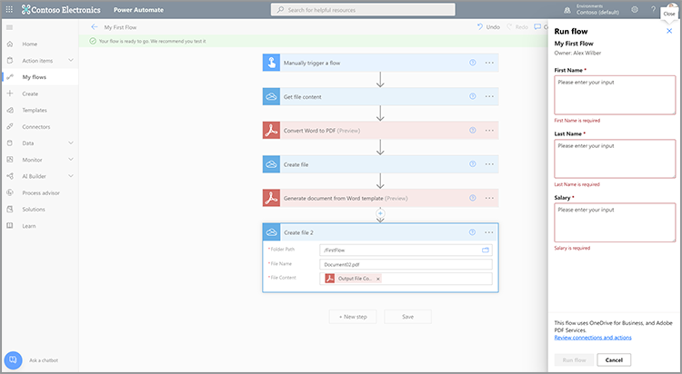

# 在Microsoft Power Automate中创建第一个流程

了解如何在中创建第一个流程 [Microsoft Power Automate](https://flow.microsoft.com/zh-cn/) 使用 [Adobe PDF Services](https://us.flow.microsoft.com/zh-cn/connectors/shared_adobepdftools/adobe-pdf-services/) 连接器。

在本实际操作教程中，学习如何：

* 将Word文档转换为PDF
* 将PDF文档合并为一个PDF
* Protect带密码的PDF文档

## 准备

### 您需要的内容

* **Adobe PDF Services的试用或生产凭据**
详细了解如何在Microsoft Power Automate中获取和配置凭据 [此处](https://experienceleague.adobe.com/docs/document-services/tutorials/pdfservices/getting-credentials-power-automate.html)的
* **Microsoft Power Automate与Premium连接器**
了解如何检查Power Automate的许可级别 [此处](https://docs.microsoft.com/en-us/power-platform/admin/power-automate-licensing/types)的
* **OneDrive**
本教程使用OneDrive存储连接器，但任何存储连接器都可以替换。

### 范例文件

有两个 [示例文件](assets/sample-assets.zip) 需要解压缩并上载到OneDrive的文件夹：

* WordDocument01.docx
* WordDocument02.docx

### 获取凭据

要完成本教程，您需要已在Microsoft Power Automate for Adobe PDF Services中配置凭据。 如果您尚未完成此步骤，请参阅 [此处提供了相关说明](https://experienceleague.adobe.com/docs/document-services/tutorials/pdfservices/getting-credentials-power-automate.html)的

## 第1部分：创建新流程并将Word转换为PDF

### 创建流

在本部分中，您将新建一个流 [Microsoft Power Automate](https://flow.microsoft.com/zh-cn/) 使用即时流、添加参数、从OneDrive获取文件以及将其转换为PDF。

1. 导航至 [Microsoft Power Automate](https://flow.microsoft.com/zh-cn/) 并使用您的凭据登录。
1. 在侧边栏中，选择 **[!UICONTROL 创建]**&#x200B;的

   

1. 选择 **[!UICONTROL 即时流]**&#x200B;的
1. 为您的流命名。
1. 在 *选择如何触发此流*，请选择 **[!UICONTROL 手动触发流程]**&#x200B;的
1. 选择&#x200B;**[!UICONTROL 创建]**。

### 获取文件的文件内容

接下来，获取示例文件的文件内容。

>[!PREREQUISITES]
>
>如果您尚未上传 [示例文件](assets/sample-assets.zip) 并将其解压缩并上传。


1. 在 [Power Automate](https://flow.microsoft.com/zh-cn/)，请选择 **[!UICONTROL +新步骤]**&#x200B;的
1. 搜索 *OneDrive* （在搜索栏中）。
1. 通过选择 **[!UICONTROL OneDrive for Business]** 或 **[!UICONTROL OneDrive]**&#x200B;的
1. 搜索 *获取文件内容* （在搜索栏中）。
1. 在 **[!UICONTROL 文件]** 字段中，选择文件夹图标以导航至 *WordDocument01.docx* 文件。

   

### 将文件转换为PDF

现在，您拥有了文件内容，可以将文档转换为PDF。

1. 在 [Power Automate](https://flow.microsoft.com/zh-cn/)，请选择 **[!UICONTROL +新步骤]**&#x200B;的
1. 搜索 *Adobe PDF Services* （在搜索栏中）。
1. 选择 **[!UICONTROL Adobe PDF Services]**&#x200B;的
1. 搜索 *将Word转换为PDF* （在搜索栏中）。
1. 在 **[!UICONTROL 文件名]**，根据需要命名文件，但文件结尾必须是 *.docx*&#x200B;的 此扩展名对于将文档从Word转换为PDF是必需的。
1. 将光标放在 **[!UICONTROL 文件内容]** 字段。
1. 使用 **[!UICONTROL 动态内容]** 面板中，选择 **[!UICONTROL 文件内容]**&#x200B;的

   

### 将文件保存到OneDrive

生成文档后，将文件保存回OneDrive。

1. 在 [Microsoft Power Automate](https://flow.microsoft.com/zh-cn/)，请选择 **[!UICONTROL +新步骤]**&#x200B;的
1. 搜索 *OneDrive* （在搜索栏中）。
1. 通过选择 **[!UICONTROL OneDrive for Business]** 或 **[!UICONTROL OneDrive]**&#x200B;的
1. 搜索 *获取文件内容* （在搜索栏中）。
1. 搜索 *创建文件* （在搜索栏中）。
1. 选择 **[!UICONTROL 创建文件]**&#x200B;的
1. 在 **[!UICONTROL 文件夹路径]** 字段中，选择文件夹图标以指定在OneDrive中保存文件的位置。
1. 在 **[!UICONTROL 文件名]**，根据需要命名文件，但文件结尾必须是 *.docx*&#x200B;的 此扩展名对于将文档从Word转换为PDF是必需的。
1. 在 **[!UICONTROL 文件内容]** 字段，使用 **[!UICONTROL 动态内容]** 面板来插入“PDF文件内容”变量。

### 试用流程

1. 在左上角，选择 **[!UICONTROL Untitled]** 重命名流。
1. 选择&#x200B;**[!UICONTROL 保存]**。
1. 选择 **[!UICONTROL 测试]**&#x200B;的
1. 选择 **[!UICONTROL 手动]** 然后 **[!UICONTROL 保存和测试]**&#x200B;的
1. 选择&#x200B;**[!UICONTROL “继续”]**。
1. 选择 **[!UICONTROL 运行流程]**&#x200B;的

在OneDrive文件夹中，您现在应该可以看到转换后的PDF。


## 第二部分：从模板生成动态文档

此下一部分构建在第1部分上，并使用 *从Word生成文档* 模板，用于将数据动态合并到文档中。

### 审阅文档模板

打开 *WordDocument02_.docx* OneDrive中的示例文件。 Word文档包含多个不同的文本标记，这些标记表示将数据填充到文档中的位置。

### 向触发器添加参数

要将动态数据推送到文档中，您需要为触发器创建一些参数以提示输入值。

1. 编辑流程时，选择 **[!UICONTROL 手动触发流程]** 以展开操作。
1. 选择 **[!UICONTROL 添加输入]**&#x200B;的
1. 选择 **[!UICONTROL 文本]**&#x200B;的
1. 命名字段 *名字*&#x200B;的

重复步骤2-4以添加以下字段：

* 姓氏
* 薪金


### 获取模板的文件内容

要生成文档，您首先需要获取Word模板的文件内容。

1. 在Power Automate中，选择+ **[!UICONTROL 新步骤]**&#x200B;的
1. 搜索 *OneDrive* （在搜索栏中）。
1. 通过选择 **[!UICONTROL OneDrive for Business]** 或 **[!UICONTROL OneDrive]**&#x200B;的
1. 搜索 *获取文件内容* （在搜索栏中）。
1. 在 **[!UICONTROL 文件]** 字段中，选择文件夹图标以导航至 *WordDocument02.docx* 文件。


### 从模板生成文档

1. 在Power Automate中，选择 **[!UICONTROL +新步骤]**&#x200B;的
1. 搜索 *Adobe PDF Services* （在搜索栏中）。
1. 选择 **[!UICONTROL Adobe PDF Services]**&#x200B;的
1. 选择 **[!UICONTROL 从Word模板生成文档]** 操作。
1. 在 **[!UICONTROL 模板文件名]** 字段中，根据需要，命名您的文件，但必须以 *.docx*&#x200B;的

#### 合并数据

使用 *从Word模板生成文档* 操作，您可以使用动态内容将数据从流中以前的任何不同变量合并到文档中。

将下面的JSON数据复制到 **合并数据** 字段：

```
{
    "FirstName": "",
    "LastName": "",
    "Salary": ""
}
```

1. 将光标放在文档中两个引号之间的字段中， *FirstName* 值。
1. 使用 **[!UICONTROL 动态内容]** 面板中，插入 *名字* “手动”(Manually)触发“流”(Flow)操作中的值。

   

1. 对重复步骤7-8 **[!UICONTROL 姓氏]** 和 **[!UICONTROL 薪金]** 字段。
1. 在 **[!UICONTROL 模板文件内容]** 字段，使用 **[!UICONTROL 动态内容]** 面板来插入 **[!UICONTROL 文件内容]** 值 *获取文件内容* 命令。


>[!TIP]
>
>在 *从Word模板生成文档* 操作使用Adobe文档生成API。 如果您想了解有关如何创建模板的更多信息，请访问以下资源：
>
>* [详细了解Adobe文档生成](https://developer.adobe.com/document-services/apis/doc-generation/)
>* [Microsoft Word的Adobe文档生成标记](https://appsource.microsoft.com/en-US/product/office/WA200002654)
>* [Adobe文档生成API文档](https://developer.adobe.com/cn/document-services/docs/overview/document-generation-api/)


### 将文件保存到OneDrive

生成文档后，您可以将文件保存回OneDrive。

1. 在Power Automate中，选择 **+ [!UICONTROL 新步骤]**&#x200B;的
1. 搜索 *OneDrive* （在搜索栏中）。
1. 通过选择 **[!UICONTROL OneDrive for Business]** 或 **[!UICONTROL OneDrive]**&#x200B;的
1. 搜索 *创建文件* （在搜索栏中）。
1. 选择 **[!UICONTROL 创建文件]**&#x200B;的
1. 在 **[!UICONTROL 文件夹路径]** 字段中，选择文件夹图标以指定在OneDrive中保存文件的位置。
1. 在 **[!UICONTROL 文件名]** 字段，设置文件的名称。 由于输出是PDF，因此您的文件名必须以.pdf扩展名结尾。
1. 使用 **[!UICONTROL 动态内容]** 面板，用于将“PDF文件内容”变量插入到 **[!UICONTROL 文件内容]** 字段。

### 试用流程



1. 选择&#x200B;**[!UICONTROL 保存]**。
1. 选择 **[!UICONTROL 测试]**&#x200B;的
1. 选择 **[!UICONTROL 手动]** 然后 **[!UICONTROL 保存和测试]**&#x200B;的
1. 选择&#x200B;**[!UICONTROL “继续”]**。
1. 输入值 *名字*, *姓氏*&#x200B;和 *薪金*&#x200B;的
1. 选择 **[!UICONTROL 运行流程]**&#x200B;的

在OneDrive文件夹中，您现在可看到从WordPDF生成的文档。 在OneDrive中打开PDF文档时，您会看到数据被合并到文本标记位置。


## 第三部分：将PDF合并为一个

现在，您已生成一个Word文档并将其转换为PDF，下一步是将多个PDF文档合并在一起。

>[!NOTE]
>
>在之前的操作中，您将文档的副本另存为OneDrive中的文件。 要使用合并PDF等工具，您无需将文件保存到OneDrive。 相反，您可以将输出从一个操作直接传递到下一个操作，这比在每次操作后保存到OneDrive要好。 但是，出于演示目的，您需要将这些文件保存到OneDrive。

### 添加合并PDF步骤

1. 编辑流程时，选择 **[!UICONTROL +下一步]** 在流程的末尾添加动作。
1. 搜索 *Adobe PDF Services* （在搜索栏中）。
1. 选择 **[!UICONTROL Adobe PDF Services]**&#x200B;的
1. 选择 **[!UICONTROL 合并PDF]** 操作。
1. 在 **[!UICONTROL 合并PDF文件名]** 字段中，输入所需的文件名(例如，*CombinedDocument.pdf*)。
1. 在 **[!UICONTROL 文件内容–1]** 字段，使用 **[!UICONTROL 动态内容]** 面板来插入 *PDF文件内容* 值 **[!UICONTROL 将Word转换为PDF]** 命令。
1. 要添加下一个文档，请选择 **+ [!UICONTROL 添加新项目]**&#x200B;的
1. 在 **[!UICONTROL 文件内容 — 2]** 字段，使用 **[!UICONTROL 动态内容]** 面板来插入 **[!UICONTROL 输出文件内容]** 值 *从Word模板生成文档* 命令。


### 将合并的PDF保存到OneDrive

合并文档后，您可以将文档保存回OneDrive。

1. 在Power Automate中，选择 **+ [!UICONTROL 新步骤]**&#x200B;的
1. 搜索 *OneDrive* （在搜索栏中）。
1. 通过选择 **[!UICONTROL OneDrive for Business]** 或 **[!UICONTROL OneDrive]**&#x200B;的
1. 搜索 *创建文件* （在搜索栏中）。
1. 选择 **[!UICONTROL 创建文件]**&#x200B;的
1. 在 **[!UICONTROL 文件夹路径]** 字段中，选择文件夹图标以指定在OneDrive中保存文件的位置。
1. 在 **[!UICONTROL 文件名]** 字段，设置文件的名称。 由于输出是PDF，因此您的文件名必须以.pdf结尾。
1. 在 **[!UICONTROL 文件内容]** 字段，使用 **[!UICONTROL 动态内容]** 面板来插入 *PDF文件内容* 值 **[!UICONTROL 合并PDF]** 命令。

   

### 试用流程

1. 选择&#x200B;**[!UICONTROL 保存]**。
1. 选择 **[!UICONTROL 测试]**&#x200B;的
1. 选择 **[!UICONTROL 手动]** 然后 **[!UICONTROL 保存和测试]**&#x200B;的
1. 选择&#x200B;**[!UICONTROL “继续”]**。
1. 输入值 *名字*, *姓氏*&#x200B;和 *薪金*&#x200B;的
1. 选择 **[!UICONTROL 运行流程]**&#x200B;的

在OneDrive文件夹中，您可以看到包含第一个和第二个文档的PDF的组合页面。

## 第四部分：ProtectPDF文档

生成文档后，您可以通过在保存到OneDrive之前包含额外的步骤来防止文档被编辑。

### 保护 PDF

1. 在Power Automate中编辑流程时，请选择 **+** 在 **[!UICONTROL 合并PDF]** 和 **[!UICONTROL 创建文件3]** 操作。

   

1. 选择 **[!UICONTROL 添加动作]**&#x200B;的
1. 搜索 *Adobe PDF Services* （在搜索栏中）。
1. 选择 **[!UICONTROL Adobe PDF Services]**&#x200B;的
1. 选择 **[!UICONTROL ProtectPDF不显示]** 操作。
1. 在 **[!UICONTROL 文件名]** 字段中，将名称设置为所需的名称，前提是该名称以.pdf扩展名结尾。
1. 设置 **[!UICONTROL 密码]** 字段输入您指定的密码以打开文档。
1. 在 **[!UICONTROL 文件内容]** 字段，使用 **[!UICONTROL 动态内容]** 面板来插入 *PDF文件内容* 值 **[!UICONTROL 合并PDF]** 命令。

### 更新保存到OneDrive

文档受到保护后，您可以将文件保存回OneDrive。 在此示例中，您将更新预先存在的 **创建文件3** 使用新的 *文件内容* 值。

1. 在 **[!UICONTROL 文件内容]** 字段 **[!UICONTROL 创建文件3]** 操作。
1. 使用 **[!UICONTROL 动态内容]** 面板来插入 *PDF文件内容* 值 **ProtectPDF不显示** 命令。

### 试用流程

1. 选择&#x200B;**[!UICONTROL 保存]**。
1. 选择 **[!UICONTROL 测试]**&#x200B;的
1. 选择 **[!UICONTROL 手动]** 然后 **[!UICONTROL 保存和测试]**&#x200B;的
1. 选择&#x200B;**[!UICONTROL “继续”]**。
1. 输入值 *名字*, *姓氏*&#x200B;和 *薪金*&#x200B;的
1. 选择 **[!UICONTROL 运行流程]**&#x200B;的

在OneDrive文件夹中，您会看到一个组合PDF，它现在提示您输入密码来查看文档。

## 后续步骤

在本教程中，您将Word文档转换为PDF，根据数据生成文档，合并文档，并使用密码进行保护。 要了解更多信息，请浏览Microsoft Power Automate中Adobe PDF服务连接器提供的其他一些操作：

* 查看Microsoft Power Automate中提供的预创建模板。
* 学习 [文章](https://medium.com/adobetech/tagged/microsoft-power-automate) 在Adobe技术博客上。
* 审阅 [文档](https://developer.adobe.com/cn/document-services/docs/overview/document-generation-api/) 用于Adobe文档生成API。
