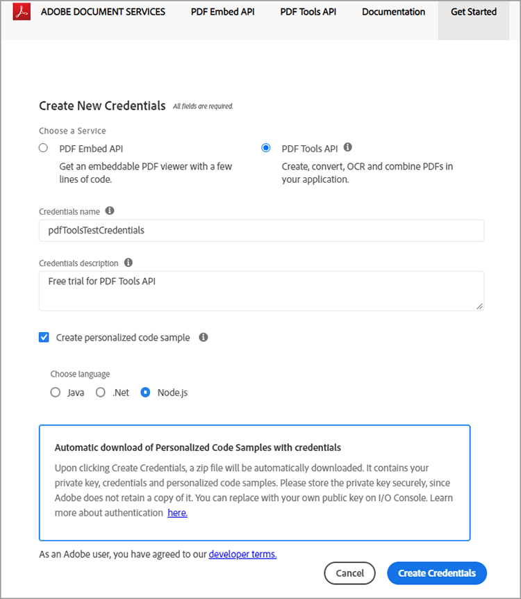
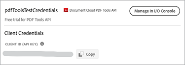

# 使用PDF服务API和Node.js，几分钟即可从HTML或MS Office创建PDF


借助新的Adobe PDF Services API数字化文档工作流程从未如此简单，它让开发人员可以自由选择几种功能强大的PDF操作服务，以满足复杂业务工作流程的需要。 借助这些随时可用的基于云的Web服务，可简化复杂的体系结构、实施策略和技术提升。

在PDF服务API中，有几个服务可用于创建和处理PDF，或从PDF导出到MS Office和其他格式。

* 从静态或动态PDF、MS Word、PowerPoint、Excel等创建HTML文件
* Export PDF到MS Word、PowerPoint、Excel等
* OCR，用于识别文档文件PDF中的文本并启用文档搜索
* ProtectPDF打开文档时使用密码
* 将PDF页或PDF文档合并为一个PDF
* 压缩PDF以减小通过电子邮件或在线共享的大小
* 线性化以优化PDF以便在Web上快速查看
* 使用PDF插入、替换、重新排序、删除和旋转服务来组织页面

开发人员只需几分钟即可开始使用准备好的示例文件，这些文件为访问所有可用的Web服务而提供。 下面是使用方法。

## 获取凭据和下载示例文件

第一步是获取凭据（API密钥）以解除使用锁定。 [在此处注册免费试用](https://www.adobe.com/go/dcsdks_credentials) 然后单击“开始使用”以创建新凭据。


选择“个人帐户”来注册免费试用版非常重要：


在下一步中，您将选择PDF服务API服务，然后为您的凭据添加名称和说明。

有一个“创建个性化代码示例”复选框。 选择此选项可跳过手动步骤，将您的新凭据自动添加到示例文件。

接下来，选择Node.js作为接收特定于Node.js示例的语言，然后单击“创建凭据”按钮。



您将收到一个名为PDFToolsSDK-Node.jsSamples.zip的.zip文件以供下载，该文件可保存到您的本地文件系统。

## 将您的凭据添加到代码示例

如果您选择了“创建个性化代码示例”选项，则不必手动将客户端ID添加到代码示例文件，并可以跳过下一步直接转到下面的“运行代码示例”部分。

如果您未选择“创建个性化代码示例”选项，则必须从Adobe.io控制台复制客户端ID（API密钥）：



解压缩PDFToolsSDK-Node.jsSamples.zip的内容。

转到adobe-dc-pdf-tools-sdk-node-samples文件夹下的根目录。

使用任意文本编辑器或IDE打开pdftools-api-credentials.json。

将凭据粘贴到代码中客户端ID的字段中：

```javascript
{
 "client_credentials": {
  "client_id": "abcdefghijklmnopqrstuvwxyz",
```

保存文件并继续下一步以运行代码示例。

## 运行第一个代码示例

使用命令提示符，转到adobe-dc-pdf-tools-sdk-node-samples文件夹下的根目录。

键入npm install:

C:\Temp\PDFToolsAPI\adobe-dc-pdf-tools-sdk-node-samples>npm安装

现在，您可以运行示例文件了！

对于您的第一个示例，创建一个PDF:

仍位于命令提示符下，使用以下命令运行createPDF示例：

C:\Temp\PDFToolsAPI\adobe-dc-pdf-tools-sdk-node-samples>node src/createpdf/create-pdf-from-docx.js

输出示例：


您的PDF将在输出中指定的位置创建，默认情况下为pdfServicesSdkResult目录。

## 资源和后续步骤

* 有关更多帮助和支持，请访问Adobe [[!DNL Acrobat Services] API](https://community.adobe.com/t5/document-cloud-sdk/bd-p/Document-Cloud-SDK?page=1&amp;sort=latest_replies&amp;filter=all) 社区论坛

PDF服务API [文档](https://www.adobe.com/go/pdftoolsapi_doc)

* [常见问题](https://community.adobe.com/t5/document-cloud-sdk/faq-for-document-services-pdf-tools-api/m-p/10726197) 有关PDF服务API问题

* [联系我们](https://www.adobe.com/go/pdftoolsapi_requestform) 有关许可和定价的问题

* 相关文章:
  [新的PDF服务API为文档工作流提供了更多功能](https://community.adobe.com/t5/document-services-apis/new-pdf-tools-api-brings-more-capabilities-for-document-services/m-p/11294170)

  [7月版 [!DNL Adobe Acrobat Services]:PDF嵌入和PDF服务](https://medium.com/adobetech/july-release-of-adobe-document-services-pdf-embed-and-pdf-tools-17211bf7776d)
