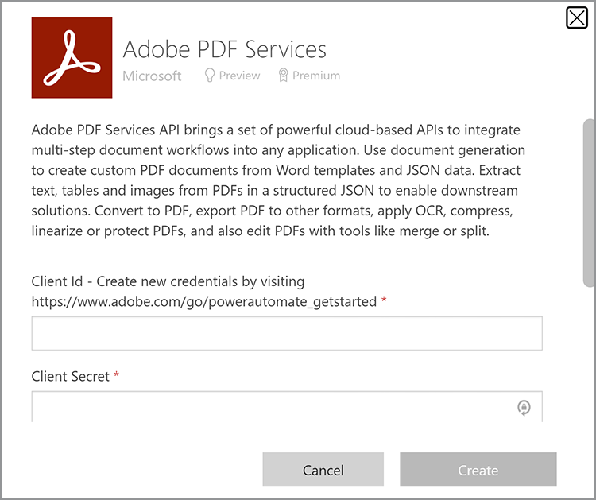
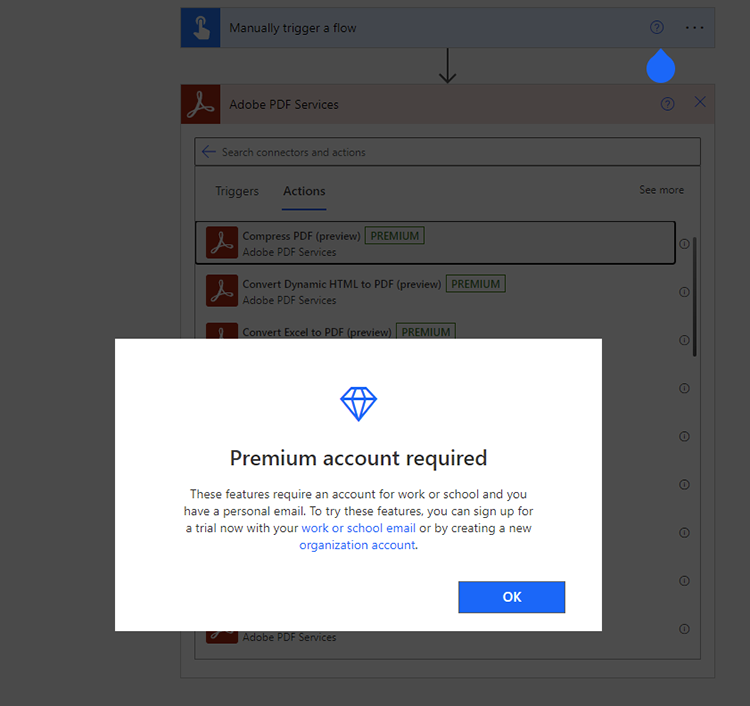

# 获取Microsoft Power Automate凭据

[Microsoft Power Automate](https://powerautomate.microsoft.com/) 为市民开发人员和开发人员提供了一种强大的方式，使他们能够创建功能强大的自动化流程，无需编写代码即可改进自己的业务。 [Adobe PDF Services](https://us.flow.microsoft.com/zh-cn/connectors/shared_adobepdftools/adobe-pdf-services/) 连接器，作为 [[!DNL Adobe Acrobat Services]](https://developer.adobe.com/document-services)中，允许用户在Microsoft Power Automate中执行Adobe PDF Services API提供的任何操作。

在本教程中，了解如何获取凭据以开始使用或试用Adobe PDF服务。 根据您是试用版用户还是现有客户，本教程将逐步介绍获取凭据的正确步骤。

## Microsoft Power Automate用户如何开始使用Adobe PDF服务连接器？

现有Microsoft Power Automate用户可以 [获取试用版凭据](https://www.adobe.com/cn/go/powerautomate_getstarted) 对于Adobe PDF Services。 上面的链接是一个特殊的注册链接，在此过程中仅向Microsoft Power Automate用户提供帮助。


>[!IMPORTANT]
> 如果您要登录以使用试用版，则必须使用Adobe ID而不是Enterprise ID。 如果您不是Adobe PDF Services API的当前订阅者并尝试使用您的Enterprise ID登录，则可能会收到权限错误，因为您的企业未授权您使用Adobe PDF Services API。 因此，建议使用免费个人Adobe ID。

1. 登录后，系统会提示您为新凭据选择一个名称。 输入您的 *凭据名称*&#x200B;的
1. 选中该复选框以同意开发人员条款。
1. 选择 **[!UICONTROL 创建凭据]**&#x200B;的

   

这些凭据涵盖五个不同的值：

* 客户 ID（API 密钥）
* 客户密码
* 组织 ID
* 技术帐户 ID
* Base64（编码私钥）


包含所有这些值的JSON文件也会自动下载到您的系统中。 该文件已命名 `pdfservices-api-pa-credentials.json` 并且看上去像：

```json
{
 "client_id": "client id value",
 "client_secret": "client secret value",
 "organization_id": "organized id value",
 "account_id": "account id value",
 "base64_encoded_private_key": "base64 version of the private key"
}
```

将此文件存储在一个安全位置，因为无法再次获得私钥的副本。

### 在Microsoft Power Automate中添加连接

现在，您拥有了凭据，可以开始在Microsoft Power Automate流程中使用它们。

1. 在侧边栏菜单中，打开 **[!UICONTROL 数据]** 菜单，然后选择 **连接**:

   

1. 选择 **+ [!UICONTROL 新建连接]**&#x200B;的

1. 下一个屏幕显示可能的连接类型列表。 在右上角，输入“adobe”以筛选选项：

   

1. 选择 **[!UICONTROL Adobe PDF Services（预览）]**&#x200B;的
1. 在模态窗口中，输入之前生成的所有五个值。 选择 **[!UICONTROL 创建]** 完成后。

   

现在，您就可以在Microsoft Power Automate中使用Adobe PDF服务了。

### 创建凭据后访问凭据

如果您已经创建了凭据并且错误地放置了下载的凭据，则可以在中再次检索它们 [Adobe Developer Console](https://developer.adobe.com/console)的

1. 登录到 [Adobe Developer Console](https://developer.adobe.com/console)，首先找到并选择您的项目。
1. 在左侧的菜单中 *凭据*，请选择 **服务帐户(JWT)**:

   

1. 请注意此处显示的五个值： *客户端ID*, *客户端密钥*, *技术帐户ID*, *技术帐户电子邮件*&#x200B;和 *组织ID*&#x200B;的

很遗憾，您无法下载以前的私钥，但您可以使用“生成公共/私有密钥对”按钮创建一个新私钥。

## 使用现有的Adobe PDF Services凭据

如果您已通过生成现有Adobe PDF Services API凭据 [!DNL Adobe Acrobat Services] 网站，您可以将其与Microsoft Power Automate结合使用。 如果您在注册时下载了SDK，则您的现有凭据将采用JSON文件的形式，该文件最有可能被命名为 `pdfservices-api-credentials.json`的 该JSON文件包含创建连接凭据时所需的五个密钥。 将JSON文件中的每个值复制到相应的连接字段中。

您的私钥值来自名为 `private.key`的

您也可以按上述步骤从Adobe Developer Console获取值。

## 如何 [!DNL Adobe Acrobat Services] 用户开始使用Microsoft Power Automate?

要开始使用Power Automate，请首先转到 <https://powerautomate.microsoft.com> 然后使用“Start free”（自由开始）按钮 如果您没有Microsoft帐户，则需要创建一个帐户。 登录后，您会看到Power Automate仪表板。


如本教程开头所述，创建一个新流程、添加一个步骤并找到Adobe PDF Services。 选择一个操作，系统可能会警告您必需使用高级帐户。



如以上屏幕截图所示，您可以切换到工作帐户或设置新的组织帐户。 执行此操作后，您便可以添加Adobe PDF Services操作。

如需深入了解如何使用 [!DNL Adobe Acrobat Services]，请参阅 [在Microsoft Power Automate中创建您的第一个工作流程](https://experienceleague.adobe.com/docs/document-services/tutorials/pdfservices/create-workflow-power-automate.html)的

## 其他资源

为了帮助您获得更多信息，下面列出了一些其他资源：

* 首先是Adobe PDF Services Power Automate文档： <https://docs.microsoft.com/en-us/connectors/adobepdftools/>的 这些资源是对您在此处所学内容的补充。
* 需要示例？ 你可以发现很多 [Power Automate模板](https://powerautomate.microsoft.com/en-us/connectors/details/shared_adobepdftools/adobe-pdf-services/) 演示PDF服务。
* 我们的实时视频内容， [纸质剪辑](https://www.youtube.com/playlist?list=PLcVEYUqU7VRe4sT-Bf8flvRz1XXUyGmtF)，还包含演示Power Automate使用情况的视频。
* 在 [Adobe技术博客](https://medium.com/adobetech/tagged/microsoft-power-automate) 包含许多有关使用Power Automate的文章。
* 最后，请务必参考核心信息 [PDF服务](https://developer.adobe.com/cn/document-services/docs/overview/) 文档。
