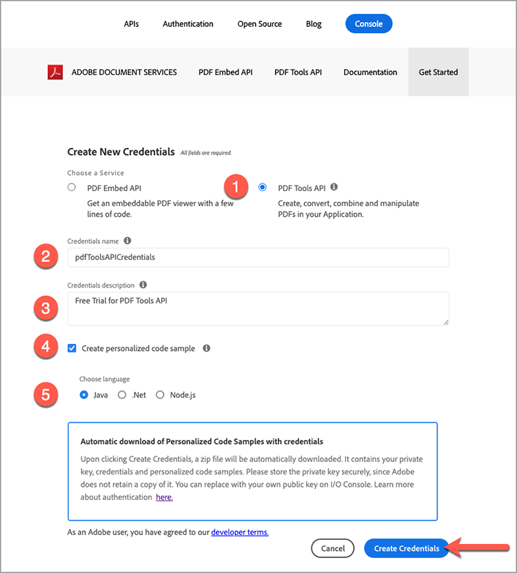

# Adobe PDF Services API和.Net快速入门

开发人员只需几分钟即可开始使用，并准备好运行为访问所有可用Web服务提供的示例文件。 本教程将指导您完成使用PDF服务.Net SDK开始运行示例的所有步骤：

## 步骤1：获取凭据并下载示例文件

第一步是获取用于解锁使用的凭据（API密钥）。 [在此处注册免费试用](https://www.adobe.io/apis/documentcloud/dcsdk/gettingstarted.html) 然后单击“开始使用”以创建新凭据。

选择“个人帐户”以注册免费试用非常重要：

在下一步中，您将选择PDF服务API服务，然后为您的凭据添加名称和描述。

选中了“Create personalized code sample”（创建个性化代码示例）复选框。 选择此选项可将新凭据自动添加到示例文件，这将保存将凭据添加到项目的手动步骤。

接下来，选择Node.js作为接收特定Node.js示例的语言，然后单击“创建凭据”按钮。

您将收到一个名为PDFToolsSDK-.NetSamples.zip的.zip文件供您下载，该文件可以保存到您的本地文件系统。

## 步骤2：设置.Net环境并运行示例代码

1. 下载并安装 [.Net SDK](https://dotnet.microsoft.com/learn/dotnet/hello-world-tutorial/install)
1. 提取下载的 **[!UICONTROL PDFToolsSDK-.NetSamples.zip]** 并解压缩内容
1. cd到samples根目录 **[!UICONTROL adobe-DC.PDFTools.SDK.NET.Samples]**
1. 从samples根目录运行 `dotnet build`

   C:\Temp\PDFToolsAPI\ PDFToolsSDK-.NetSamples\adobe-DC.PDFTools.SDK.NET.Samples>dotnet build

   现在，您可以运行示例文件了！

   最后这些步骤将介绍如何通过“从Word创建PDF”操作来运行第一个示例：

1. 从samples根目录将目录更改为CreatePDFFromDocx文件夹，cd CreatePDFFromDocx/

   C:\Temp\PDFToolsAPI\ PDFToolsSDK-.NetSamples\adobe-DC.PDFTools.SDK.NET.Samples>cd CreatePDFFromDocx/

1. 运行 `dotnet run CreatePDFFromDocx.csproj`

   C:\Temp\PDFToolsAPI\ PDFToolsSDK-.NetSamples\adobe-DC.PDFTools.SDK.NET.Samples\CreatePDFFromDocx>dotnet run CreatePDFFromDocx.csproj

您的PDF将在输出中指定的位置创建，默认情况下，该位置为同一文件夹。

## 最后想法

PDF服务API可通过自动化常见工作流程并将处理负担转移到云来帮助您消除手动流程。 在每个浏览器对PDF处理方式都不同的情况下，利用Adobe PDF Embed API以及PDF服务API，您可以创建可正确运行和显示的简化、可靠和可预测的流程 **每次** 无论使用何种平台或设备。

## 资源和后续步骤

* 如需其他帮助和支持，请访问 [[!DNL Adobe Acrobat Services] API](https://community.adobe.com/t5/document-cloud-sdk/bd-p/Document-Cloud-SDK?page=1&amp;sort=latest_replies&amp;filter=all) 社区论坛

* PDF服务API [文档](https://www.adobe.com/go/pdftoolsapi_doc)

* [常见问题解答](https://community.adobe.com/t5/document-cloud-sdk/faq-for-document-services-pdf-tools-api/m-p/10726197) 对于PDF服务API问题

* [联系我们](https://www.adobe.com/go/pdftoolsapi_requestform) 有关许可和定价的问题

* 相关文章

  [新的PDF服务API为Document Workflows提供了更多功能](https://community.adobe.com/t5/document-services-apis/new-pdf-tools-api-brings-more-capabilities-for-document-services/m-p/11294170)

  [7月版 [!DNL Adobe Acrobat Services]：PDF嵌入和PDF服务](https://medium.com/adobetech/july-release-of-adobe-document-services-pdf-embed-and-pdf-tools-17211bf7776d)
