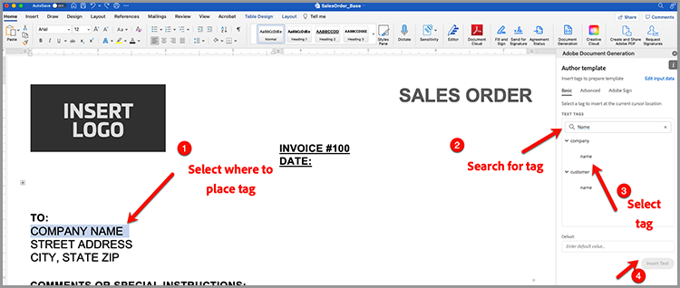

# 加快销售过程


从白皮书到合同和协议，在整个购买过程中都需要大量文档。 在本教程中，了解如何 [[!DNL Adobe Acrobat Services]](https://developer.adobe.com/document-services/) 可以在整个旅程中集成文档体验以帮助加快销售。

## 从数据生成协议和销售订单

销售协议、合同和其他文档可能因具体条件而大不相同。 例如，销售协议可能仅包含基于唯一条件的特定条款，如位于特定国家或州，或将特定产品作为协议的一部分包括在内。 手动创建这些文档或维护许多不同的模板变体会显着增加与手动查看更改相关的法律成本。

[Document Generation APIAdobe](https://developer.adobe.com/document-services/apis/doc-generation/) 允许您从CRM或其他数据系统中获取数据，以便根据该数据动态生成销售文档。

## 获取凭据

首先注册免费的Adobe PDF Services凭据：

1. 导航 [此处](https://documentcloud.adobe.com/dc-integration-creation-app-cdn/main.html) 注册您的凭据。
1. 使用您的Adobe ID登录。
1. 设置凭据名称（例如Sales Agreements Demo）。

   

1. 选择一种语言以下载示例代码（例如，Node.js）。
1. 选中以同意 **[!UICONTROL 开发人员条款]**.
1. 选择 **[!UICONTROL 创建凭据]**.
系统随即将一个文件下载到您的计算机，该ZIP文件包含用于身份验证的示例文件pdfservices-api-credentials.json和private.key。

   

1. 选择 **[!UICONTROL 获取Microsoft Word插件]** 或转到 [AppSource](https://appsource.microsoft.com/en-cy/product/office/WA200002654) 以进行安装。

   >[!NOTE]
   >
   >安装Word加载项需要您具有在Microsoft 365中安装加载项的权限。 如果您没有权限，请与Microsoft 365管理员联系。

## 您的数据

如果要从特定数据系统提取数据，必须将该数据输出为JSON数据或生成您自己的架构。 此方案使用以下预创建的示例数据集：

```
{
    "salesOrder": {
        "comment": "Make sure to call 555-555-1234 when you arrive. The front door is broken."
    },
    "company": {
        "name":"Home Services Co.",
        "address": {
            "city": "Homestead",
            "state": "NY",
            "zip": "14623",
            "streetAddress": "123 Demohome Street"
        }
    },
    "customer": {
        "address": {
            "city": "Seattle",
            "state": "WA",
            "zip": "98052",
            "streetAddress": "20341 Whitworth Institute 405 N. Whitworth"
        },
        "email": "mailto:jane-doe@xyz.edu",
        "jobTitle": "Professor",
        "name": "Jane Doe",
        "telephone": "(425) 123-4567",
        "url": "http://www.janedoe.com"
    },
    "tax": {
        "state":"WA",
        "rate": 0.08
    },
    "referencesOrder": [
        {
            "description": "Carpet Cleaning Service - 3BR 2BA",
            "totalPaymentDue": {
                "price": 359.54
            },
            "orderedItem": {
                "description": "Carpet Cleaning Service"
            }
        },
        {
            "description": "Home Cleaning Service - 3BR 2BA",
            "totalPaymentDue": {
                "price": 299.99
            },
            "orderedItem": {
                "description": "House Cleaning Service"
            }
        }
    ]
}
```

## 将基本标签添加到文档

此方案使用可以下载的销售订单文档 [此处](https://github.com/benvanderberg/adobe-document-generation-samples/blob/main/SalesOrder/Exercise/SalesOrder_Base.docx?raw=true).


1. 打开 *SalesOrder.docx* Microsoft Word中的示例文档。
1. 如果已安装Document Generation插件，请选择 **[!UICONTROL Document Generation]** 在“功能区”中。 如果在功能区中看不到Document Generation，请按照以下说明进行操作。
1. 选择 **[!UICONTROL 开始使用]**.
1. 将上面写入的JSON示例数据复制到 *JSON数据* 字段。

   

接下来，导航到“Document Generation Tagger”面板，将标签置入文档中。

1. 选择要替换的文本(例如， *公司名称*)。
1. 在 *Document Generation Tagger* 面板中，搜索“名称”。
1. 在标签列表中，选择“公司”下的“名称”。
1. 选择 **[!UICONTROL 插入文本]**.

   

   此过程会放置一个名为 {{company.name}} 因为标记位于JSON中的路径下方。

   ```
   {
   …
   "company": {
       "name":"Home Services Co.",
       …
   },
   …
   }
   ```

对文档中的某些其他标签（如街道地址、城市、州/省、ZIP等）重复这些操作。

## 预览生成的文档

您可以直接在Microsoft Word中根据示例JSON数据预览生成的文档。

1. 在 *Document Generation Tagger* 面板，选择 **[!UICONTROL 生成文档]**. 系统首次可能会提示您使用Adobe ID登录。 选择 **[!UICONTROL 登录]** 并完成使用您的凭据登录的提示。

   

1. 选择 **[!UICONTROL 查看文档]**.

   

1. 此时会打开一个浏览器窗口，允许您预览文档结果。

   

可以看到文档中的标签被原始样本数据中的数据替换。


## 将表添加到模板

在此下一个方案中，向文档中的表添加产品列表。

1. 在必须放置表的位置插入光标。
1. 在 *Document Generation Tagger* 面板，选择 **[!UICONTROL 高级]**.
1. 展开 **[!UICONTROL 表和列表]**.
1. 在 *表记录* 字段，选择 *参考顺序*，它是一个列出所有产品项目的数组。
1. 在选择列记录字段中，键入要包括的内容 *描述* 和 *totalPaymentDue.price* 字段。
1. 选择 **[!UICONTROL 插入表]**.

   

编辑该表以调整样式、大小和其他参数，就像Microsoft Word中的任何其他表一样。

## 添加数值计算

数值计算允许您根据数据集合（如数组）计算求和和其他计算。 在此方案中，添加一个字段以计算小计。

1. 选择 *$0.00* 小计标题旁边。
1. 在 *[!UICONTROL Document Generation Tagger]* 面板，展开 **[!UICONTROL 数值计算]**.
1. 下 *[!UICONTROL 选择计算类型]*，选择 **[!UICONTROL 聚合]**.
1. 下 *[!UICONTROL 选择类型]*，选择 **[!UICONTROL 求和]**.
1. 下 *[!UICONTROL 选择记录]*，选择 **[!UICONTROL 参考顺序]**.
1. 低于*[!UICONTROL 选择要执行汇总的物料]**，选择 **[!UICONTROL totalPaymentsDue.price]**.
1. 选择 **[!UICONTROL 插入计算]**.

此过程将插入一个计算标记，该标记提供值的总和。 可以使用JSONata计算进行更高级的计算。 例如：

* 小计： `${{expr($sum(referencesOrder.totalPaymentDue.price))}}`
计算referencesOrder.totalPaymentDue.price的总和。

* 销售税： `${{expr($sum(referencesOrder.totalPaymentDue.price)*0.08)}}`
计算价格并乘以8%以计算税款。

* 应付款总额： `${{expr($sum(referencesOrder.totalPaymentDue.price)*1.08)}}`
计算价格和乘以1.08的倍数以计算小计+税费。

## 添加条件条款

条件部分允许您仅在满足特定条件时包含句子或段落。 在此方案中，仅当节与特定状态匹配时，才会包含该节。

1. 在文档中，找到名为的分区 *加利福尼亚州隐私声明*.
1. 用光标选择部分。

   

1. 在 *[!UICONTROL Document Generation Tagger]*，选择 **[!UICONTROL 高级]**.
1. 展开 **[!UICONTROL 条件内容]**.
1. 在 *[!UICONTROL 选择记录]* 字段，搜索和选择 **[!UICONTROL customer.address.state]**.
1. 在 *[!UICONTROL 选择运算符]* 字段，选择 **=**.
1. 在 *[!UICONTROL 值字段]*，类型 *CA*.
1. 选择 **[!UICONTROL 插入条件]**.

仅当customer.address.state = CA时，生成的文档中才会显示California部分。

接下来，选择“WASHINGTON隐私声明”部分，并重复上述步骤，将值CA替换为WA。

## 添加动态图像

Document Generation API允许您从数据动态插入图像。 当您拥有不同的子品牌，并且希望更改徽标、肖像图像或图像以使它们与特定行业更相关时，此功能非常有用。

图像可以通过数据或base64内容中的URL传递。 本示例使用URL。

1. 将光标放在要包含图像的位置。
1. 在 *[!UICONTROL Document Generation Tagger]* 面板，选择 **[!UICONTROL 高级]**.
1. 展开 **[!UICONTROL 图像]**.
1. 在 *[!UICONTROL 选择标签]* 字段，选择 **[!UICONTROL 徽标]**.
1. 在 *[!UICONTROL 可选替代文本]* 字段，提供描述（即徽标）。 此过程将插入如下所示的图像占位符：

   

但是，您需要在版面中的图像上动态设置图像，可以通过以下操作完成：

1. 右键单击已插入的占位符图像。

   

1. 选择 **[!UICONTROL 编辑替代文本]**.
1. 在面板中，复制如下所示的文本：
   `{ "location-path": "logo", "image-props": { "alt-text": "Logo" }}`
1. 在文档中选择要动态的其他图像。

   

1. 右键单击图像并选择 **[!UICONTROL 编辑替代文本]**.
1. 将该值粘贴到面板中。

此流程用数据中徽标变量内的图像替换图像。

## 为Acrobat Sign添加标签

Adobe Acrobat Sign允许您捕获文档上的电子签名。 Acrobat Sign提供了一种在Web界面中拖放字段的简单方法，但您也可以使用文本标记控制签名和其他字段的放置。 使用AdobeDocument Generation Tagger，您可以轻松放置这些文本标记字段。

1. 导航到示例文档中需要签名的位置。
1. 在需要签名的位置插入光标。
1. 在 *[!UICONTROL AdobeDocument Generation标记器]* 面板，选择 **[!UICONTROL Adobe Sign]**.
1. 在 *[!UICONTROL 指定收件人数]* 字段，设置收件人的数量（在本例中为1）。
1. 在 *[!UICONTROL 收件人]* 字段，选择 **[!UICONTROL Signer-1]**.
1. 在 *[!UICONTROL 字段]* 类型，选择 **[!UICONTROL 签名]**.
1. 选择 **[!UICONTROL 插入Adobe Sign文本标记]**.

将标签插入到文档中。


Acrobat Sign提供了多种其他可以置入的字段类型，例如日期字段。
1. 在 *字段* 类型，选择 **[!UICONTROL 日期]**.
1. 将光标移动到文档中的日期位置上方。
1. 选择 **[!UICONTROL 插入Adobe Sign文本标记]**.


## 生成协议

您现在已为文档添加了标签，可以开始使用了。 下一节将逐步介绍如何使用Document Generation API示例为Node.js生成文档，但这些示例适用于任何语言。

打开注册凭据时下载的pdfservices-node-sdk-samples-master。 这些文件中应包含pdfservices-api-credentials.json和private.key文件。

1. 打开终端以使用npm install安装依赖项。
1. 将示例data.json复制到资源文件夹中。
1. 将Word模板复制到资源文件夹中。
1. 在samples文件夹的根目录中创建一个名为generate-salesOrder.js的新文件。

```
const PDFServicesSdk = require('@adobe/pdfservices-node-sdk');
const fs = require('fs');
const path = require('path');

var dataFileName = path.join('resources', '<INSERT JSON FILE');
var outputFileName = path.join('output', 'salesOrder_'+Date.now()+".pdf");
var inputFileName = path.join('resources', '<INSERT DOCX>');

//Loads credentials from the file that you created.
const credentials =  PDFServicesSdk.Credentials
    .serviceAccountCredentialsBuilder()
    .fromFile("pdfservices-api-credentials.json")
    .build();

// Setup input data for the document merge process
const jsonString = fs.readFileSync(dataFileName),
jsonDataForMerge = JSON.parse(jsonString);

// Create an ExecutionContext using credentials
const executionContext = PDFServicesSdk.ExecutionContext.create(credentials);

// Create a new DocumentMerge options instance
const documentMerge = PDFServicesSdk.DocumentMerge,
documentMergeOptions = documentMerge.options,
options = new documentMergeOptions.DocumentMergeOptions(jsonDataForMerge, documentMergeOptions.OutputFormat.PDF);

// Create a new operation instance using the options instance
const documentMergeOperation = documentMerge.Operation.createNew(options)

// Set operation input document template from a source file.
const input = PDFServicesSdk.FileRef.createFromLocalFile(inputFileName);
documentMergeOperation.setInput(input);

// Execute the operation and Save the result to the specified location.
documentMergeOperation.execute(executionContext)
.then(result => result.saveAsFile(outputFileName))
.catch(err => {
    if(err instanceof PDFServicesSdk.Error.ServiceApiError
        || err instanceof PDFServicesSdk.Error.ServiceUsageError) {
        console.log('Exception encountered while executing operation', err);
    } else {
        console.log('Exception encountered while executing operation', err);
    }
});
```

1. 替换 `<INSERT JSON FILE>` /resources中的JSON文件的名称。
1. 替换 `<INSERT DOCX>` DOCX文件的名称。
1. 要运行，请使用终端执行节点generate-salesOrder.js。

输出文件应位于/output文件夹中，并且正确生成了文档。

## 更多选项

生成文档后，您可以采取其他操作，例如：

* 使用密码保护文档
* 如果有大型图像，请压缩PDF
* 捕获文档中的电子签名

要详细了解一些其他可用的操作，请查看示例文件的/src文件夹中的脚本。 您还可以通过查看不同操作的文档来了解更多信息。

## 其他用例

[!DNL Adobe Acrobat Services] 可以通过数字文档工作流程帮助简化销售周期中的许多环节：

* 使用Adobe PDF Embed API在网站上嵌入白皮书和其他内容，同时还可度量和收集观众分析
* 使用Acrobat Sign捕获所生成协议上的电子签名
* 使用Adobe PDF Extract API从PDF文档提取协议数据

## 进一步学习

有兴趣了解更多信息？ 了解一些其他的使用方法 [!DNL Adobe Acrobat Services]：

* 了解更多来自 [文档](https://developer.adobe.com/cn/document-services/docs/overview/)
* 查看Adobe Experience League上的更多教程
* 使用/src文件夹中的示例脚本了解如何利用PDF
* 关注 [Adobe技术博客](https://medium.com/adobetech/tagged/adobe-document-cloud) 了解最新提示和技巧
* 订阅 [纸质剪辑（每月实时流）](https://www.youtube.com/playlist?list=PLcVEYUqU7VRe4sT-Bf8flvRz1XXUyGmtF) 了解如何使用 [!DNL Adobe Acrobat Services].=======
* 了解更多来自 [文档](https://developer.adobe.com/cn/document-services/docs/overview/)
* 查看Adobe Experience League上的更多教程
* 使用/src文件夹中的示例脚本了解如何利用PDF
* 关注 [Adobe技术博客](https://medium.com/adobetech/tagged/adobe-document-cloud) 了解最新提示和技巧
* 订阅 [纸质剪辑（每月实时流）](https://www.youtube.com/playlist?list=PLcVEYUqU7VRe4sT-Bf8flvRz1XXUyGmtF) 了解如何使用 [!DNL Adobe Acrobat Services]
