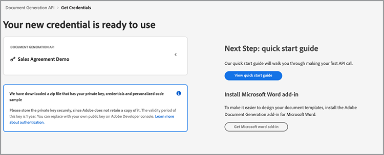
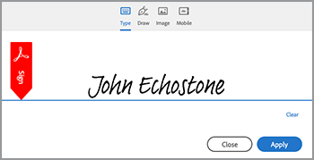

# 自动化法律工作流程


理想情况下，接受协议条款而不进行任何修改。 但是，通常情况下，协议需要自定义，这需要进行法律审查。 法律审查会产生巨额成本，并减缓交付协议条款的过程。 使用可根据批准的语言进行更改的预定义模板，可帮助法律团队管理和更安全地执行协议条款。

本教程使用的法律协议因州而异。 为了解决这些变化，将创建具有条件部分的协议模板，仅当满足特定条件时才会包括这些内容。 生成的文档可以是Word文档或PDF文档。 您还可以了解使用Adobe PDF Services API或Acrobat Sign保护文档的一些方法。

## 获取凭据

首先注册免费的Adobe PDF Services凭据：

1. 在[此处](https://documentcloud.adobe.com/dc-integration-creation-app-cdn/main.html)导航以注册您的凭据。
1. 使用您的Adobe ID登录。
1. 设置凭据名称。

   

1. 选择一种语言以下载示例代码（例如Node.js）。
1. 检查以同意&#x200B;**[!UICONTROL 开发人员条款]**。
1. 选择&#x200B;**[!UICONTROL 创建凭据]**。
系统随即将一个文件下载到您的计算机，该ZIP文件包含用于身份验证的示例文件pdfservices-api-credentials.json和private.key。

   

1. 选择&#x200B;**[!UICONTROL 获取Microsoft Word插件]**&#x200B;或转到[AppSource](https://appsource.microsoft.com/en-cy/product/office/WA200002654)进行安装。

   >[!NOTE]
   >
   >安装Word加载项需要您具有在Microsoft 365中安装加载项的权限。 如果您没有权限，请与Microsoft 365管理员联系。

## 您的数据

在这种情况下，系统会传递信息以帮助生成文档，并告知是否应包含某些章节：

```
{
    "customer": {
        "name": "Home Services Company",
        "street": "123 Any Street",
        "city": "Anywhere",
        "state": "CA",
        "zip": "12345",
        "country":"USA",
        "signer": {
            "email": "johnnyechostone@gmail.com",
            "firstName": "John",
            "lastName": "Echostone"
        }
    },
    "company": {
        "name": "Projected Consultants",
        "signer": {
            "email": "maryburostone@gmail.com",
            "firstName": "Mary",
            "lastName": "Burostone"
        }
    },
    "conditions": {
        "includeGeneralTerms": true,
        "includeConsumerDiscloure": true
    }
}
```

在数据中，可以找到有关客户、客户姓名、签名者，以及客户所在状态等信息。 此外，还有一些章节用于介绍正在生成协议的公司，以及一些用于包含协议特定部分的条件标志。

## 将基本标签添加到文档

此方案使用条款和条件文档，可在[此处](https://github.com/benvanderberg/adobe-document-generation-samples/blob/main/Agreement/exercise/TermsAndConditions_Sample.docx?raw=true)下载。


1. 在Microsoft Word中打开&#x200B;*TermsAndConditions.docx*&#x200B;示例文档。
1. 如果安装了[Document Generation](https://appsource.microsoft.com/en-cy/product/office/WA200002654)插件，请在功能区中选择&#x200B;**[!UICONTROL Document Generation]**。 如果在功能区中看不到Document Generation，请按照以下说明进行操作。
1. 选择&#x200B;**[!UICONTROL 开始使用]**。
1. 将上面写入的JSON示例数据复制到“JSON数据”字段中。

   

导航到&#x200B;*Document Generation Tagger*&#x200B;面板，以将标签置入文档。

## 插入公司名称

1. 选择要替换的文本。 在这种情况下，您将替换文档打开部分中的COMPANY。
1. 在&#x200B;*Document Generation Tagger*&#x200B;中，搜索“name”。
1. 在“公司”下，选择&#x200B;*名称*。

   

1. 选择&#x200B;**[!UICONTROL 插入文本]**。

这将放置一个名为`{{company.name}}`的标记，因为该标记位于JSON中该路径的下方。

```
{
    "company": {
        "name": "Projected Consultants",
        ...
    }
    ...
}
```

接下来，在CUSTOMER文本的开头部分重复此步骤。 重复&#x200B;**步骤1-4**，将customer下的CUSTOMER替换为“name”。 输出应为`{{customer.name}}`，以反映文本来自customer对象的下方。

AdobeDocument Generation API还允许您在页眉和页脚中添加标签，并将标签放在需要放置签名标题的最末端。

对页脚中的COMPANY和CUSTOMER文本&#x200B;**步骤1-4**&#x200B;再次重复此过程。


最后，您需要&#x200B;**重复步骤1-4**，将签名页面的“客户”部分下的“名字”和“姓氏”分别替换为`{{customer.signer.firstName}}`和`{{customer.signer.lastName}}`的标记。 如果标签很长，并且由于在生成文档时替换了标签而重排到下一行，请不要担心。

文档的开始和页脚应该如下所示：

* 起始部分：


* 页脚：


* 签名页面：


现在，您的标签已放置在文档中，您可以预览生成的协议了。

## 预览生成的文档

您可以直接在Microsoft Word中根据示例JSON数据预览生成的文档。

1. 在&#x200B;*Document Generation标记*&#x200B;中，选择&#x200B;**[!UICONTROL 生成文档]**。
1. 系统首次可能会提示您使用Adobe ID登录。 选择“**[!UICONTROL 登录]**”，并完成使用凭据登录的提示。

   

1. 选择&#x200B;**[!UICONTROL 查看文档]**。

   

1. 此时会打开一个浏览器窗口，您可以预览文档结果。

   

## 为每个状态添加条件项

在下一部分中，您根据特定的输入数据条件仅设置要包括的某些部分。 在示例文档中，第4节和第5节仅与特定状态有关。 对于这种情形，当客户处于特定状态时，只应包含特定于状态的条款。 此外，如果删除Microsoft Word中的这一部分，则该部分不应包含在编号中。 使用Document Generation API的“条件内容”功能对此进行标记。


1. 在文档中，选择“加州信息披露条款”部分和所有子项目符号。

   

1. 在&#x200B;*[!UICONTROL Document Generation标记]*&#x200B;中，选择&#x200B;**[!UICONTROL 高级]**。
1. 展开&#x200B;**[!UICONTROL 条件内容]**。
1. 在&#x200B;*[!UICONTROL 选择记录]*&#x200B;字段中，搜索并选择&#x200B;**[!UICONTROL customer.state]**。
1. 在&#x200B;*[!UICONTROL 选择运算符]*&#x200B;字段中，选择&#x200B;**=**。
1. 在&#x200B;*[!UICONTROL 值]*&#x200B;字段中，键入&#x200B;*CA*。
1. 选择&#x200B;**[!UICONTROL 插入条件]**。

现在，该分区被一些称为条件分区标签的标签所包围。 添加标签时，它可能添加了conditional-section标签作为编号行。 可以通过在标签前回退来删除删除删除项，否则，它将像生成文档时标签不存在一样对项目进行编号。 条件部分以``标记结尾。


对&#x200B;*Washington Disclosure*&#x200B;部分&#x200B;**重复步骤1-7**，将&#x200B;*CA*&#x200B;值替换为&#x200B;*WA*，以表示仅当客户的州是华盛顿时才会显示该部分。


## 使用条件部分进行测试

条件部分就位后，您可以通过选择&#x200B;**生成文档**&#x200B;来预览文档。

生成文档时，请注意，包含的节仅符合数据条件的节。 在下面的示例中，由于该州等于CA，因此仅包括California部分。


另一个显着变化是，下一节“使用服务和软件”的编号为5。 这意味着，如果忽略Washington部分，编号将继续。


要测试模板在华盛顿州而不是加利福尼亚州时的行为是否正确，请更改模板的示例数据：

1. 在&#x200B;*Document Generation标记*&#x200B;中，选择&#x200B;**[!UICONTROL 编辑输入数据]**。

   

1. 选择&#x200B;**[!UICONTROL 编辑]**。

1. 在JSON数据中，将&#x200B;*CA*&#x200B;更改为&#x200B;*WA*。

   

1. 选择&#x200B;**[!UICONTROL 生成标签]**。
1. 选择&#x200B;**[!UICONTROL 生成文档]**&#x200B;以重新生成该文档。

请注意，该文档仅包含华盛顿州部分。


## 添加条件语句

与条件部分一样，在满足某些条件时，也可以包含特定的句子。 就这个例子来说，加利福尼亚和华盛顿之间的回报政策是不同的。

1. 在第3.1节中，选择第一句“在华盛顿州购买时，必须在原始交易后的30天内通过MAIL退货，以获得全额退款。”
1. 在&#x200B;*[!UICONTROL Document Generation标记]*&#x200B;中，选择&#x200B;**[!UICONTROL 高级]**。
1. 展开&#x200B;**[!UICONTROL 条件内容]**。
1. 在&#x200B;*[!UICONTROL 内容类型]*&#x200B;下，选择&#x200B;**[!UICONTROL 短语]**。
1. 在&#x200B;*[!UICONTROL 选择记录]*&#x200B;字段中，搜索并选择&#x200B;**[!UICONTROL customer.state]**。
1. 在&#x200B;*[!UICONTROL 选择运算符]*&#x200B;字段中，选择&#x200B;**=**。
1. 在&#x200B;*[!UICONTROL 值]*&#x200B;字段中，键入&#x200B;*CA*。
1. 选择&#x200B;**[!UICONTROL 插入条件]**。

虽然标签名称相同，但短语和章节的主要区别在于短语包含章节不包含新行。 condition-section标记和 — end-section标记必须位于同一段落中。


## 为Acrobat Sign添加标签

Acrobat Sign允许您发送协议以请求签名，或嵌入到Web体验中，供其他人轻松查看和签名。 Microsoft Word中的AdobeDocument Generation Tagger允许您在使用Acrobat Sign发送文档之前轻松地为文档预先添加标签，因此签名始终放在正确的位置。 在这种情况下，有两个签名者需要签名文档并设定其日期。

1. 导航到客户必须签名的位置。
1. 将光标放在需要放置签名的位置。

   

1. 在&#x200B;*[!UICONTROL Document Generation标记]*&#x200B;中，选择&#x200B;**[!UICONTROL Adobe Sign]**。
1. 在&#x200B;*[!UICONTROL 指定收件人数量]*&#x200B;字段中，设置收件人数量（此示例使用2）。
1. 在&#x200B;*[!UICONTROL 收件人]*&#x200B;字段中，选择&#x200B;**[!UICONTROL 签名者–1]**。
1. 在&#x200B;*[!UICONTROL 字段]*&#x200B;类型中，选择&#x200B;**[!UICONTROL 签名]**。
1. 选择&#x200B;**[!UICONTROL 插入Adobe Sign文本标记]**。

   

>[!NOTE]
>
>如果显示“**插入Adobe Sign文本标记**”按钮缺失，请向下滚动。

这会将签名字段放置在第一个签名者需要签名的位置。


接下来，为签名者放置一个数据字段，该签名者在签名时自动填充。

1. 将光标移到日期应该放置的位置。

   

1. 将字段类型设置为日期。
1. 选择&#x200B;**[!UICONTROL 插入Adobe Sign文本标记]**。

放置的Date标记相当长： `{{Date 3_es_:signer1:date:format(mm/dd/yyyy):font(size=Auto)}}`。 Acrobat Sign文本标记必须保留在同一行，这与Document Generation标记不同。 `:format()`和`font()`参数是可选的，因此对于此方案，可将标记缩短为`{{Date 3_es_:signer1:date}}`。

重复&#x200B;*公司签名*&#x200B;部分以上的步骤。 执行此操作时，您必须将收件人字段更改为&#x200B;**签名者–2**，否则所有签名字段将分配给同一人。

## 生成协议

您现在已为文档添加了标签，可以开始使用了。 在下一部分中，了解如何使用Document Generation API示例为Node.js生成文档。 这些示例适用于任何语言。

打开在注册凭据时下载的pdfservices-node-sdk-samples-master文件。 这些文件包括pdfservices-api-credentials.json和private.key文件。

1. 打开&#x200B;**[!UICONTROL 终端]**&#x200B;以使用`npm install`安装依赖项。
1. 将示例&#x200B;*data.json*&#x200B;复制到&#x200B;*resources*&#x200B;文件夹中。
1. 将您创建的Word模板复制到&#x200B;*资源*&#x200B;文件夹中。
1. 在samples文件夹的根目录中创建一个名为&#x200B;*generate-salesOrder.js*&#x200B;的新文件。

   ```
   const PDFServicesSdk = require('@adobe/pdfservices-node-sdk').
   const fs = require('fs');
   const path = require('path');
   
   var dataFileName = path.join('resources', '<INSERT JSON FILE');
   var outputFileName = path.join('output', 'salesOrder_'+Date.now()+".pdf");
   var inputFileName = path.join('resources', '<INSERT DOCX>');
   
   //Loads credentials from the file that you created.
   const credentials =  PDFServicesSdk.Credentials
      .serviceAccountCredentialsBuilder()
      .fromFile("pdfservices-api-credentials.json")
      .build();
   
   // Setup input data for the document merge process
   const jsonString = fs.readFileSync(dataFileName),
   jsonDataForMerge = JSON.parse(jsonString);
   
   // Create an ExecutionContext using credentials
   const executionContext = PDFServicesSdk.ExecutionContext.create(credentials);
   
   // Create a new DocumentMerge options instance
   const documentMerge = PDFServicesSdk.DocumentMerge,
   documentMergeOptions = documentMerge.options,
   options = new documentMergeOptions.DocumentMergeOptions(jsonDataForMerge, documentMergeOptions.OutputFormat.PDF);
   
   // Create a new operation instance using the options instance
   const documentMergeOperation = documentMerge.Operation.createNew(options)
   
   // Set operation input document template from a source file.
   const input = PDFServicesSdk.FileRef.createFromLocalFile(inputFileName);
   documentMergeOperation.setInput(input);
   
   // Execute the operation and Save the result to the specified location.
   documentMergeOperation.execute(executionContext)
   .then(result => result.saveAsFile(outputFileName))
   .catch(err => {
      if(err instanceof PDFServicesSdk.Error.ServiceApiError
         || err instanceof PDFServicesSdk.Error.ServiceUsageError) {
         console.log('Exception encountered while executing operation', err);
      } else {
         console.log('Exception encountered while executing operation', err);
      }
   });
   ```

1. 将`<JSON FILE>`替换为/resources中的JSON文件的名称。
1. 将`<INSERT DOCX>`替换为DOCX文件的名称。
1. 若要运行，请使用&#x200B;**[!UICONTROL 终端]**&#x200B;执行节点`generate-salesOrder.js`。

输出文件位于/output文件夹中，并且正确生成了文档。

您可以通过更改下面的行来更改格式。 如果要将此文档发送给某人以供其在Word中编辑或供其审阅合同，DOCX格式非常有用。

PDF：

```
options = new documentMergeOptions.DocumentMergeOptions(jsonDataForMerge,
documentMergeOptions.OutputFormat.PDF);
```

单词：

```
options = new documentMergeOptions.DocumentMergeOptions(jsonDataForMerge, documentMergeOptions.OutputFormat.DOCX);
```

对于PDF或DOCX输出格式，还必须将输出文件的名称分别更改为.pdf或.docx：

```
var outputFileName = path.join('output', 'salesOrder_'+Date.now()+".docx");
```

## 发送协议以供签名

[Adobe Acrobat Sign](https://www.adobe.com/acrobat/business/sign.html)允许您将协议发送给一个或多个收件人，供其查看和签署文档。 除了易于使用的发送文档以供签名的用户体验之外，您还可以使用REST API来接受Word、PDF、HTML和其他格式并发送它们以供签名。

以下示例逐步说明如何使用REST API文档页面来获取以前生成的文档并发送它以供签名。 首先，了解如何通过Acrobat Sign Web界面执行此操作，然后了解如何使用REST API执行此操作。

## 获取Acrobat Sign帐户

如果您没有Acrobat Sign帐户，请注册一个开发人员帐户，在[此处](https://developer.adobe.com/adobesign-api/)查看文档，然后选择&#x200B;**注册开发人员帐户**。 系统会提示您填写表单并接收验证电子邮件。 完成此操作后，您将定向到一个网站以设置您的密码和帐户，然后您可以在其中登录Acrobat Sign。

## 从Web界面发送协议

1. 从导航栏中选择&#x200B;**[!UICONTROL 发送]**。

   

1. 在&#x200B;*收件人*&#x200B;字段中，指定两个电子邮件地址。 最好使用与您的Acrobat Sign帐户无关联的电子邮件地址。

   

1. 设置&#x200B;**[!UICONTROL 协议名称]**&#x200B;和&#x200B;**[!UICONTROL 消息]**。
1. 选择&#x200B;**[!UICONTROL 添加文件]**&#x200B;并从计算机上传生成的文件。
1. 选择&#x200B;**[!UICONTROL 预览并添加签名字段]**。
1. 选择&#x200B;**[!UICONTROL 下一步]**。
1. 向下滚动到签名页面时，您可以看到根据标签放置的签名字段。

   

1. 选择&#x200B;**[!UICONTROL 发送]**。
1. 在您的电子邮件中，会显示一条消息，其中包含用于查看和签名的链接。

   

1. 选择&#x200B;**[!UICONTROL 审阅并签名]**。
1. 选择&#x200B;**[!UICONTROL 继续]**&#x200B;以接受使用条款。
1. 选择“**[!UICONTROL 开始]**”以跳转到您需要签名的位置。

   

1. 选择&#x200B;**[!UICONTROL 单击此处进行签名]**。

   

1. 键入您的签名。

   

1. 选择&#x200B;**[!UICONTROL 应用]**。
1. 选择&#x200B;**[!UICONTROL 单击以签名]**。

随后将一封电子邮件发给下一个签名者。 重复步骤9-16以查看并签署第二个签名者。

完成协议后，通过电子邮件将协议的签名副本发送给各方当事人。 此外，还可以从&#x200B;**管理**&#x200B;页面的Acrobat Sign Web界面中检索已签名的协议。


接下来，了解如何通过REST API文档执行相同的操作。

## 获取凭据

1. 导航到[Acrobat Sign REST文档](https://secure.na1.adobesign.com/public/docs/restapi/v6)。
1. 展开&#x200B;*transientDocuments*&#x200B;和[POST/transientDocuments](https://benprojecteddemo.na1.adobesign.com/public/docs/restapi/v6#!/transientDocuments/createTransientDocument)。
1. 选择&#x200B;**[!UICONTROL OAUTH ACCESS-TOKEN]**。

   

1. 检查&#x200B;*agreement_write*、*agreement_sign*、*widget_write*&#x200B;和&#x200B;*library_write*&#x200B;的OAUTH权限。
1. 选择&#x200B;**[!UICONTROL 授权]**。
1. 系统会弹出窗口提示您使用Acrobat Sign帐户登录。 登录用户您的管理员的用户名和密码。
1. 系统会提示您允许访问REST文档。 选择&#x200B;**[!UICONTROL 允许访问]**。

然后向&#x200B;**授权**&#x200B;字段添加持有者令牌。

要了解如何为Acrobat Sign创建授权令牌，您可以按照[此处](https://opensource.adobe.com/acrobat-sign/developer_guide/helloworld.html)概述的步骤操作。

## 上传临时文档

由于在前面的步骤中添加了授权令牌，因此您需要上传文档以进行API调用：

1. 在&#x200B;*文件*&#x200B;字段中，上传在之前步骤生成的PDF文档。

   

1. 选择&#x200B;**[!UICONTROL 试用！]**。
1. 在&#x200B;**[!UICONTROL 响应正文]**&#x200B;中，复制&#x200B;*transientDocumentId*&#x200B;值。

*transientDocumentId*&#x200B;用于引用临时存储在Acrobat Sign中的文档，以便在后续API调用中引用。

## 发送以请求签名

上传文档后，您需要发送协议以供签名。

1. 展开协议部分和POST协议部分。
1. 在&#x200B;*AgreementInfo*&#x200B;字段中，使用以下JSON填充：

   ```
   {
   "fileInfos": [
      {
         "transientDocumentId": "3AAABLblqZhAJeoswpyslef8_toTGT1WgBLk3TlhfJXy_uSLlKyre2hjF0-J1meBDn0PlShk0uQy6JghlqEoqXNnskq7YawteF6QWtHefP9wN2CW_Xbt0O9kq1tkpznG0a5-mEm4bYAV1FGOnD1mt_ooYdzKxm7KzTB11DLX2-81Zbe2Z1suy7oXiWNR3VSb-zMfIb5D4oIxF8BiNfN0q08RwT108FcB1bx4lekkATGld3nRbf8ApVPhB72VNrAIF0F1rAFBWTtfgvBKZaxrYSyZq73R_neMdvZEtxWTk5fii_bLVe7VdNZMcO55sofH61eQC_QIIsoYswZP4rw6dsTa68ZRgKUNs"
      }
   ],
   "name": "Terms and Conditions",
   "participantSetsInfo": [
      {
         "memberInfos": [
         {
            "email": "adobesigndemo+customer@outlook.com"
         }
         ],
         "order": 1,
         "role": "SIGNER"
      },
      {
         "memberInfos": [
            {
               "email": "adobesigndemo+company@outlook.com"
            }
         ],
         "order": 1,
         "role": "SIGNER"
         }
   ],
   "signatureType": "ESIGN",
   "state": "IN_PROCESS"
   }
   ```

1. 选择&#x200B;**[!UICONTROL 试用！]**。

**POST协议API**&#x200B;返回协议的ID。 要获取JSON模型架构的模板，请选择&#x200B;**最小模型架构**。 在&#x200B;**完整模型架构**&#x200B;部分中提供了完整的参数列表。

## 检查协议状态

获得协议ID后，您可以发送协议状态。

1. 展开&#x200B;**[!UICONTROL GET/agreements/{agreementId}]**。
1. 由于您可能需要额外的OAUTH范围，因此请再次选择&#x200B;**[!UICONTROL OAUTH-ACCESS-TOKEN]**。
1. 将上一个API调用响应中的agreementId复制到agreementId字段中。
1. 选择&#x200B;**[!UICONTROL 试用！]**。

现在您已了解关于该协议的信息。

```
{
    "id": "CBJCHBCAABAAc6LyP4SVuKXP_pNstzIzyripanRdz4IB",
    "name": "Terms and Conditions",
    "groupId": "CBJCHBCAABAAoyMb1yIgczAGhBuJeHf99mglPtM7ElEu",
    "type": "AGREEMENT",
    "participantSetsInfo": [
      {
        "id": "CBJCHBCAABAAzZE-IcHHkt05-AVbxas4Jz7DUl3oEBO6",
        "memberInfos": [
          {
            "email": "adobesigndemo+customer@outlook.com",
            "id": "CBJCHBCAABAAyWgMMReqbxUFM7ctI5xz16c2kOmEy-IQ",
            "securityOption": {
              "authenticationMethod": "NONE"
            }
          }
        ],
        "role": "SIGNER",
        "order": 1
      },
      {
        "id": "CBJCHBCAABAAaRHz3gY2W0w5n_6pj1GMMuZAfhBihc1j",
        "memberInfos": [
          {
            "email": "adobesigndemo+company@outlook.com",
            "id": "CBJCHBCAABAAOZQwjPwJXFiX8YDKPYtzMpftsmxYrIo9",
            "securityOption": {
              "authenticationMethod": "NONE"
            }
          }
        ],
        "role": "SIGNER",
        "order": 1
      }
    ],
    "senderEmail": "adobesigndemo+new@outlook.com",
    "createdDate": "2022-03-22T02:59:36Z",
    "lastEventDate": "2022-03-22T02:59:41Z",
    "signatureType": "ESIGN",
    "locale": "en_US",
    "status": "OUT_FOR_SIGNATURE",
    "documentVisibilityEnabled": true,
    "hasFormFieldData": false,
    "hasSignerIdentityReport": false,
    "documentRetentionApplied": false
  }
```

在更新发生更改时获取通知的更高效方法是通过Webhook，您可以在此处了解有关[此处](https://opensource.adobe.com/acrobat-sign/developer_guide/webhookapis.html)的更多信息。

## 存储已签名的文档

签署文档后，可使用GET/agreements/combinedDocument文件检索该文档。

1. 展开&#x200B;**[!UICONTROL GET/agreements/{agreementId}/combinedDocument]**。
1. 将&#x200B;**[!UICONTROL agreementId]**&#x200B;设置为从上一个API调用提供的&#x200B;*agreementId*。
1. 选择&#x200B;**[!UICONTROL 试用！]**。

可以使用attachSupportingDocuments和attachAuditReport参数设置附加审核报告或支持文档的其他参数。

在&#x200B;**响应正文**&#x200B;中，随后可将其下载到您的计算机并存储在您喜欢的位置。

## 更多选项

除了生成文档并发送文档以供签名之外，还可以采取其他操作。

例如，如果文档没有签名，Adobe PDF Services API提供了许多可以在生成协议后转换文档的方法，例如：

* 使用密码保护文档
* 如果有大型图像，请压缩PDF
* 要详细了解其他可用操作，请参阅Adobe PDF Services API示例文件的/src文件夹中的脚本。 您还可以通过查看有关可以使用的不同操作的文档来了解更多信息。

此外，Acrobat Sign还提供多种其他功能，例如：

* 在应用程序中嵌入签名体验
* 为签名者添加身份验证方法
* 配置电子邮件通知设置
* 作为协议的一部分下载单独的文档

## 进一步学习

有兴趣了解更多信息？ 了解使用[!DNL Adobe Acrobat Services]的一些其他方法：

* 从[文档](https://developer.adobe.com/document-services/docs/overview/)中了解详情
* 查看Adobe Experience League上的更多教程
* 使用/src文件夹中的示例脚本查看如何使用PDF
* 有关最新的提示和技巧，请关注[Adobe技术博客](https://medium.com/adobetech/tagged/adobe-document-cloud)
* 订阅[纸质剪辑（每月实时流）](https://www.youtube.com/playlist?list=PLcVEYUqU7VRe4sT-Bf8flvRz1XXUyGmtF)以了解如何使用[!DNL Adobe Acrobat Services]实现自动化。
