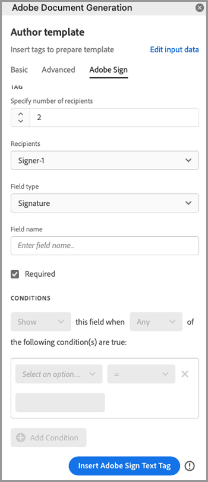
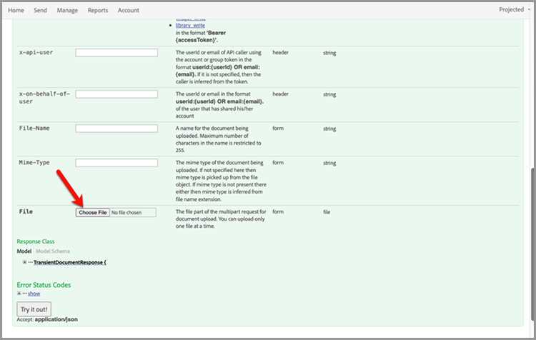

# 自动化法律工作流程


在理想的情况下，接受协议条款时无需进行任何修改。 但是，通常情况下，协议需要自定义，然后需要进行法律审查。 法律审查会造成高昂的成本，并减缓协议条款的交付过程。 使用预定义模板，这些模板会根据批准的语言进行更改，可帮助法律团队更好地管理协议条款并更安全地执行协议。

本教程使用各州之间不同的法律协议。 为了解决这些变体问题，将创建一个包含条件部分的协议模板，这些条件部分仅在满足特定条件时才会包含在内。 生成的文档可以是Word或PDF文档。 您还可以学习使用Adobe PDF Services API或Acrobat Sign保护文档的一些方法。

## 获取凭据

首先注册免费的Adobe PDF服务凭据：

1. 导航 [此处](https://documentcloud.adobe.com/dc-integration-creation-app-cdn/main.html) 注册您的凭据。
1. 使用您的Adobe ID登录。
1. 设置凭据名称。

   

1. 选择用于下载示例代码的语言（例如Node.js）。
1. 选中以同意 **[!UICONTROL 开发人员条款]**&#x200B;的
1. 选择 **[!UICONTROL 创建凭据]**的
使用包含用于身份验证的示例文件、pdfservices-api-credentials.json和private.key的ZIP文件将文件下载到您的计算机。

   

1. 选择 **[!UICONTROL 获取Microsoft Word加载项]** 或转到 [AppSource](https://appsource.microsoft.com/en-cy/product/office/WA200002654) 以安装。

   >[!NOTE]
   >
   >安装Word加载项需要您具有在Microsoft 365内安装加载项的权限。 如果您没有权限，请联系您的Microsoft 365管理员。

## 您的数据

在此场景中，将传送信息以帮助生成文档，并通知是否应包括某些部分：

```
{
    "customer": {
        "name": "Home Services Company",
        "street": "123 Any Street",
        "city": "Anywhere",
        "state": "CA",
        "zip": "12345",
        "country":"USA",
        "signer": {
            "email": "johnnyechostone@gmail.com",
            "firstName": "John",
            "lastName": "Echostone"
        }
    },
    "company": {
        "name": "Projected Consultants",
        "signer": {
            "email": "maryburostone@gmail.com",
            "firstName": "Mary",
            "lastName": "Burostone"
        }
    },
    "conditions": {
        "includeGeneralTerms": true,
        "includeConsumerDiscloure": true
    }
}
```

数据中包含有关客户、其姓名、签名者、所在状态等的信息。 此外，还有一些部分，介绍有关生成协议的公司的信息以及条件标志，用于包括协议的某些部分。

## 向文档中添加基本标签

此方案使用可下载的条款和条件文档 [此处](https://github.com/benvanderberg/adobe-document-generation-samples/blob/main/Agreement/exercise/TermsAndConditions_Sample.docx?raw=true)的


1. 打开 *TermsAndConditions.docx* Microsoft Word中的示例文档。
1. 如果 [文档生成](https://appsource.microsoft.com/en-cy/product/office/WA200002654) 如果插件已安装，请选择 **[!UICONTROL 文档生成]** 在功能区中。 如果您在功能区中看不到“文档生成”，请按照以下说明进行操作。
1. 选择 **[!UICONTROL 开始使用]**&#x200B;的
1. 将上面编写的JSON示例数据复制到“JSON数据”字段中。

   

导航至 *文档生成标记* 面板，用于在文档中放置标签。

## 插入公司名称

1. 选择要替换的文本。 在这种情况下，您将替换文档开头部分中的COMPANY。
1. 在 *文档生成标记*，请搜索“name”。
1. 在公司下，选择 *name*&#x200B;的

   

1. 选择 **[!UICONTROL 插入文本]**&#x200B;的

这将放置一个名为 `{{company.name}}` 因为标记位于JSON中的该路径下。

```
{
    "company": {
        "name": "Projected Consultants",
        ...
    }
    ...
}
```

接下来，在打开部分的客户文本中重复此步骤。 重复 **步骤1-4**，用“name”替换客户。 输出应为 `{{customer.name}}`，表明文本来自客户对象下方。

Adobe文档生成API还允许您在页眉和页脚中以及签名标题所需的最末尾添加标签。

再次使用 **步骤1-4** 页脚中的公司文本和客户文本。


最后，您需要 **重复步骤1-4** 在签名页面的“客户”部分下将“名字”和“姓氏”替换为以下标签： `{{customer.signer.firstName}}` 和 `{{customer.signer.lastName}}` 部分。 不必担心标签较长并会重排到下一行，因为生成文档时会替换标签。

文档的开始和页脚应如下所示：

* 起始部分：


* 页脚：


* 签名页面：


现在，您的标记已放置在文档中，您可以预览生成的协议。

## 预览生成的文档

您可以直接在Microsoft Word中，根据示例JSON数据预览生成的文档。

1. 在 *文档生成标记*，请选择 **[!UICONTROL 生成文档]**&#x200B;的
1. 系统可能会首次提示您使用Adobe ID登录。 选择 **[!UICONTROL 登录]** 并完成提示以使用您的凭据登录。

   

1. 选择 **[!UICONTROL 查看文档]**&#x200B;的

   

1. 此时会打开一个浏览器窗口，允许您预览文档结果。

   

## 为每个状态添加条件项

在下一部分中，您仅根据特定的输入数据标准设置了要包括的某些部分。 在示例文档中，第4节和第5节仅与特定状态有关。 对于此情景，当客户处于特定状态时，只应包含特定于状态的条款。 此外，如果该部分被删除，Microsoft Word中的编号不应包括该部分。 使用文档生成API的条件内容功能对此进行标记。


1. 在文档中，选择“加利福尼亚州披露”部分和所有子项目符号。

   

1. 在 *[!UICONTROL 文档生成标记]*，请选择 **[!UICONTROL 高级]**&#x200B;的
1. 扩展 **[!UICONTROL 条件内容]**&#x200B;的
1. 在 *[!UICONTROL 选择记录]* 字段、搜索和选择 **[!UICONTROL customer.state]**&#x200B;的
1. 在 *[!UICONTROL 选择运算符]* 字段，选择 **=**&#x200B;的
1. 在 *[!UICONTROL 值]* 字段，类型 *CA*&#x200B;的
1. 选择 **[!UICONTROL 插入条件]**&#x200B;的

该部分现在包含一些名为conditional-section标签的标签。 添加标签时，它可能添加了conditional-section标签作为编号行。 您可以通过在标签之前使用后间距来删除它，否则它会给项目编号，就像生成文档时标签不存在一样。 条件部分以 `` 标记。


**重复步骤1-7** 对于 *华盛顿信息披露* 部分，替换 *CA* 值 *WA* 表示仅在客户的状态为华盛顿时才显示此部分。


## 使用条件部分进行测试

条件部分准备就绪后，可通过选择 **生成文档**&#x200B;的

生成文档时，请注意其中包含的部分只是符合数据条件的部分。 在下面的示例中，由于该州等于CA，因此只包含California部分。


另一个显著变化是，后续部分“服务和软件的使用”的编号为5。 这意味着，当省略Washington部分时，编号将继续。


要测试在客户位于华盛顿而不是加利福尼亚州时模板是否正常运行，请更改模板的示例数据：

1. 在 *文档生成标记*，请选择 **[!UICONTROL 编辑输入数据]**&#x200B;的

   

1. 选择 **[!UICONTROL 编辑]**&#x200B;的

1. 在JSON数据中，更改 *CA* 来 *WA*&#x200B;的

   

1. 选择 **[!UICONTROL 生成标签]**&#x200B;的
1. 选择 **[!UICONTROL 生成文档]** 以重新生成文档。

请注意，本文档仅包含“华盛顿州”部分。


## 添加条件语句

与条件部分一样，您也可以包含满足特定条件的特定语句。 在本例中，加利福尼亚州和华盛顿州的返回策略有所不同。

1. 在第3.1节中，选择第一句“在华盛顿州购买时，必须在原始交易后的30天内通过邮件返回以获得全额退款。”
1. 在 *[!UICONTROL 文档生成标记]*，请选择 **[!UICONTROL 高级]**&#x200B;的
1. 扩展 **[!UICONTROL 条件内容]**&#x200B;的
1. 在 *[!UICONTROL 内容类型]*，请选择 **[!UICONTROL 短语]**&#x200B;的
1. 在 *[!UICONTROL 选择记录]* 字段、搜索和选择 **[!UICONTROL customer.state]**&#x200B;的
1. 在 *[!UICONTROL 选择运算符]* 字段，选择 **=**&#x200B;的
1. 在 *[!UICONTROL 值]* 字段，类型 *CA*&#x200B;的
1. 选择 **[!UICONTROL 插入条件]**&#x200B;的

虽然标签的名称相同，但“短语”和“章节”之间的主要区别是：短语中的章节不包括新行。 condition-section标签和 — end-section标签必须位于同一段落中。


## 为Acrobat Sign添加标签

Acrobat Sign允许您发送协议以请求签名，或将其嵌入到Web体验中，以使他人能够轻松查看和签名。 Microsoft Word中的“Adobe文档生成标记”允许您在文档与Acrobat Sign一起发送之前，轻松地对文档进行预标记，以便始终将签名放在正确的位置。 在这种情况下，有两个签名者需要有一个位置来签名文档并设置日期。

1. 导航到客户必须签名的位置。
1. 将光标放在需要签名的地方。

   

1. 在 *[!UICONTROL 文档生成标记]*，请选择 **[!UICONTROL Adobe Sign]**&#x200B;的
1. 在 *[!UICONTROL 指定收件人数量]* 字段中，设置收件人的数量（此示例使用2）。
1. 在 *[!UICONTROL 收件人]* 字段，选择 **[!UICONTROL Signer-1]**&#x200B;的
1. 在 *[!UICONTROL 字段]* 文字，选择 **[!UICONTROL 签名]**&#x200B;的
1. 选择 **[!UICONTROL 插入Adobe Sign文本标记]**&#x200B;的

   

>[!NOTE]
>
>如果 **插入Adobe Sign文本标记** 按钮似乎缺失，向下滚动。

这会将签名字段放置在第一位签名者需要签名的位置。


接下来，为将在签名时自动填充的签名者放置一个数据字段。

1. 将光标移动到日期应放置的位置。

   

1. 将“字段类型”设置为“日期”。
1. 选择 **[!UICONTROL 插入Adobe Sign文本标记]**&#x200B;的

放置的“日期”标签相当长： `{{Date 3_es_:signer1:date:format(mm/dd/yyyy):font(size=Auto)}}`的 Acrobat Sign文本标记必须保持在同一行上，这与“文档生成”标记不同。 在 `:format()` 和 `font()` 参数是可选的，因此对于这种情况，我们可以将标签缩短到 `{{Date 3_es_:signer1:date}}`的

重复上述步骤 *公司签名* 部分。 执行此操作时，您必须将收件人字段更改为 **签名者–2**&#x200B;否则，所有签名字段都将分配给同一人。

## 生成协议

现在，您已经为您的文档添加了标签，并且准备开始使用。 在下一部分中，了解如何使用Node.js的文档生成API示例生成文档。 这些范例支持多种语言。

打开注册凭据时下载的pdfservices-node-sdk-samples-master文件。 这些文件包括pdfservices-api-credentials.json和private.key文件。

1. 打开您的 **[!UICONTROL 终端]** 要使用 `npm install`的
1. 复制您的样本 *data.json* 到 *资源* 文件夹。
1. 将您创建的Word模板复制到 *资源* 文件夹。
1. 在名为samples文件夹的根目录中创建新文件 *generate-salesOrder.js*&#x200B;的

   ```
   const PDFServicesSdk = require('@adobe/pdfservices-node-sdk').
   const fs = require('fs');
   const path = require('path');
   
   var dataFileName = path.join('resources', '<INSERT JSON FILE');
   var outputFileName = path.join('output', 'salesOrder_'+Date.now()+".pdf");
   var inputFileName = path.join('resources', '<INSERT DOCX>');
   
   //Loads credentials from the file that you created.
   const credentials =  PDFServicesSdk.Credentials
      .serviceAccountCredentialsBuilder()
      .fromFile("pdfservices-api-credentials.json")
      .build();
   
   // Setup input data for the document merge process
   const jsonString = fs.readFileSync(dataFileName),
   jsonDataForMerge = JSON.parse(jsonString);
   
   // Create an ExecutionContext using credentials
   const executionContext = PDFServicesSdk.ExecutionContext.create(credentials);
   
   // Create a new DocumentMerge options instance
   const documentMerge = PDFServicesSdk.DocumentMerge,
   documentMergeOptions = documentMerge.options,
   options = new documentMergeOptions.DocumentMergeOptions(jsonDataForMerge, documentMergeOptions.OutputFormat.PDF);
   
   // Create a new operation instance using the options instance
   const documentMergeOperation = documentMerge.Operation.createNew(options)
   
   // Set operation input document template from a source file.
   const input = PDFServicesSdk.FileRef.createFromLocalFile(inputFileName);
   documentMergeOperation.setInput(input);
   
   // Execute the operation and Save the result to the specified location.
   documentMergeOperation.execute(executionContext)
   .then(result => result.saveAsFile(outputFileName))
   .catch(err => {
      if(err instanceof PDFServicesSdk.Error.ServiceApiError
         || err instanceof PDFServicesSdk.Error.ServiceUsageError) {
         console.log('Exception encountered while executing operation', err);
      } else {
         console.log('Exception encountered while executing operation', err);
      }
   });
   ```

1. 替换 `<JSON FILE>` 在/resources中使用JSON文件的名称。
1. 替换 `<INSERT DOCX>` DOCX文件的名称。
1. 要运行，请使用 **[!UICONTROL 终端]** 执行节点 `generate-salesOrder.js`的

输出文件位于/output文件夹中，并且文档生成正确。

您可以通过更改下面的行来更改格式。 如果要发送此文档供其他人在Word中编辑或进行合同审阅，DOCX格式会很有用。

PDF:

```
options = new documentMergeOptions.DocumentMergeOptions(jsonDataForMerge,
documentMergeOptions.OutputFormat.PDF);
```

Word:

```
options = new documentMergeOptions.DocumentMergeOptions(jsonDataForMerge, documentMergeOptions.OutputFormat.DOCX);
```

您还必须将输出文件的名称分别更改为.pdf或.docx(对于PDF或DOCX输出格式):

```
var outputFileName = path.join('output', 'salesOrder_'+Date.now()+".docx");
```

## 发送协议以请求签名

[Adobe Acrobat Sign](https://www.adobe.com/cn/sign.html) 允许您向一个或多个收件人发送协议，以便他们查看和签署文档。 除了在发送文档以供签名方面易于使用的用户体验之外，REST API还允许您采用Word、PDF、HTML和其他格式并发送它们以供签名。

以下示例将逐步介绍如何使用REST API文档页面来获取以前生成的文档并发送它以供签名。 首先，了解如何通过Acrobat Sign Web界面执行此操作，以及如何使用REST API执行此操作。

## 获取Acrobat Sign帐户

如果您没有Acrobat Sign帐户，请注册一个开发人员帐户并查看文档 [此处](https://developer.adobe.com/adobesign-api/)，然后选择。 **开发人员帐户注册**&#x200B;的 系统会提示您填写表单并收到验证电子邮件。 执行此操作后，您将被引导到一个网站以设置密码和帐户，然后您可以通过该网站登录到Acrobat Sign。

## 从Web界面发送协议

1. 选择 **[!UICONTROL 发送]** 工具栏内。

   

1. 在 *收件人* 字段中，指定两个电子邮件地址。 最佳做法是使用未与您的Acrobat Sign帐户关联的电子邮件地址。

   

1. 设置 **[!UICONTROL 协议名称]** 和 **[!UICONTROL 消息]**&#x200B;的
1. 选择 **[!UICONTROL 添加文件]** 并从计算机上传生成的文件。
1. 选择&#x200B;**[!UICONTROL 预览并添加签名字段]**。
1. 选择&#x200B;**[!UICONTROL 下一步]**。
1. 向下滚动到签名页面时，您可以看到基于标签放置的签名字段。

   

1. 选择&#x200B;**[!UICONTROL 发送]**。
1. 在您的电子邮件中，会显示一条消息，其中包含可查看和签名的链接。

   

1. 选择 **[!UICONTROL 审阅并签名]**&#x200B;的
1. 选择 **[!UICONTROL 继续]** 接受使用条款。
1. 选择 **[!UICONTROL 开始]** 跳到需要签名的位置

   

1. 选择 **[!UICONTROL 单击此处进行签名]**&#x200B;的

   

1. 键入您的签名。

   

1. 选择 **[!UICONTROL 应用]**&#x200B;的
1. 选择 **[!UICONTROL 单击以签名]**&#x200B;的

系统会向下一个签名者发送一封电子邮件。 重复步骤9-16以查看并签名第二位签名者。

协议完成后，系统会通过电子邮件将已签名的协议副本发送给协议各方。 此外，签名协议可从 **管理** 页面。


接下来，了解如何通过REST API文档执行相同的方案。

## 获取凭据

1. 导航至 [Acrobat Sign REST文档](https://secure.na1.adobesign.com/public/docs/restapi/v6)的
1. 扩展 *transientDocuments* 和 [POST/transientDocuments](https://benprojecteddemo.na1.adobesign.com/public/docs/restapi/v6#!/transientDocuments/createTransientDocument)的
1. 选择 **[!UICONTROL OAUTH ACCESS-TOKEN]**&#x200B;的

   

1. 检查OAUTH权限 *agreement_write*, *agreement_sign*, *widget_write*&#x200B;和 *library_write*&#x200B;的
1. 选择 **[!UICONTROL 授权]**&#x200B;的
1. 系统通过弹出窗口提示您使用Acrobat Sign帐户登录。 登录以使用管理员的用户名和密码。
1. 系统会提示您允许访问REST文档。 选择 **[!UICONTROL 允许访问]**&#x200B;的

然后，将持有者令牌添加到 **授权** 字段。

要了解有关如何为Acrobat Sign创建授权令牌的更多信息，您可以按照下述步骤操作 [此处](https://opensource.adobe.com/cn/acrobat-sign/developer_guide/helloworld.html)的

## 上传临时文档

由于在前面的步骤中添加了授权令牌，因此您需要上传文档才能进行API调用：

1. 在 *文件* 字段，上传PDF在先前步骤中生成的文档。

   

1. 选择 **[!UICONTROL 尝试一下！]**&#x200B;的
1. 在 **[!UICONTROL 响应正文]**，复制 *transientDocumentId* 值。

在 *transientDocumentId* 用于引用临时存储在Acrobat Sign中的文档，以便在后续API调用中引用该文档。

## 发送以请求签名

上载文档后，您需要发送协议以请求签名。

1. 展开协议部分和POST协议部分。
1. 在 *AgreementInfo* 字段中，使用以下JSON填充它：

   ```
   {
   "fileInfos": [
      {
         "transientDocumentId": "3AAABLblqZhAJeoswpyslef8_toTGT1WgBLk3TlhfJXy_uSLlKyre2hjF0-J1meBDn0PlShk0uQy6JghlqEoqXNnskq7YawteF6QWtHefP9wN2CW_Xbt0O9kq1tkpznG0a5-mEm4bYAV1FGOnD1mt_ooYdzKxm7KzTB11DLX2-81Zbe2Z1suy7oXiWNR3VSb-zMfIb5D4oIxF8BiNfN0q08RwT108FcB1bx4lekkATGld3nRbf8ApVPhB72VNrAIF0F1rAFBWTtfgvBKZaxrYSyZq73R_neMdvZEtxWTk5fii_bLVe7VdNZMcO55sofH61eQC_QIIsoYswZP4rw6dsTa68ZRgKUNs"
      }
   ],
   "name": "Terms and Conditions",
   "participantSetsInfo": [
      {
         "memberInfos": [
         {
            "email": "adobesigndemo+customer@outlook.com"
         }
         ],
         "order": 1,
         "role": "SIGNER"
      },
      {
         "memberInfos": [
            {
               "email": "adobesigndemo+company@outlook.com"
            }
         ],
         "order": 1,
         "role": "SIGNER"
         }
   ],
   "signatureType": "ESIGN",
   "state": "IN_PROCESS"
   }
   ```

1. 选择 **[!UICONTROL 尝试一下！]**&#x200B;的

**POST协议API** 返回协议的ID。 要获取JSON模型架构的模板，请选择 **最小模型架构**&#x200B;的 完整的参数列表位于 **完成模型架构** 部分。

## 检查协议的状态

拥有协议ID后，您可以发送协议状态。

1. 扩展 **[!UICONTROL GET/agreements/{agreementId}]**&#x200B;的
1. 由于可能需要其他OAUTH作用域，请选择 **[!UICONTROL OAUTH-ACCESS-TOKEN]** 提示。
1. 将上一个API调用响应中的agreementId复制到agreementId字段中。
1. 选择 **[!UICONTROL 立即试用！]**&#x200B;的

现在，您就可以获得有关该协议的信息。

```
{
    "id": "CBJCHBCAABAAc6LyP4SVuKXP_pNstzIzyripanRdz4IB",
    "name": "Terms and Conditions",
    "groupId": "CBJCHBCAABAAoyMb1yIgczAGhBuJeHf99mglPtM7ElEu",
    "type": "AGREEMENT",
    "participantSetsInfo": [
      {
        "id": "CBJCHBCAABAAzZE-IcHHkt05-AVbxas4Jz7DUl3oEBO6",
        "memberInfos": [
          {
            "email": "adobesigndemo+customer@outlook.com",
            "id": "CBJCHBCAABAAyWgMMReqbxUFM7ctI5xz16c2kOmEy-IQ",
            "securityOption": {
              "authenticationMethod": "NONE"
            }
          }
        ],
        "role": "SIGNER",
        "order": 1
      },
      {
        "id": "CBJCHBCAABAAaRHz3gY2W0w5n_6pj1GMMuZAfhBihc1j",
        "memberInfos": [
          {
            "email": "adobesigndemo+company@outlook.com",
            "id": "CBJCHBCAABAAOZQwjPwJXFiX8YDKPYtzMpftsmxYrIo9",
            "securityOption": {
              "authenticationMethod": "NONE"
            }
          }
        ],
        "role": "SIGNER",
        "order": 1
      }
    ],
    "senderEmail": "adobesigndemo+new@outlook.com",
    "createdDate": "2022-03-22T02:59:36Z",
    "lastEventDate": "2022-03-22T02:59:41Z",
    "signatureType": "ESIGN",
    "locale": "en_US",
    "status": "OUT_FOR_SIGNATURE",
    "documentVisibilityEnabled": true,
    "hasFormFieldData": false,
    "hasSignerIdentityReport": false,
    "documentRetentionApplied": false
  }
```

通过Webhook可以更有效地获取更新发生时的通知，您可以了解有关 [此处](https://opensource.adobe.com/acrobat-sign/developer_guide/webhookapis.html)。

## 存储已签名的文档

签署文档后，可使用GET/agreements/combinedDocument文件检索文档。

1. 扩展 **[!UICONTROL GET/agreements/{agreementId}/combinedDocument]**&#x200B;的
1. 设置 **[!UICONTROL agreementId]** 到 *agreementId* 前一个API调用中提供的。
1. 选择 **[!UICONTROL 立即试用！]**&#x200B;的

使用attachSupportingDocuments和attachAuditReport参数可以设置附加审计报告或支持文档的其他参数。

在 **响应正文**，然后可将其下载到您的计算机中并存储到您喜欢的位置。

## 更多选项

除了生成文档并发送文档以供签名之外，还提供了其他操作。

例如，如果文档没有签名，则Adobe PDF Services API提供了许多在生成协议后转换文档的方法，例如：

* 使用密码保护文档
* 压缩PDF（如果有大型图像）
* 要了解有关其他可用操作的更多信息，请查看适用于Adobe PDF Services API的示例文件的/src文件夹中的脚本。 您还可以通过查看文档了解更多有用的操作。

此外，Acrobat Sign还提供了一些附加功能，例如：

* 将签名体验嵌入到应用程序中
* 为签名者添加身份验证方法
* 配置电子邮件通知设置
* 作为协议的一部分下载单独的文档

## 进一步学习

有兴趣了解更多信息？ 了解一些其他使用方法 [!DNL Adobe Acrobat Services]:

* 了解更多信息 [文档](https://developer.adobe.com/cn/document-services/docs/overview/)
* 查看有关Adobe Experience League的更多教程
* 使用/src文件夹中的示例脚本查看如何使用PDF
* 关注 [Adobe技术博客](https://medium.com/adobetech/tagged/adobe-document-cloud) 了解最新提示和技巧
* 订购 [纸质剪辑（每月实时流）](https://www.youtube.com/playlist?list=PLcVEYUqU7VRe4sT-Bf8flvRz1XXUyGmtF) 要了解如何使用 [!DNL Adobe Acrobat Services]的
