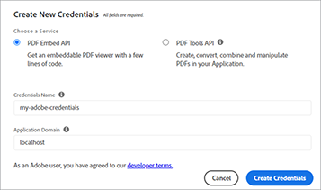

# 数字文档发布


电子文档随处可见，事实上，电子文档可能是 [数万亿的PDF](https://itextpdf.com/en/blog/technical-notes/do-you-know-how-many-pdf-documents-exist-world) 在全球范围内，这个数字每天都在上升。 通过在网页中嵌入PDF查看器，用户无需重新设计HTML和CSS或阻止访问网站即可查看文档。

下面我们就来了解一个流行的情景。 公司发布 [网站上的白皮书](https://www.adobe.io/apis/documentcloud/dcsdk/digital-content-publishing.html)
为他们的应用程序和服务提供上下文。 该网站的营销人员希望更好地了解用户如何与其基于PDF的内容进行交互，并将此内容与其网页和品牌相结合。 他们已决定将白皮书作为 [封闭式内容](https://whatis.techtarget.com/definition/gated-content-ungated-content#:~:text=Gated%20content%20is%20online%20materials,about%20their%20jobs%20and%20organizations.)、控制谁可以下载它们。

## 您可以学到的内容

在本实际操作教程中，学习如何使用 [Adobe PDF Embed API](https://www.adobe.io/apis/documentcloud/dcsdk/pdf-embed.html)，这是免费且易于使用的。 这些示例使用一些JavaScript、Node.js、Express.js、HTML和CSS。 您可以在以下位置查看完整的项目代码： [GitHub](https://www.google.com/url?q=https://github.com/marcelooliveira/EmbedPDF/tree/main/pdf-app&amp;sa=D&amp;source=editors&amp;ust=1617129543031000&amp;usg=AOvVaw2rzSwYuJ_JI7biVIgbNMw1)的

## 相关API和资源

* [PDF嵌入API](https://www.adobe.com/devnet-docs/dcsdk_io/viewSDK/index.html)

* [PDF服务API](https://opensource.adobe.com/pdftools-sdk-docs/release/latest/index.html)

* [项目代码](https://www.google.com/url?q=https://github.com/marcelooliveira/EmbedPDF/tree/main/pdf-app&amp;sa=D&amp;source=editors&amp;ust=1617129543031000&amp;usg=AOvVaw2rzSwYuJ_JI7biVIgbNMw1)

## 创建节点Web应用程序

让我们先使用Node.js和Express创建一个站点，它使用了一个好看的模板并提供几个可供下载的PDF。

首先， [下载并安装Node.js](https://nodejs.org/en/download/)的

若要使用最少的Web应用程序结构轻松创建Node.js项目，请安装应用程序生成器工具 `` `express-generator` ``的

```
npm install express-generator -g
```

接下来，创建名为pdf-app的新Express应用程序，选择它作为视图引擎。

```
express pdf-app --view=ejs
```

现在，移至\\pdf-app目录并安装所有项目依赖项。

```
cd pdf-app
npm install
```

然后，启动本地Web服务器并运行应用程序。

```
npm start
```

最后，打开位于 <http://localhost:3000>的


您现在拥有一个基本的网站。

## 渲染白皮书数据

要将白皮书发布到网站，将在网站上定义并准备白皮书数据，以显示这些文档。 首先，在项目根目录下创建一个新的\\data文件夹。 有关可用白皮书的信息来自名为 [data.json](https://github.com/marcelooliveira/EmbedPDF/blob/main/pdf-app/data/data.json)，该文件夹位于数据文件夹中。

要为Web应用程序提供优雅、精致的外观，请安装 [Bootstrap](https://getbootstrap.com/) 和 [Font Awesome](https://fontawesome.com/) 前端库。

```
npm install bootstrap
npm install font-awesome
```

打开app.js文件并将这些目录作为静态文件的源包含在 `` `express.static` `` 行。

```
app.use(express.static(path.join(__dirname, '/node_modules/bootstrap/dist')));
app.use(express.static(path.join(__dirname, '/node_modules/font-awesome')));
```

要包含PDF文档，请在项目的\\public文件夹下创建一个名为\\pdfs的文件夹。 您可以从Dreamweaver中复制PDF和缩览图，而不是自己创建它们 [GitHub存储库文件夹](https://github.com/marcelooliveira/EmbedPDF/tree/main/pdf-app/public) 添加到\\pdfs和\\image文件夹中。

\\public\\pdfs文件夹现在包含PDF文档：


而\\public\\images文件夹应包含每个文档的PDF图：


现在，打开\\routs\\index.js文件，其中包含路由主页的逻辑。 要使用data.json文件中的白皮书数据，您必须加载负责访问文件系统并与之交互的Node.js模块。 然后，声明 `fs` \\routs\\index.js文件第一行中的常量，如下所示：

```
const fs = require('fs');
```

然后，阅读和分析data.json文件，并将其存储在papers变量中：

```
let rawdata = fs.readFileSync('data/data.json');
let papers = JSON.parse(rawdata);
```

现在，修改该行以调用索引视图的渲染方法，并将纸张集合作为索引视图的模型传递。

```
res.render('index', { title: 'Embedding PDF', papers: papers });
```

要在主页上呈现白皮书集合，请打开\\views\\index.ejs文件，并用项目的 [索引文件](https://github.com/marcelooliveira/EmbedPDF/blob/main/pdf-app/views/index.ejs)的

现在，重新运行npm开始并打开 <http://localhost:3000> 查看可用白皮书集合。


接下来的部分将涉及改进网站和使用 [PDF嵌入API](https://www.adobe.io/apis/documentcloud/dcsdk/pdf-embed.html) 以显示PDF文档网页。 PDF嵌入API可免费使用 — 您只需获取API凭据即可。

## 获取PDF嵌入API凭据

要获取免费的PDF嵌入API凭据，请访问 [开始使用](https://www.adobe.io/apis/documentcloud/dcsdk/gettingstarted.html) 页面。

单击 **创建新凭据** 然后 **开始使用：**


此时，如果您没有免费帐户，则需要注册一个帐户。

选择 **PDF嵌入API**，然后键入您的凭据名称和应用程序域。 使用 **localhost** 域。



单击 **创建凭据** 按钮，以访问您的PDF凭据并获取客户端ID（API密钥）。


在Node.js项目中，在应用程序的根文件夹中创建名为.ENV的文件，并使用上一步骤中API KEY凭据的值声明PDF嵌入客户端ID的环境变量。

```
PDF_EMBED_CLIENT_ID=**********************************************
```

之后，您会使用此客户端ID访问PDF嵌入API。 安装dotenv包以使用Node.js代码访问此环境变量。

```
npm install dotenv
```

现在，打开app.js文件并在文件顶部添加以下行，以便Node.js可以加载dotenv模块：

```
require('dotenv').config();
```

## 在WebPDF中显示应用程序

现在，使用PDF嵌入API可以显示PDF在网站上。 打开实时视图 [PDF嵌入API演示](https://documentcloud.adobe.com/view-sdk-demo/index.html#/view/FULL_WINDOW/Bodea%20Brochure.pdf)的


在左侧面板上，您可以选择最符合网站需求的嵌入模式：

* **完整窗口**:PDF涵盖所有网页空间

* **大小容器**:该PDF以有限大小的div在网页内显示，一次显示一页

* **内联**:整个PDF显示在网页内的div中

* **Lightbox**:该PDF显示为网页顶部的图层

建议对白皮书使用内嵌模式，稍后使用代码生成器将PDF嵌入应用程序。

## 创建内嵌模式页面

要将PDF查看器嵌入您的网页中并同时显示所有页面，请使用内嵌模式创建新页面。

使用EJS视图引擎在文件\\views\\in-line.ejs中创建新视图。

```
<! html DOCTYPE >
<html>
<head>
<title>
<%= title %>
</title>
<link rel='stylesheet' href='/stylesheets/style.css' />
<link rel='stylesheet' href='/css/bootstrap.min.css'/>
<link rel='stylesheet' href='/css/font-awesome.min.css' />
<style type="text/css">
p {
font-family: 'Gill Sans', 'Gill Sans MT', Calibri, 'Trebuchet MS', sans-serif
}
</style>
</head>
<body class="m-0">
<div>
<main>
<div class="row">
<div class="col-sm-3"></div>
<div class="col-sm-6">
<h3>
<p class="text-center">Grow your business, establish your brand,<br
/>
```

将客户放在第一位。

```
</p>
</h3>
<div>
<p class="text-center">Lorem ipsum dolor sit amet, consectetur adipiscing elit, sed do<br />
eiusmod tempor incididunt ut labore et dolore</p>
</div>
</div>
</main>
<footer>
<div class="row">
<div class="col-sm-3"></div>
<div class="col-sm-6">
<p class="text-center">Bodea Inc. Your trusted partner since 2008</p>
</div>
</div>
</footer>
</div>
</div>
</body>
</html>
```

然后，修改\\views\\index.ejs以创建用于打开内联视图的按钮。

```
<div class="card-body">
<h5 class="card-title">
<span>
<%= paper.title %>
</span>
</h5>
<p>
<a class="btn btn-sm btn btn-danger" href="/in-line/<%=
paper.id %>">
<span type="button"></span>
<span class="fa fa-file-pdf-o"></span>&nbsp;View Document</button>
</a>
</p>
</div>
```

打开app.js文件，在indexRouter声明后声明一个新路由器：

```
var indexRouter = require('./routes/index');
var inLineRouter = require('./routes/in-line');
```

然后在app.use(&#39;/&#39;, indexRouter)之后添加此代码；要将内嵌模式视图与其路由器相关联，请执行以下操作：

```
app.use('/', indexRouter);
app.use('/in-line', inLineRouter);
```

现在，在\\routs下创建一个新的in-line.js文件，以创建新的路由器逻辑。 包括Express，一种启用Web应用程序后端节点模块。

```
var express = require('express');
const fs = require('fs');
var router = express.Router();
```

接下来，创建处理特定白皮书ID的GET请求并呈现in-line.ejs视图的端点。

```
router.all('/:id', function(req, res, next) {
let rawdata = fs.readFileSync('data/data.json');
let papers = JSON.parse(rawdata);
let paper = papers.filter(p => p.id == parseInt(req.params.id))[0];
res.render('in-line', { title: paper.title, paper: paper });
});
module.exports = router;
```

请再次查看 [实时演示](https://documentcloud.adobe.com/view-sdk-demo/index.html#/view/FULL_WINDOW/Bodea%20Brochure.pdf) 自动生成PDF嵌入API代码。 单击 **内联** 从左侧面板中：


单击 **生成代码** 查看显示“HTML大小”容器查看器所需的PDF代码。


单击 **复制代码** 并将代码粘贴到in-line.ejs文件中。

```
<div>
<p class="text-center">Lorem ipsum dolor sit amet, consectetur adipiscing elit, sed do<br />
eiusmod tempor incididunt ut labore et dolore</p>
</div>
<div class="row align-items-center border border-primary">
<div id="adobe-dc-view" style="width: 800px;"></div>
<script src="https://documentcloud.adobe.com/view-sdk/main.js"></script>
<script type="text/javascript">
document.addEventListener("adobe_dc_view_sdk.ready", function(){
var adobeDCView = new AdobeDC.View({clientId: "<YOUR_CLIENT_ID>", divId: "adobe-dc-view"});
adobeDCView.previewFile({
content:{location: {url: "https://documentcloud.adobe.com/view-sdk-demo/PDFs/Bodea Brochure.pdf"}},
metaData:{fileName: "Bodea Brochure.pdf"}
}, {embedMode: "IN_LINE"});
});
</script>
</div>
```

但是，文档参数仍然采用硬编码。 让我们使用EJS括号语法(\&lt;%= someValue %\>)替换它们，以便根据白皮书模型数据渲染页面。

```
<div id="adobe-dc-view" style="width: 800px;"></div>
<script src="https://documentcloud.adobe.com/view-sdk/main.js"></script>
<script type="text/javascript">
document.addEventListener("adobe_dc_view_sdk.ready", function () {
var adobeDCView = new AdobeDC.View({ clientId: "<%=process.env.PDF_EMBED_CLIENT_ID %>", divId: "adobe-dc-view" });
adobeDCView.previewFile({
content: { location: { url: "<%= paper.pdf %>" } },
metaData: { fileName: "<%= paper.fileName %>" }
}, {
embedMode: "IN_LINE"
});
});
</script>
```

现在，使用npm start命令运行应用程序，并打开位于 <http://localhost:3000>的


最后，选择一个白皮书，然后单击 **查看文档** 要打开具有内嵌式页面的新页面，请执行以下PDF:


请注意“下载PDF”和“打印PDF”选项现在如何显示。


您希望控制后端上的这些标志。 之后，您可以根据用户身份实施授权控制，并根据业务规则限制访问。 此处不需要这种复杂性，因此我们只需修改\\routs\\in-line.js ，在模型对象中包含经过身份验证的属性和权限属性。

```
let authenticated = false;
res.render('in-line', {
title: paper.title,
paper: paper,
authenticated: authenticated,
permissions: {
showDownloadPDF: true,
showPrintPDF: true,
showFullScreen: true
}
});
```

然后，修改\\views\\in-line.ejs以便您的网页可以呈现来自后端的标志值。

```
embedMode: "IN_LINE",
showDownloadPDF: <%= permissions.showDownloadPDF %>,
showPrintPDF: <%= permissions.showPrintPDF %>,
showFullScreen: <%= permissions.showFullScreen %>
Now, open the in-line.js route file and modify it to disallow the printing, downloading, and full-screen controls.
permissions: {
showDownloadPDF: false,
showPrintPDF: false,
showFullScreen: false
}
```

然后，重新运行应用程序以查看此更改在PDF查看器中的反映。


## 创建封闭内容

根据最终用户场景，公司网站的营销人员希望更好地了解用户如何与基于PDF的内容进行交互，并将内容与其网页和品牌的其他部分结合在一起。

我们的重点是PDF嵌入，因此您不会创建用户身份验证功能。 相反，只需使用一个接受某些用户信息的Web表单实现一个简单的虚假付费专栏，然后在用户提交表单后显示PDF文档。

将\\routs\\in-line.js文件替换为以下内容，为视图模型提供用户信息：

```
var express = require('express');
const fs = require('fs');
var router = express.Router();
router.all('/:id', function(req, res, next) {
let rawdata = fs.readFileSync('data/data.json');
let papers = JSON.parse(rawdata);
let paper = papers.filter(p => p.id == parseInt(req.params.id))[0];
let authenticated = false;
let user = {};
if (req.body.firstName) {
user = {
firstName: req.body.firstName,
lastName: req.body.lastName,
jobTitle: req.body.jobTitle,
email: req.body.email,
};
authenticated = true;
}
res.render('in-line', {
title: paper.title,
paper: paper,
user: user,
authenticated: authenticated,
permissions: {
showDownloadPDF: false,
showPrintPDF: false,
showFullScreen: false
}
});
});
module.exports = router;
```

然后，将\\views\\in-line.ejs内容替换为下面的代码。 它显示用户数据表单或PDF查看器，具体取决于它是经过身份验证的用户。

```
<!DOCTYPE html>
<html>
<head>
<title>
<%= title %>
</title>
<link rel='stylesheet' href='/css/bootstrap.min.css'/>
<link rel='stylesheet' href='/css/font-awesome.min.css' />
<style type="text/css">
p {
font-family: 'Gill Sans', 'Gill Sans MT', Calibri, 'Trebuchet MS', sans-serif
}
</style>
</head>
<body class="m-0">
<% if (authenticated) { %>
<header class="bg-dark text-white">
<div class="text-right mr-4">Hello, <%= user.firstName %> <%= user.lastName%></div>
</header>
<% } %>
<div>
<main>
<div class="row">
<div class="col-sm-3"></div>
<div class="col-sm-6">
<h3>
<p class="text-center">Grow your business, establish your brand,<br
/>
```

将客户放在第一位。

```
</p>
</h3>
<div>
<p class="text-center">Lorem ipsum dolor sit amet, consectetur adipiscing elit, sed do<br />
eiusmod tempor incididunt ut labore et dolore</p>
</div>
<% if (!authenticated) { %>
<div class="row">
<form method="POST" class="center-panel text offset-md-3 col-md-6 border">
<fieldset class="offset-md-1">
<legend>Submit your info to<br/>access the whitepaper</legend>
<p><input name="firstName" placeholder="first name"/></p>
<p><input name="lastName" placeholder="last name"/></p>
<p><input name="jobTitle" placeholder="job title"/></p>
<p><input name="email" placeholder="email"/></p>
<p><button type="submit" class="btn btn-sm btn btn-primary">Submit</button></p>
</fieldset>
</form>
</div>
<% } %>
<% if (authenticated) { %>
<div class="row align-items-center border border-primary">
<div id="adobe-dc-view" style="width: 800px;"></div>
<script src="https://documentcloud.adobe.com/view-sdk/main.js"></script>
<script type="text/javascript">
document.addEventListener("adobe_dc_view_sdk.ready", function () {
var adobeDCView = new AdobeDC.View({ clientId: "<%=process.env.PDF_EMBED_CLIENT_ID %>", divId: "adobe-dc-view" });
adobeDCView.previewFile({
content: { location: { url: "<%= paper.pdf %>" } },
metaData: { fileName: "<%= paper.fileName %>" }
}, {
embedMode: "IN_LINE",
showDownloadPDF: <%= permissions.showDownloadPDF %>,
showPrintPDF: <%= permissions.showPrintPDF %>,
showFullScreen: <%= permissions.showFullScreen %>
});
});
</script>
<% } %>
</div>
</div>
</main>
<footer>
<div class="row">
<div class="col-sm-3"></div>
<div class="col-sm-6">
<p class="text-center">Bodea Inc. Your trusted partner since 2008</p>
</div>
</div>
</footer>
</div>
</div>
</body>
</html>
```


现在，站点访问者只能在提交PDF的信息后访问网站：


## 启用事件

让我们了解如何轻松地将PDF查看器事件与您的应用程序集成在一起，为营销人员收集分析数据。 要使用PDFEmbedAPI扩展查看器，请在声明adobeDCView变量后以及在调用previewFile方法之前，添加以下代码行：

```
var adobeDCView = new AdobeDC.View({ clientId: "<%=process.env.PDF_EMBED_CLIENT_ID %>", divId: "adobe-dc-view" });
adobeDCView.registerCallback(
AdobeDC.View.Enum.CallbackType.EVENT_LISTENER,
function(event) {
console.log(event);
},
{ enablePDFAnalytics: true }
);
```

现在，请重新运行该应用程序并打开Web浏览器的开发人员工具以查看事件数据。


您可以将此数据发送到 [Adobe Analytics](https://www.adobe.io/apis/documentcloud/dcsdk/docs.html?view=view) 或其他分析工具。

## 后续步骤

[!DNL Acrobat Services] API可帮助开发人员使用以PDF为中心的工作流程轻松解决数字出版挑战。 您已经了解如何创建示例Node Web应用程序以显示白皮书集合。 然后，获取 [免费API凭据](https://www.adobe.io/apis/documentcloud/dcsdk/gettingstarted.html) 并限制对白皮书的访问，这可以显示在四张白皮书中 [嵌入模式](https://documentcloud.adobe.com/view-sdk-demo/index.html#/view/FULL_WINDOW/Bodea%20Brochure.pdf)的

整合此工作流程可帮助 [假想营销人员](https://www.adobe.io/apis/documentcloud/dcsdk/digital-content-publishing.html) 收集潜在客户联系信息，以换取白皮书下载和查看有关谁在与PDF进行交互的统计信息。 您可以将这些功能整合到您的网站中，以推动并监控用户参与度。

如果您是Angular或React开发人员，您可能喜欢尝试 [其他示例](https://github.com/adobe/pdf-embed-api-samples) 介绍如何将PDF嵌入API与React和Angular项目集成。

Adobe使您能够通过创新解决方案构建端到端客户体验。 签出 [Adobe PDF Embed API](https://www.adobe.io/apis/documentcloud/viesdk) 免费。 要了解您还可以做什么，请尝试Adobe PDF Services API [随用随付](https://www.adobe.io/apis/documentcloud/dcsdk/pdf-pricing.html)[结冰](https://www.adobe.io/apis/documentcloud/dcsdk/pdf-pricing.html)的

[开始使用](https://www.adobe.io/apis/documentcloud/dcsdk/gettingstarted.html) 与 [!DNL Adobe Acrobat Services] API（即今日）。
