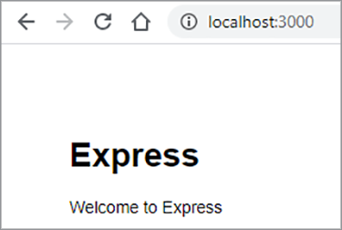

# 数字文档发布


电子文档无处不在 — 事实上，全球大概有[万亿个PDF](https://itextpdf.com/en/blog/technical-notes/do-you-know-how-many-pdf-documents-exist-world)，这个数字每天都在上升。 通过在网页中嵌入PDF查看器，用户可以查看文档，而无需重新设计HTML和CSS或阻止访问您的网站。

让我们来了解一个大众情景。 一家公司在其网站上发布了[白皮书](https://developer.adobe.com/document-services/use-cases/content-publishing/digital-content-publishing)
为其应用程序和服务提供上下文。 该网站的营销人员希望更好地了解用户如何与基于PDF的内容进行交互，并将其与网页和品牌相结合。 他们已决定将白皮书作为[门禁内容](https://whatis.techtarget.com/definition/gated-content-ungated-content#:~:text=Gated%20content%20is%20online%20materials,about%20their%20jobs%20and%20organizations.)发布，并控制谁可以下载这些白皮书。

## 您可以学到的内容

在本实际操作教程中，了解如何使用[Adobe PDF Embed API](https://developer.adobe.com/document-services/apis/pdf-embed)显示网页中嵌入的PDF文档，该功能免费且易于使用。 这些示例使用一些JavaScript、Node.js、Express.js、HTML和CSS。 您可以在[GitHub](https://www.google.com/url?q=https://github.com/marcelooliveira/EmbedPDF/tree/main/pdf-app&amp;sa=D&amp;source=editors&amp;ust=1617129543031000&amp;usg=AOvVaw2rzSwYuJ_JI7biVIgbNMw1)上查看完整的项目代码。

## 相关的API和资源

* [PDF的嵌入API](https://www.adobe.com/devnet-docs/dcsdk_io/viewSDK/index.html)

* [PDF服务API](https://opensource.adobe.com/pdftools-sdk-docs/release/latest/index.html)

* [项目代码](https://www.google.com/url?q=https://github.com/marcelooliveira/EmbedPDF/tree/main/pdf-app&amp;sa=D&amp;source=editors&amp;ust=1617129543031000&amp;usg=AOvVaw2rzSwYuJ_JI7biVIgbNMw1)

## 创建节点Web应用程序

首先，让我们使用Node.js和Express创建一个网站，该网站使用外观精美的PDF并提供多个下载模板。

首先，[下载并安装Node.js](https://nodejs.org/en/download/)。

若要使用最小的Web应用程序结构轻松创建Node.js项目，请安装应用程序生成器工具`` `express-generator` ``。

```
npm install express-generator -g
```

接下来，创建名为pdf-app的新Express应用程序，选择作为视图引擎。

```
express pdf-app --view=ejs
```

现在，移至\\pdf-app目录并安装所有项目依赖项。

```
cd pdf-app
npm install
```

然后，启动本地Web服务器并运行应用程序。

```
npm start
```

最后，在<http://localhost:3000>打开网站。



您现在拥有一个基本网站。

## 正在渲染白皮书数据

为了向网站发布白皮书，在网站上定义并准备白皮书数据以显示这些文档。 首先，在项目根目录下创建一个新的\\data文件夹。 有关可用白皮书的信息来自名为[data.json](https://github.com/marcelooliveira/EmbedPDF/blob/main/pdf-app/data/data.json)的新文件，该文件放在data文件夹中。

为了让Web应用程序具有优美的外观，请安装[Bootstrap](https://getbootstrap.com/)和[Font Awesome](https://fontawesome.com/)前端库。

```
npm install bootstrap
npm install font-awesome
```

打开app.js文件并将这些目录作为静态文件的源包括在内，将其放置在现有`` `express.static` ``行之后。

```
app.use(express.static(path.join(__dirname, '/node_modules/bootstrap/dist')));
app.use(express.static(path.join(__dirname, '/node_modules/font-awesome')));
```

要包含PDF文档，请在项目的\\public文件夹下创建一个名为\\pdf的文件夹。 您可以将[GitHub存储库文件夹](https://github.com/marcelooliveira/EmbedPDF/tree/main/pdf-app/public)中的PDF和缩览图复制到\\pdf和\\image文件夹，而不是自己创建云文档和缩览图。

\\public\\pdf文件夹现在包含PDF文档：


而\\public\\images文件夹应包含每个PDF文档的缩览图：


现在，打开\\routes\\index.js文件，其中包含用于路由主页的逻辑。 要使用data.json文件中的白皮书数据，必须加载负责访问文件系统并与之交互的Node.js模块。 然后，在\\routes\\index.js文件第一行中声明`fs`常量，如下所示：

```
const fs = require('fs');
```

然后，读取并解析data.json文件，将其存储在论文变量中：

```
let rawdata = fs.readFileSync('data/data.json');
let papers = JSON.parse(rawdata);
```

现在，修改该行以调用索引视图的渲染方法，将论文集作为索引视图的模型传递。

```
res.render('index', { title: 'Embedding PDF', papers: papers });
```

要在主页上呈现白皮书集合，请打开\\views\\index.ejs文件，并用项目[索引文件](https://github.com/marcelooliveira/EmbedPDF/blob/main/pdf-app/views/index.ejs)中的代码替换现有代码。

现在，重新运行npm start并打开<http://localhost:3000>以查看可用的白皮书集合。


接下来的部分将介绍如何增强网站并使用[PDF嵌入API](https://developer.adobe.com/document-services/apis/pdf-embed)在网页中显示PDF文档。 PDFEmbed API可免费使用 — 您只需获取API凭据即可。

## 获取PDF的嵌入API凭据

要获取免费的PDFEmbed API凭据，请在注册新帐户或登录到现有帐户后访问[开始使用](https://www.adobe.io/apis/documentcloud/dcsdk/gettingstarted.html)页。

单击&#x200B;**创建新凭据**，然后&#x200B;**开始使用：**


此时，如果您没有免费帐户，则要求您注册一个。

选择&#x200B;**PDF的嵌入API**，然后键入凭据名称和应用程序域。 使用&#x200B;**localhost**&#x200B;域，因为已在本地测试Web应用。


单击&#x200B;**创建凭据**&#x200B;按钮以访问您的PDF凭据并获取客户端ID （API密钥）。


在Node.js项目中，在应用程序的根文件夹中创建名为.ENV的文件，并使用上一步骤中的API KEY凭据值声明PDF嵌入客户端ID的环境变量。

```
PDF_EMBED_CLIENT_ID=**********************************************
```

之后，您可以使用此客户端ID访问PDFEmbed API。 安装dotenv包以使用Node.js代码访问此环境变量。

```
npm install dotenv
```

现在，打开app.js文件并在文件顶部添加以下行，以便Node.js可以加载dotenv模块：

```
require('dotenv').config();
```

## 在Web应用程序中显示PDF

现在，使用PDFEmbed API在网站上显示PDF。 打开实时[PDFEmbed API演示](https://documentcloud.adobe.com/view-sdk-demo/index.html#/view/FULL_WINDOW/Bodea%20Brochure.pdf)。


在左侧面板上，您可以选择最适合您网站需求的嵌入模式：

* **完整窗口**：PDF涵盖所有网页空间

* **大小容器**：PDF以有限大小的div形式显示在网页内部，一次显示一页

* **In-Line**：整个PDF显示在网页内的div中

* **Lightbox**：PDF在网页顶部显示为图层

建议对白皮书使用内嵌模式，并在以后使用代码生成器将PDF嵌入到应用程序中。

## 创建内嵌模式页面

要在网页中嵌入PDF查看器并同时显示所有页面，请使用内嵌模式创建一个新页面。

使用EJS视图引擎在文件\\views\\in-line.ejs中创建一个新视图。

```
<! html DOCTYPE >
<html>
<head>
<title>
<%= title %>
</title>
<link rel='stylesheet' href='/stylesheets/style.css' />
<link rel='stylesheet' href='/css/bootstrap.min.css'/>
<link rel='stylesheet' href='/css/font-awesome.min.css' />
<style type="text/css">
p {
font-family: 'Gill Sans', 'Gill Sans MT', Calibri, 'Trebuchet MS', sans-serif
}
</style>
</head>
<body class="m-0">
<div>
<main>
<div class="row">
<div class="col-sm-3"></div>
<div class="col-sm-6">
<h3>
<p class="text-center">Grow your business, establish your brand,<br
/>
```

把你的客户放在第一位。

```
</p>
</h3>
<div>
<p class="text-center">Lorem ipsum dolor sit amet, consectetur adipiscing elit, sed do<br />
eiusmod tempor incididunt ut labore et dolore</p>
</div>
</div>
</main>
<footer>
<div class="row">
<div class="col-sm-3"></div>
<div class="col-sm-6">
<p class="text-center">Bodea Inc. Your trusted partner since 2008</p>
</div>
</div>
</footer>
</div>
</div>
</body>
</html>
```

然后，修改\\views\\index.ejs以创建用于打开串联视图的按钮。

```
<div class="card-body">
<h5 class="card-title">
<span>
<%= paper.title %>
</span>
</h5>
<p>
<a class="btn btn-sm btn btn-danger" href="/in-line/<%=
paper.id %>">
<span type="button"></span>
<span class="fa fa-file-pdf-o"></span>&nbsp;View Document</button>
</a>
</p>
</div>
```

打开app.js文件，并在indexRouter声明后声明新的路由器：

```
var indexRouter = require('./routes/index');
var inLineRouter = require('./routes/in-line');
```

然后在app.use(&#39;/&#39;， indexRouter)；之后添加此代码，以将内嵌模式视图与其路由器关联：

```
app.use('/', indexRouter);
app.use('/in-line', inLineRouter);
```

现在，在\\routes下创建一个新的in-line.js文件，以创建新的路由器逻辑。 包括Express，一个启用Web应用程序后端节点模块。

```
var express = require('express');
const fs = require('fs');
var router = express.Router();
```

接下来，创建一个端点，以处理特定白皮书ID的GET请求并呈现in-line.ejs视图。

```
router.all('/:id', function(req, res, next) {
let rawdata = fs.readFileSync('data/data.json');
let papers = JSON.parse(rawdata);
let paper = papers.filter(p => p.id == parseInt(req.params.id))[0];
res.render('in-line', { title: paper.title, paper: paper });
});
module.exports = router;
```

再次查看[实时演示](https://documentcloud.adobe.com/view-sdk-demo/index.html#/view/FULL_WINDOW/Bodea%20Brochure.pdf)，以自动生成PDF的Embed API代码。 单击左侧面板中的&#x200B;**In-Line**：


单击&#x200B;**生成代码**&#x200B;查看显示大小容器HTML查看器所需的PDF代码。


单击&#x200B;**复制代码**&#x200B;并将代码粘贴到in-line.ejs文件中。

```
<div>
<p class="text-center">Lorem ipsum dolor sit amet, consectetur adipiscing elit, sed do<br />
eiusmod tempor incididunt ut labore et dolore</p>
</div>
<div class="row align-items-center border border-primary">
<div id="adobe-dc-view" style="width: 800px;"></div>
<script src="https://documentcloud.adobe.com/view-sdk/main.js"></script>
<script type="text/javascript">
document.addEventListener("adobe_dc_view_sdk.ready", function(){
var adobeDCView = new AdobeDC.View({clientId: "<YOUR_CLIENT_ID>", divId: "adobe-dc-view"});
adobeDCView.previewFile({
content:{location: {url: "https://documentcloud.adobe.com/view-sdk-demo/PDFs/Bodea Brochure.pdf"}},
metaData:{fileName: "Bodea Brochure.pdf"}
}, {embedMode: "IN_LINE"});
});
</script>
</div>
```

但是，文档参数仍采用硬编码。 让我们用EJS括号语法(\&lt;%= someValue %\>)替换它们，以根据白皮书模型数据呈现页面。

```
<div id="adobe-dc-view" style="width: 800px;"></div>
<script src="https://documentcloud.adobe.com/view-sdk/main.js"></script>
<script type="text/javascript">
document.addEventListener("adobe_dc_view_sdk.ready", function () {
var adobeDCView = new AdobeDC.View({ clientId: "<%=process.env.PDF_EMBED_CLIENT_ID %>", divId: "adobe-dc-view" });
adobeDCView.previewFile({
content: { location: { url: "<%= paper.pdf %>" } },
metaData: { fileName: "<%= paper.fileName %>" }
}, {
embedMode: "IN_LINE"
});
});
</script>
```

现在使用npm start命令运行应用程序并打开位于<http://localhost:3000>的网站。


最后，选择一张白皮书并单击&#x200B;**查看文档**&#x200B;以打开包含内置嵌入PDF的新页面：

的屏幕截图

请注意下载PDF和打印PDF选项现在是如何显示的。


您想要在后端控制这些标志。 稍后，您可以根据用户身份实施授权控制，并根据业务规则限制访问。 这里不需要这种复杂性，所以让我们修改\\routes\\in-line.js以在model对象中包含authenticated和permissions属性。

```
let authenticated = false;
res.render('in-line', {
title: paper.title,
paper: paper,
authenticated: authenticated,
permissions: {
showDownloadPDF: true,
showPrintPDF: true,
showFullScreen: true
}
});
```

然后，修改\\views\\in-line.ejs ，以便您的网页可以呈现来自后端的标志值。

```
embedMode: "IN_LINE",
showDownloadPDF: <%= permissions.showDownloadPDF %>,
showPrintPDF: <%= permissions.showPrintPDF %>,
showFullScreen: <%= permissions.showFullScreen %>
Now, open the in-line.js route file and modify it to disallow the printing, downloading, and full-screen controls.
permissions: {
showDownloadPDF: false,
showPrintPDF: false,
showFullScreen: false
}
```

然后，重新运行应用程序以查看此更改在PDF查看器中反映的方式。


## 创建封闭内容

根据最终用户场景，公司网站的营销人员希望更好地了解用户如何与基于PDF的内容进行交互，并将内容与其网页和品牌的其余部分合并。

我们的重点是嵌入PDF，因此您并未创建用户身份验证功能。 相反，只需使用一个接受某些用户信息的Web表单实现一个简单、虚假的付费墙，然后在用户提交表单后显示PDF文档。

将\\routes\\in-line.js文件替换为以下内容，以便为视图模型提供用户信息：

```
var express = require('express');
const fs = require('fs');
var router = express.Router();
router.all('/:id', function(req, res, next) {
let rawdata = fs.readFileSync('data/data.json');
let papers = JSON.parse(rawdata);
let paper = papers.filter(p => p.id == parseInt(req.params.id))[0];
let authenticated = false;
let user = {};
if (req.body.firstName) {
user = {
firstName: req.body.firstName,
lastName: req.body.lastName,
jobTitle: req.body.jobTitle,
email: req.body.email,
};
authenticated = true;
}
res.render('in-line', {
title: paper.title,
paper: paper,
user: user,
authenticated: authenticated,
permissions: {
showDownloadPDF: false,
showPrintPDF: false,
showFullScreen: false
}
});
});
module.exports = router;
```

然后将\\views\\in-line.ejs内容替换为以下代码。 根据用户是否为经过身份验证的用户，它会显示用户数据表单或PDF查看器。

```
<!DOCTYPE html>
<html>
<head>
<title>
<%= title %>
</title>
<link rel='stylesheet' href='/css/bootstrap.min.css'/>
<link rel='stylesheet' href='/css/font-awesome.min.css' />
<style type="text/css">
p {
font-family: 'Gill Sans', 'Gill Sans MT', Calibri, 'Trebuchet MS', sans-serif
}
</style>
</head>
<body class="m-0">
<% if (authenticated) { %>
<header class="bg-dark text-white">
<div class="text-right mr-4">Hello, <%= user.firstName %> <%= user.lastName%></div>
</header>
<% } %>
<div>
<main>
<div class="row">
<div class="col-sm-3"></div>
<div class="col-sm-6">
<h3>
<p class="text-center">Grow your business, establish your brand,<br
/>
```

把你的客户放在第一位。

```
</p>
</h3>
<div>
<p class="text-center">Lorem ipsum dolor sit amet, consectetur adipiscing elit, sed do<br />
eiusmod tempor incididunt ut labore et dolore</p>
</div>
<% if (!authenticated) { %>
<div class="row">
<form method="POST" class="center-panel text offset-md-3 col-md-6 border">
<fieldset class="offset-md-1">
<legend>Submit your info to<br/>access the whitepaper</legend>
<p><input name="firstName" placeholder="first name"/></p>
<p><input name="lastName" placeholder="last name"/></p>
<p><input name="jobTitle" placeholder="job title"/></p>
<p><input name="email" placeholder="email"/></p>
<p><button type="submit" class="btn btn-sm btn btn-primary">Submit</button></p>
</fieldset>
</form>
</div>
<% } %>
<% if (authenticated) { %>
<div class="row align-items-center border border-primary">
<div id="adobe-dc-view" style="width: 800px;"></div>
<script src="https://documentcloud.adobe.com/view-sdk/main.js"></script>
<script type="text/javascript">
document.addEventListener("adobe_dc_view_sdk.ready", function () {
var adobeDCView = new AdobeDC.View({ clientId: "<%=process.env.PDF_EMBED_CLIENT_ID %>", divId: "adobe-dc-view" });
adobeDCView.previewFile({
content: { location: { url: "<%= paper.pdf %>" } },
metaData: { fileName: "<%= paper.fileName %>" }
}, {
embedMode: "IN_LINE",
showDownloadPDF: <%= permissions.showDownloadPDF %>,
showPrintPDF: <%= permissions.showPrintPDF %>,
showFullScreen: <%= permissions.showFullScreen %>
});
});
</script>
<% } %>
</div>
</div>
</main>
<footer>
<div class="row">
<div class="col-sm-3"></div>
<div class="col-sm-6">
<p class="text-center">Bodea Inc. Your trusted partner since 2008</p>
</div>
</div>
</footer>
</div>
</div>
</body>
</html>
```


站点访问者现在只能在提交其信息后访问PDF：


## 启用事件

让我们看看如何轻松地将PDF查看器事件与您的应用程序集成在一起，以便为营销人员收集分析数据。 要使用PDFEmbedAPI扩展查看器，请在声明adobeDCView变量之后和调用previewFile方法之前添加以下代码行：

```
var adobeDCView = new AdobeDC.View({ clientId: "<%=process.env.PDF_EMBED_CLIENT_ID %>", divId: "adobe-dc-view" });
adobeDCView.registerCallback(
AdobeDC.View.Enum.CallbackType.EVENT_LISTENER,
function(event) {
console.log(event);
},
{ enablePDFAnalytics: true }
);
```

现在，重新运行该应用程序，并打开Web浏览器的开发者工具以查看事件数据。


您可以将此数据发送到[Adobe Analytics](https://developer.adobe.com/document-services/docs/overview/pdf-embed-api)或其他分析工具。

## 后续步骤

[!DNL Acrobat Services]个API可帮助开发人员使用以PDF为中心的工作流程轻松解决数字发布难题。 您已了解如何创建示例Node Web应用程序以显示白皮书集合。 然后，获取[免费API凭据](https://www.adobe.io/apis/documentcloud/dcsdk/gettingstarted.html)，并构建对白皮书的限制访问权限，这些白皮书可以在四种[嵌入模式](https://documentcloud.adobe.com/view-sdk-demo/index.html#/view/FULL_WINDOW/Bodea%20Brochure.pdf)的其中一种显示。

将此工作流程放在一起有助于[虚拟营销人员](https://developer.adobe.com/document-services/use-cases/content-publishing/digital-content-publishing)收集潜在客户联系信息，以交换白皮书下载情况并查看与PDF交互的人员的统计信息。 您可以将这些功能纳入您的网站，以推动和监控用户参与情况。

如果您是Angular或React开发人员，您可能喜欢尝试[其他示例](https://github.com/adobe/pdf-embed-api-samples)，其中包含如何将PDFEmbed API与React和Angular项目集成。

通过Adobe，您可以使用创新解决方案打造端到端客户体验。 免费查看[Adobe PDF Embed API](https://developer.adobe.com/document-services/apis/pdf-embed/)。 要探索您还能做什么，请通过[pay-as-you-gopr](https://developer.adobe.com/document-services/pricing/main) [icing](https://developer.adobe.com/document-services/pricing/main)来试用Adobe PDF Services API。

今天[开始使用](https://www.adobe.io/apis/documentcloud/dcsdk/gettingstarted.html) [!DNL Adobe Acrobat Services] API。
