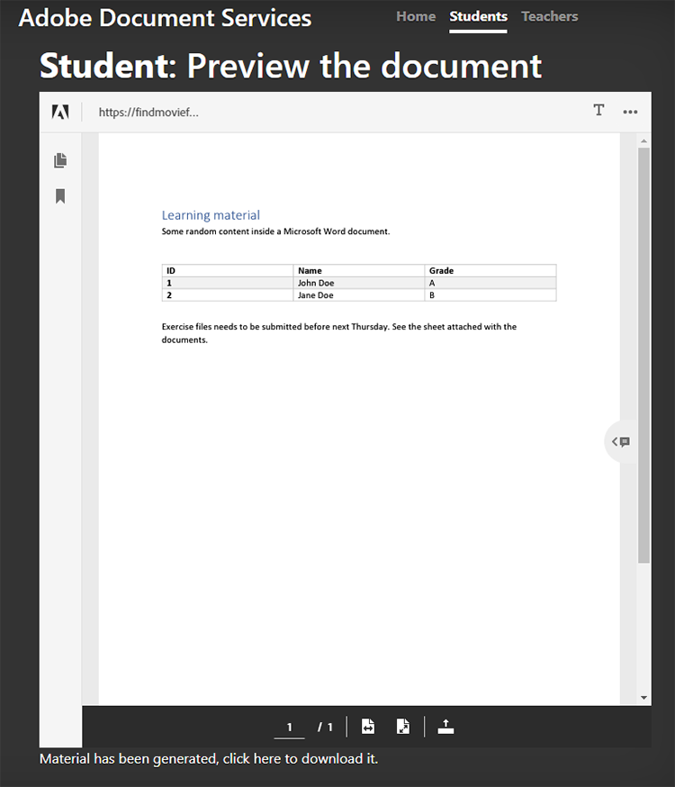

# 学生 — 教师协作


教育机构使用PDF文档与学生共享学习材料。 PDF为教师提供了可互换的文档格式。

集成 [Adobe PDF Services API](https://www.adobe.io/apis/documentcloud/dcsdk/pdf-tools.html) 和 [Adobe PDF Embed API](https://www.adobe.io/apis/documentcloud/dcsdk/pdf-embed.html) 集成到应用程序中，可为教师和学生提供单一的教学和学习平台。 例如，您的应用程序可让学生就其作业和报告卡提问，以及协作处理组作业。

Node.js应用程序有一个正式SDK来访问PDF服务API。 这样，您就可以将Microsoft Word或Microsoft Excel等文档转换为PDF。 此外，您还可以执行更高级的操作，如合并多个报告、重新排列页面和保护PDF。 有关更多详细信息，请查看 [产品文档](https://www.adobe.io/apis/documentcloud/dcsdk/)的

## 您可以学到的内容

在此实际操作教程中，学习如何创建在线学习平台，以便 [使教师和学生能够轻松共享资源](https://www.adobe.io/apis/documentcloud/dcsdk/student-teacher-collaboration.html) PDF。 本教程使用 [学习门户](https://github.com/afzaal-ahmad-zeeshan/adobe-pdf-tools-for-teachers) 使用Node.js JavaScript运行时(Node.js)和PDF服务创建。

学习门户具有以下功能：

* 允许教师上传资源

* 允许学生选择多个文档以转换为PDF

* 允许将文档转换为PDF

* 在Web浏览器中为学生提供PDF预览，使学生无需其他软件即可对文档进行注释

* 允许学生留下注释并将注释下载到他们的计算机

了解具体方法 [!DNL Adobe Acrobat Services] 为学生提供丰富的PDF。 [!DNL Acrobat Services] API无缝集成到您现有的应用程序中，以便学生可以上传、转换和查看文件，然后制作和保存注释 — 所有这些操作都在您当前的设置中完成。

## 相关API和资源

* [PDF嵌入API](https://www.adobe.com/devnet-docs/dcsdk_io/viewSDK/index.html)

* [PDF Services API](https://opensource.adobe.com/pdftools-sdk-docs/release/latest/index.html)

* [项目代码](https://github.com/afzaal-ahmad-zeeshan/adobe-pdf-tools-for-teachers)

## 将资源上传到学习门户

在学习门户的教师部分，教师可以上传作业、测试等文档。 文档可以采用任何格式，如Microsoft Word、Microsoft Excel、HTML、各种图像格式等。


上传的文档会存储起来并在学生打开网页时显示给他们。

要了解应用程序如何上传文件，请参阅 [项目代码](https://github.com/afzaal-ahmad-zeeshan/adobe-pdf-tools-for-teachers)的

## 将文档转换为PDF

学生可以将任何类型的单个或多个文档转换为PDF，如Microsoft Word、Excel和PowerPoint以及其他常用文本和图像文件类型。 学习门户使用PDF服务将文件转换为PDF。

要创建自己的学习门户，您必须首先创建自己的凭据。 [注册](https://www.adobe.io/apis/documentcloud/dcsdk/gettingstarted.html) 要免费使用PDF服务API，需时六个月，最多可进行1,000次文档交易。 之后， [即付即用](https://www.adobe.io/apis/documentcloud/dcsdk/pdf-pricing.html) 每文档事务只需\$0.05，因为类会增加其分配。

学生从信息板中选择文档时，会看到以下内容：


学生只需选择要转换的文档并单击 **获取报告**&#x200B;的

学习门户会将文档转换为PDF，并显示报告页面和PDF文件预览。

以下是此步骤的示例代码：

```
async function createPdf(rawFile, outputPdf) {
    try {
            // configurations
            const credentials =  adobe.Credentials
            .serviceAccountCredentialsBuilder()
            .fromFile("./src/pdftools-api-credentials.json")
            .build();
 
            // Capture the credential from app and show create the context
            const executionContext = adobe.ExecutionContext.create(credentials),
            operation = adobe.CreatePDF.Operation.createNew();
 
            // Pass the content as input (stream)
            const input = adobe.FileRef.createFromLocalFile(rawFile);
            operation.setInput(input);
 
            // Async create the PDF
            let result = await operation.execute(executionContext);
            await result.saveAsFile(outputPdf);
    } catch (err) {
            console.log('Exception encountered while executing operation', err);
    }
}
```

示例代码调用 `createPdf` 方法生成PDF。

要了解如何调用此方法，请参阅 [项目代码](https://github.com/afzaal-ahmad-zeeshan/adobe-pdf-tools-for-teachers/blob/master/src/helpers/pdf.js)的

## 预览学习资源

用户界面使用PDF嵌入API在Web浏览器中呈现PDF。 此API可免费使用。

PDF嵌入API使用与PDF服务API不同的凭据，因此您必须 [创建凭据](https://www.adobe.io/apis/documentcloud/dcsdk/gettingstarted.html)
才能使用它。 然后，您可以完全免费PDF嵌入。

请确保在令牌中输入正确的网站URL。 否则，您可能无法使用令牌渲染PDF。

用户界面使用 [手柄](https://handlebarsjs.com/) 模板语言。 它在Web浏览器中显示PDF。

以下是此步骤的代码：

```
<div id="adobe-dc-view" style="height: 750px; width: 700px;"></div>
<script src="https://documentcloud.adobe.com/view-sdk/main.js"></script>
<script type="text/javascript">
    document.addEventListener("adobe_dc_view_sdk.ready", function () {
        var adobeDCView = new AdobeDC.View({ clientId: "<your-credentials-here>", divId: "adobe-dc-view" });
        adobeDCView.previewFile(
            {
                content: {
                    location: { url: "<file-url>" }
                },
                    metaData: { fileName: "<file-name>" }
            },
           );
    });
</script>
 
<p>Material has been generated, <a href="/students/download/{{filename}}" target="_blank">click here</a> to download it.
</p>
```

此代码显示PDF输出和用于下载PDF报告的链接，如下面的屏幕截图所示：



学生应该可以在此处下载报告或处理材料。

## 批注PDF文档

学习平台应支持基本批注、评论和PDF。 PDF嵌入API提供了所有这些功能。 它使用 `showAnnotationTools`，允许教师和学生对文档添加注释，并将注释作为PDF的一部分归档。

要在PDF文档中启用批注，只需传递参数 `showAnnotationTools` :与 `previewFile` 方法。 此时会在批注预览器中显示PDF工具。 从预览右上角的三点菜单访问此工具。


在教师上传的文档中，学生可以突出显示文本、添加注释等。


在上面的屏幕截图中，用户被标记为“来宾”，但您可以为用户（例如，学生和教师）配置配置文件。

当学生应用批注时，PDF嵌入API显示 **保存** 按钮。 保存时会将批注添加到文件。 尝试单击 **保存** 了解如何在报告中嵌入注释的情况下保存文件。

学生可以使用批注提出问题或分享其对学习材料的评论。

## 跟踪文档使用

对于教师和学校而言，了解学生如何使用在线平台很重要。 这有助于教师为学生提供资源，帮助他们更好地完成作业。 PDF嵌入API与分析功能集成，后者可用于测量发生的所有事件，例如用户打开、阅读和关闭文档的时间。 借助PDF服务API，教师还可以禁用打印、下载和文件修改功能，以帮助维护学术完整性。

如果您拥有 [Adobe Analytics](https://www.adobe.io/apis/experiencecloud/analytics.html) 许可证，您可以 [即装即用的集成](https://experienceleague.adobe.com/docs/document-services/tutorials/pdfembed/controlpdfexperience.html?lang=en#adobe-analytics)的 否则，请使用回调将您的PDF服务与其他分析提供商集成，例如 [Google](https://experienceleague.adobe.com/docs/document-services/tutorials/pdfembed/controlpdfexperience.html?lang=en#google-analytics)的

要启用文档事件的度量功能，请使用 `registerCallback` 方法。 您可以在控制台上显示基本度量，例如打开文档或阅读页面。 您还可以将度量保存在日志中，或在其他分析存储中发布它们。

以下是附加事件处理函数的示例代码：

```
adobeDCView.registerCallback(
    AdobeDC.View.Enum.CallbackType.EVENT_LISTENER,
    function(event) {
           console.log(event);
    },
    {
           enablePDFAnalytics: true
    }
);
```

教师可以看到有多少学生看到过作业，有多少学生浏览了笔记的所有页面，以及其他有价值的细节。

以下是Web浏览器控制台的屏幕截图：


这个截屏画面显示，学生打开作业文件，他们阅读第一页 — 他们要么没有滚动到其他页面，要么文档只有一页 — 然后他们下载了这个文件。 您可以收集这些指标来分析并研究学生的行为。

此外， [Adobe Analytics](https://business.adobe.com/products/analytics/adobe-analytics.html) 集成了PDF嵌入API，因此，如果您拥有Adobe Analytics套件的订阅，则可以在订阅中发布指标。 要在Adobe Analytics中发布度量，您只需传递套件ID即可PDF嵌入API构造函数。 (请注意，您必须使用PDF嵌入API凭据，而不是PDF服务API凭据)。

以下代码示例说明如何将套件ID传递给PDFEmbed API构造函数：

```
var adobeDCView = new AdobeDC.View({
    clientId: "<your-adobe-dc-credential>",
    divId: "<#element>"
    reportSuiteId: <your-id-here>,
}); 
```

## 后续步骤

这个实际操作教程介绍了如何使用PDF服务API和PDF嵌入API创建学习门户，从而提升学习效果 [学生和教师之间的协作](https://www.adobe.io/apis/documentcloud/dcsdk/student-teacher-collaboration.html)的 通过此门户，教师可以上传任何格式的学习材料，并使用PDF服务API将其转换为PDF。 然后，学生可以使用PDF嵌入API预览这些PDF。

现在，您知道了如何批注PDF报告、存档批注以及跟踪PDF报告的使用，可以开始在自己的项目中实施这些解决方案。

您可以使用 [!DNL Adobe Acrobat Services] API，用于在您的网站上创建用户友好的交互式PDF体验。 免费使用Adobe PDF Services API六个月，然后仅 [即付即用](https://www.adobe.io/apis/documentcloud/dcsdk/pdf-pricing.html) (通过AWS或直接协议)，每个文档事务只需\$0.05。 免费使用Adobe PDF Embed，没有时间限制。 创建免费帐户以 [开始使用](https://www.adobe.com/go/dcsdks_credentials) 今天。
