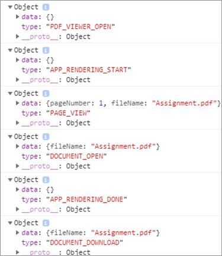

# 师生合作


教育机构使用PDF文档与学生共享学习材料。 PDF为教师提供了一种可互换的文件格式。

将[Adobe PDF Services API](https://developer.adobe.com/document-services/apis/pdf-services)和[Adobe PDF Embed API](https://developer.adobe.com/document-services/apis/pdf-embed)集成到应用程序中可为教师和学生提供单个教学平台。 例如，学生可以利用您的应用程序就作业和报告卡片提出问题，并协作完成组作业。

有一个官方的SDK，用于Node.jsPDF访问Node Services API。 这样您就可以将Microsoft Word或Microsoft Excel等文档转换为
PDF。 此外，您还可以执行更高级的操作，如合并多个报告、重新排列页面以及保护PDF。 有关更多详细信息，请查看[产品文档](https://developer.adobe.com/document-services/homepage/)。

## 您可以学到的内容

在本实际操作教程中，学习创建在线学习平台，[使教师和学生能够轻松地PDF共享资源](https://developer.adobe.com/document-services/use-cases/collaboration/student-teacher-collaboration)。 本教程使用通过Node.js JavaScript运行时(Node.js)和PDF服务创建的[学习门户](https://github.com/afzaal-ahmad-zeeshan/adobe-pdf-tools-for-teachers)。

学习门户具有以下功能：

* 使教师能够上传资源

* 使学生可选择多个文档以转换为PDF

* 允许将文档转换为PDF

* 在Web浏览器中为学生提供PDF预览，并允许他们无需其他软件即可对文档进行批注

* 使学生能够发表评论并将评论下载到其计算机

了解[!DNL Adobe Acrobat Services]如何为具有PDF的学生提供丰富的体验。 [!DNL Acrobat Services] API可无缝集成到您的现有应用程序中，因此学生可以上传、转换和查看文件，然后制作并保存注释 — 所有这些都在您当前的设置中。

## 相关的API和资源

* [PDF的嵌入API](https://www.adobe.com/devnet-docs/dcsdk_io/viewSDK/index.html)

* [PDF服务API](https://opensource.adobe.com/pdftools-sdk-docs/release/latest/index.html)

* [项目代码](https://github.com/afzaal-ahmad-zeeshan/adobe-pdf-tools-for-teachers)

## 将资源上传到学习门户

在学习门户的教师部分中，教师可以上传作业和测试等文档。 文档可以是任何格式，如Microsoft Word、Microsoft Excel、HTML、各种图像格式等。


上传的文档会被存储，并在学生打开网页时展示给学生。

要了解应用程序如何上载文件，请参阅[项目代码](https://github.com/afzaal-ahmad-zeeshan/adobe-pdf-tools-for-teachers)。

## 将文档转换为PDF

学生可以将任意类型的单个或多个文档转换为PDF，如Microsoft Word、Excel和PowerPoint，以及其他常用的文本和图像文件类型。 学习门户使用“PDF服务”将文件转换为PDF。

要创建自己的学习门户，您必须先创建自己的凭据。 [注册](https://www.adobe.io/apis/documentcloud/dcsdk/gettingstarted.html)
免费使用PDF服务API 6个月，最多1,000次文档事务。 之后，[即付即用](https://developer.adobe.com/document-services/pricing/main)只需每个文档事务\ 0.05 USD，因为类会增加其作业。

当学生从信息板中选择文档时，他们会看到以下内容：


学生只需选择要转换的文档，然后单击&#x200B;**获取报告**。

学习门户可将文档转换为PDF，并显示报告页面以及PDF文件的预览。

以下是此步骤的示例代码：

```
async function createPdf(rawFile, outputPdf) {
    try {
            // configurations
            const credentials =  adobe.Credentials
            .serviceAccountCredentialsBuilder()
            .fromFile("./src/pdftools-api-credentials.json")
            .build();
 
            // Capture the credential from app and show create the context
            const executionContext = adobe.ExecutionContext.create(credentials),
            operation = adobe.CreatePDF.Operation.createNew();
 
            // Pass the content as input (stream)
            const input = adobe.FileRef.createFromLocalFile(rawFile);
            operation.setInput(input);
 
            // Async create the PDF
            let result = await operation.execute(executionContext);
            await result.saveAsFile(outputPdf);
    } catch (err) {
            console.log('Exception encountered while executing operation', err);
    }
}
```

示例代码调用Express路由处理程序中的`createPdf`方法以生成PDF。

若要了解如何调用此方法，请参阅[项目代码](https://github.com/afzaal-ahmad-zeeshan/adobe-pdf-tools-for-teachers/blob/master/src/helpers/pdf.js)。

## 预览学习资源

用户界面使用PDFEmbed API在Web浏览器中呈现PDF。 此API可免费使用。

PDFEmbed API使用的凭据不是PDF服务API，因此您必须[创建凭据](https://www.adobe.io/apis/documentcloud/dcsdk/gettingstarted.html)
才能使用。 然后，您可以完全免费使用PDF嵌入。

请确保在令牌中输入正确的网站URL。 否则，您可能无法渲染带有令牌的PDF。

用户界面使用[手柄栏](https://handlebarsjs.com/)模板语言。 它会在Web浏览器中显示PDF。

此步骤的代码如下：

```
<div id="adobe-dc-view" style="height: 750px; width: 700px;"></div>
<script src="https://documentcloud.adobe.com/view-sdk/main.js"></script>
<script type="text/javascript">
    document.addEventListener("adobe_dc_view_sdk.ready", function () {
        var adobeDCView = new AdobeDC.View({ clientId: "<your-credentials-here>", divId: "adobe-dc-view" });
        adobeDCView.previewFile(
            {
                content: {
                    location: { url: "<file-url>" }
                },
                    metaData: { fileName: "<file-name>" }
            },
           );
    });
</script>
 
<p>Material has been generated, <a href="/students/download/{{filename}}" target="_blank">click here</a> to download it.
</p>
```

此代码显示PDF输出以及用于下载PDF报告的链接，如下面的屏幕截图所示：


学生应该能够下载报告或在此处处理材料。

## 批注PDF文档

学习平台应支持PDF中的基本批注、评论和讨论。 PDFEmbed API提供所有这些功能。 它使用`showAnnotationTools`激活批注支持，使教师和学生能够在PDF中评论文档和存档评论。

要在PDF文档中启用批注，只需将参数`showAnnotationTools` ： true传递给`previewFile`方法。 这样将在PDF预览器中显示“批注”工具。 从预览图像右上角的三点菜单访问此工具。


在教师上传的文档中，学生可以突出显示文本、添加注释等。


在上面的屏幕捕捉中，用户被标记为“来宾”，但您可以为用户配置配置文件，例如学生和教师。

学生应用批注时，PDFEmbed API会在顶部横幅上显示一个&#x200B;**保存**&#x200B;按钮。 保存操作会将批注添加到文件。 尝试单击&#x200B;**保存**，查看文件保存时报表中嵌入的批注的方式。

学生可以使用批注来提问或分享他们对学习材料的评论。

## 跟踪文档使用情况

教师和学校了解学生如何使用在线平台很重要。 这有助于教师为学生提供资源，帮助他们更好地完成任务。 PDFEmbed API与Analytics集成，后者可用于测量发生的所有事件，例如，用户打开、阅读和关闭文档时。 使用PDF服务API，教师还可以禁用打印、下载和文件修改功能，以帮助维护学术完整性。

如果您有[Adobe Analytics](https://developer.adobe.com/analytics-apis/docs/2.0/)许可证，则可以使用其[开箱即用的集成](https://experienceleague.adobe.com/zh-hans/docs/acrobat-services-learn/tutorials/pdfembed/controlpdfexperience#adobe-analytics)。 否则，请使用回调将PDF服务与其他分析提供程序(如[Google](https://experienceleague.adobe.com/zh-hans/docs/acrobat-services-learn/tutorials/pdfembed/controlpdfexperience#google-analytics))集成。

要启用文档事件的测量，请使用`registerCallback`方法和AdobeDC视图实例附加事件处理程序。 您可以在控制台上显示基本度量，如打开文档或读取页面。 您还可以将度量保存在日志中，或在其他分析存储中发布它们。

以下是附加事件处理程序的示例代码：

```
adobeDCView.registerCallback(
    AdobeDC.View.Enum.CallbackType.EVENT_LISTENER,
    function(event) {
           console.log(event);
    },
    {
           enablePDFAnalytics: true
    }
);
```

教师可以查看有多少学生看过作业，有多少学生浏览了笔记的所有页面，以及其他有价值的细节。

以下是Web浏览器控制台的屏幕截图：



屏幕截图显示学生打开了任务文件，阅读了第一页 — 他们要么没有滚动到其他页面，要么文档只有一个页面 — 然后他们下载了文件。 您可以收集这些指标以执行分析并研究学生的行为。

此外，[Adobe Analytics](https://business.adobe.com/products/adobe-analytics.html)已与PDFEmbed API集成，因此如果您订阅了Adobe Analytics套件，则可以在订阅中发布您的指标。 要在Adobe Analytics中发布度量，您只需将套件ID传递给PDFEmbed API构造函数。 (请注意，您必须使用PDFEmbed API凭据，而不是PDF服务API凭据)。

以下示例代码演示了如何将Suite ID传递给PDFEmbed API构造函数：

```
var adobeDCView = new AdobeDC.View({
    clientId: "<your-adobe-dc-credential>",
    divId: "<#element>"
    reportSuiteId: <your-id-here>,
}); 
```

## 后续步骤

本实践教程介绍了如何使用PDF服务API和PDFEmbed API创建学习门户，以促进[学生与教师之间的有效协作](https://developer.adobe.com/document-services/use-cases/collaboration/student-teacher-collaboration)。 教师可通过此门户上传任何格式的学习材料，并使用PDF服务API将其转换为PDF。 然后，学生可以使用PDFEmbed API预览这些PDF。

现在您已了解如何注释PDF报告、存档注释和跟踪PDF报告的使用，您可以开始在自己的项目中实施这些解决方案。

您可以使用[!DNL Adobe Acrobat Services]个API在您的网站上创建用户友好的交互式PDF体验。 享受6个月的免费使用Adobe PDF Services API的乐趣，之后只需支付[即付即用](https://developer.adobe.com/document-services/pricing/main)&#x200B;(通过AWS或直接协议)，每笔文档交易仅需\$0.05。 免费使用Adobe PDF Embed，无时间限制。 创建免费帐户以立即[开始使用](https://www.adobe.com/go/dcsdks_credentials)。
