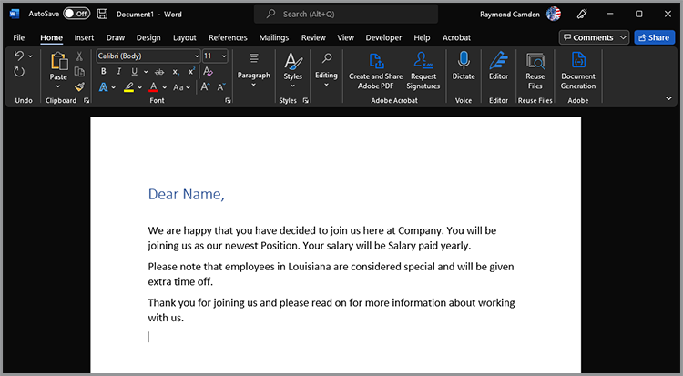

# 更新员工入职培训


在大型组织中，员工入职可能是一个庞大而缓慢的过程。 通常情况下，会有自定义文档以及必须由新员工展示和签署的样板材料。 将定制材料和样板材料混合在一起需要多个步骤 — 让参与该过程的人损失宝贵的时间。 [!DNL Adobe Acrobat Services] Acrobat Sign可以改进并自动化此方法，从而释放您的HR个人资源以处理更重要的任务。 让我们看看它是如何实现的。

## 什么是 [!DNL Adobe Acrobat Services]？

[[!DNL Adobe Acrobat Services]](https://developer.adobe.com/document-services/homepage) 是一组与使用文档(而不仅仅是PDF)相关的API。 从广义上讲，这套服务可分为三大类：

* 首先是 [PDF服务](https://developer.adobe.com/document-services/apis/pdf-services/) 工具集。 这些是处理PDF和其他文档的“实用”方法。 这些服务包括与PDF之间的转换、执行OCR和优化、合并和拆分PDF等。 它是文档处理功能的工具箱。
* [PDF提取API](https://developer.adobe.com/document-services/apis/pdf-extract/) 使用强大的AI/ML技术来分析PDF，并返回有关内容的令人难以置信的大量细节。 其中包括文本、样式和位置信息，还可以返回CSV/XLS格式的表格数据以及检索图像。
* 最后， [Document Generation API](https://developer.adobe.com/document-services/apis/doc-generation/) 允许开发人员将Microsoft Word用作“模板”，混合其数据（来自任何源）并生成动态的个性化文档(PDF和Word)。

开发人员可以 [注册](https://documentcloud.adobe.com/dc-integration-creation-app-cdn/main.html) 并通过免费试用来试用所有这些服务。 该 [!DNL Acrobat Services] 平台使用基于REST的API，但也支持用于Node、Java、.NET和Python的SDK（目前仅支持Extract）。

虽然不是API，但开发人员也可以免费使用 [嵌入式APIPDF](https://developer.adobe.com/document-services/apis/pdf-embed/)，可为您的网页文档提供一致、灵活的查看体验。

## 什么是 Acrobat Sign？

[Acrobat Sign](https://www.adobe.com/cn/sign.html) 是电子签名服务领域的全球领先者。 您可以使用各种不同的工作流程（包括多个签名）发送文档以供签名。 Acrobat Sign还支持需要签名和其他信息的工作流程。 功能强大的仪表板以及灵活的创作系统支持所有这些功能。

与 [!DNL Acrobat Services]，Acrobat Sign有一个 [免费试用](https://www.adobe.com/sign.html#sign_free_trial) 这样，开发人员既可以通过仪表板测试签名过程，也可以使用基于REST的易用API来测试。

## 入门场景

让我们考虑一个现实情景，展示Adobe的服务可以如何发挥作用。 当新员工加入公司时，他们需要根据自己的角色定制信息。 此外，他们还需要全公司的材料。 最后，他们必须签署文件证明他们接受公司政策。 让我们将这一过程分解为几个具体步骤：

* 首先，需要用姓名向新员工问候的定制随函。 信函应包含有关员工姓名、角色、薪金和位置的信息。
* 自定义信函必须与包含公司范围的基本信息（考虑各种HR政策、权益等）的PDF相结合
* 必须包括最终文档，其中要求输入员工的签名和日期。
* 上述所有内容应作为一个文档呈现，并发送给员工以供签名。

让我们详细了解如何执行此操作。

## 生成动态文档

Adobe [Document Generation](https://developer.adobe.com/document-services/apis/doc-generation/) 利用API，开发人员可以使用Microsoft Word和简单的模板语言创建动态文档，并以此为基础生成PDF和Word文档。 以下是一个操作示例。

让我们从一个具有硬编码值的Word文档开始。 可以按照您所需的任何方式设置文档的样式，包括图形、表格等。 这是初始文档。



Document Generation的工作原理是向Word文档添加“标记”，这些标记将被您的数据替换。 虽然可以手动输入这些令牌，但会出现 [Microsoft Word插件](https://developer.adobe.com/cn/document-services/docs/overview/document-generation-api/wordaddin/) 这样更容易做到。 打开文档为作者提供了一个工具，让他们可以定义可在文档中使用的标签或数据集。


您可以从本地文件中上传JSON信息，复制为JSON文本，或选择继续使用初始数据。 这样，您就可以根据特定需求以特定的方式定义标签。 在此示例中，只需要名称、角色、薪金和位置的标记。 这可以使用 **创建标签** 按钮：


定义第一个标签后，您可以继续定义所需的任意多个标签：


定义标签后，选择文档中的文本，并在适当位置替换为标签。 在本例中，为名称、角色和薪金添加了标签。


Document Generation不仅支持简单标记，还支持逻辑表达式。 文档的第二段包含仅适用于路易斯安那州人的文本。 通过进入“文档标记”的“高级”选项卡并定义条件，可以添加条件表达式。 下面是定义简单相等条件的方法，但请注意，也支持数字比较和其他比较类型。


然后，可以在段落周围插入和环绕以下内容：


要测试其工作方式，请选择 **生成文档**. 首次执行此操作时，必须使用Adobe ID登录。 登录后，将显示可手动编辑的默认JSON。


生成之后可以查看或下载的PDF。


使用“文档标记器”可快速设计和测试，一旦完成并在生产环境中使用，您就可以使用其中一个SDK来自动执行此过程。 虽然实际代码因特定需要而有所不同，但以下示例说明了此代码在Node.js中的显示方式：

```js
 const PDFServicesSdk = require('@adobe/pdfservices-node-sdk');

const credentials =  PDFServicesSdk.Credentials
    .serviceAccountCredentialsBuilder()
    .fromFile("pdfservices-api-credentials.json")
    .build();

// Data would be dynamic...
let data = {
    "name":"Raymond Camden",
    "role":"Lead Developer",
    "salary":9000,
    "location":"Louisiana"
}

// Create an ExecutionContext using credentials.
const executionContext = PDFServicesSdk.ExecutionContext.create(credentials);

// Create a new DocumentMerge options instance.
const documentMerge = PDFServicesSdk.DocumentMerge,
    documentMergeOptions = documentMerge.options,
    options = new documentMergeOptions.DocumentMergeOptions(jsonDataForMerge, documentMergeOptions.OutputFormat.PDF);

// Create a new operation instance using the options instance.
const documentMergeOperation = documentMerge.Operation.createNew(options);

// Set operation input document template from a source file.
const input = PDFServicesSdk.FileRef.createFromLocalFile('documentMergeTemplate.docx');
documentMergeOperation.setInput(input);

// Execute the operation and Save the result to the specified location.
documentMergeOperation.execute(executionContext)
    .then(result => result.saveAsFile('documentOutput.pdf'))
    .catch(err => {
        if(err instanceof PDFServicesSdk.Error.ServiceApiError
            || err instanceof PDFServicesSdk.Error.ServiceUsageError) {
            console.log('Exception encountered while executing operation', err);
        } else {
            console.log('Exception encountered while executing operation', err);
        }
    });
```

简言之，代码设置凭据，创建操作对象，设置输入和选项，然后调用操作。 最后，将结果保存为PDF。 （结果也可以输出为Word。）

Document Generation支持复杂得多的用例，包括能够具有完全动态的表和图像。 请参见 [文档](https://developer.adobe.com/cn/document-services/docs/overview/document-generation-api/) 了解更多详细信息。

## 执行PDF操作

该 [PDF服务API](https://developer.adobe.com/document-services/apis/pdf-services/) 提供了一大组“实用程序”操作来处理PDF。 这些操作包括：

* 从Office文档创建PDF
* 将PDF导出到Office文档
* 合并和拆分PDF
* 将OCR应用于PDF
* 设置、删除和修改PDF的保护
* 删除、插入、重新排序和旋转页面
* 通过压缩或线性化优化PDF
* 获取PDF属性

对于这种情形，Document Generation调用的结果必须与标准PDF合并。 使用SDK时，此操作非常简单。 以下是Node.js中的示例：

```js
const PDFServicesSdk = require('@adobe/pdfservices-node-sdk');
 
// Initial setup, create credentials instance.
const credentials = PDFServicesSdk.Credentials
    .serviceAccountCredentialsBuilder()
    .fromFile("pdfservices-api-credentials.json")
    .build();
 
// Create an ExecutionContext using credentials and create a new operation instance.
const executionContext = PDFServicesSdk.ExecutionContext.create(credentials),
    combineFilesOperation = PDFServicesSdk.CombineFiles.Operation.createNew();
 
// Set operation input from a source file.
const combineSource1 = PDFServicesSdk.FileRef.createFromLocalFile('documentOutput.pdf'),
      combineSource2 = PDFServicesSdk.FileRef.createFromLocalFile('standardCorporate.pdf');

combineFilesOperation.addInput(combineSource1);
combineFilesOperation.addInput(combineSource2);
 
// Execute the operation and Save the result to the specified location.
combineFilesOperation.execute(executionContext)
    .then(result => result.saveAsFile('combineFilesOutput.pdf'))
    .catch(err => {
        if (err instanceof PDFServicesSdk.Error.ServiceApiError
            || err instanceof PDFServicesSdk.Error.ServiceUsageError) {
            console.log('Exception encountered while executing operation', err);
        } else {
            console.log('Exception encountered while executing operation', err);
        }
    });
```

此代码将获取两个PDF，合并它们，并将结果保存到新PDF中。 简单又简单！ 请参见 [文档](https://developer.adobe.com/document-services/docs/overview/pdf-services-api/) 例如，可以执行哪些操作。

## 签名过程

在登入过程的最后一站，员工必须签署一份协议，声明他们已阅读并同意内定义的所有策略。 [Acrobat Sign](https://www.adobe.com/cn/sign.html) 支持许多不同的工作流程和集成，包括通过 [API](https://opensource.adobe.com/acrobat-sign/developer_guide/index.html). 从广义上讲，方案的最后一部分可以如下完成：

首先，设计包含需要签名的表单的文档。 可以通过多种方式做到这一点，包括在Adobe Sign用户信息板中设计的视觉效果。 另一种方法是使用Document Generation Word插件为您插入标签。 此示例请求签名和日期。


此文档可以存储为PDF，并且使用上述相同的方法，与所有文档连接在一起。 此过程会创建一个统一的包，其中包含个性化的问候语、标准的公司文档和适合签名的最终页面。

模板可以上传到Acrobat Sign仪表板，然后用于新协议。 通过使用REST API，可以将此文档发送给预期的员工，以请求他们的签名。


## 亲自体验

本文中描述的所有内容现在都可以进行测试。 该 [!DNL Adobe Acrobat Services] API [免费试用](https://documentcloud.adobe.com/dc-integration-creation-app-cdn/main.html) 目前，我们在6个月内为您提供1,000个免费请求。 Acrobat Sign的 [免费试用](https://www.adobe.com/sign.html#sign_free_trial) 用于发送带水印的协议以进行测试。

有问题吗？该 [支持论坛](https://community.adobe.com/t5/document-services-apis/ct-p/ct-Document-Cloud-SDK) 由Adobe开发人员和支持人员每天监控。 最后，要获得更多灵感，一定要抓住下一个 [纸夹](https://www.youtube.com/playlist?list=PLcVEYUqU7VRe4sT-Bf8flvRz1XXUyGmtF) 剧集。 定期与客户举行现场会议，包括新闻、演示和谈话。
