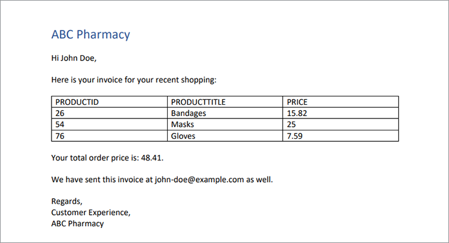

# 处理发票


当业务蓬勃发展时，这是件好事，但当需要准备所有这些发票时，生产率就会受损。 手动生成发票非常耗时，并且您可能面临出错的风险，从而有可能赔钱或因金额不正确而激怒客户。

例如，想想Danielle在一家医疗供应公司](https://www.adobe.io/apis/documentcloud/dcsdk/invoices.html)的[会计部门](https://www.adobe.io/apis/documentcloud/dcsdk/invoices.html)[工作。 月底的时候，她从几个不同的系统中提取信息，再次检查信息的准确性，并格式化发票。 在完成所有这些工作后，她终于准备好将文档转换为PDF（以便任何人都可以查看，而无需购买特定软件），并向每个客户发送其个性化发票。

即使每月的发票开完了，Danielle也逃不掉这些发票。 一些客户有非月度计费周期，因此她始终为某人创建发票。 有时，客户会编辑其发票并支付不足的金额。 然后Danielle将花时间解决此发票不匹配问题。 按照这个速度，她需要雇个助理来做所有工作！

Danielle需要一种快速、准确地生成发票的方法，既可以在月底批量生成，也可以在其他时间临时生成。 理想情况下，如果她能够保护这些发票不被编辑，她就不必担心金额不匹配的问题。

## 您可以学到的内容

在本实际操作教程中，了解如何使用AdobeDocument Generation API自动生成发票、对PDF进行密码保护并向每个客户交付发票。 只需对Node.js、JavaScript、Express.js、HTML和CSS有一定程度的了解。

此项目的完整代码为[在GitHub上可用](https://github.com/afzaal-ahmad-zeeshan/adobe-pdf-invoice-generation)。 您必须使用模板和原始数据文件夹设置公共目录。 在生产中必须从外部API获取数据。 您还可以浏览包含模板资源的应用程序的此存档版本。

## 相关的API和资源

* [PDF服务API](https://opensource.adobe.com/pdftools-sdk-docs/release/latest/index.html)

* [Adobe的Document Generation API](https://www.adobe.io/apis/documentcloud/dcsdk/doc-generation.html)

* [Adobe Sign API](https://www.adobe.io/apis/documentcloud/sign.html)

* [项目代码](https://github.com/afzaal-ahmad-zeeshan/adobe-pdf-invoice-generation)

## 正在准备数据

本教程不介绍如何从数据仓库中导入数据。 您的客户订单可能存在于数据库、外部API或自定义软件中。 AdobeDocument Generation API需要包含开票数据的JSON文档，此类数据可从您的客户关系管理(CRM)或电子商务平台获得信息。 本教程假设数据已经是JSON格式。

为简单起见，请在开具发票时使用以下JSON结构：

```
{ 
    "customerName": "John Doe", 
    "customerEmail": "john-doe@example.com", 
    "order": [ 
        { 
            "productId": 26, 
            "productTitle": "Bandages", 
            "price": 15.82 
        }, 
        { 
            "productId": 54, 
            "productTitle": "Masks", 
            "price": 25 
        }, 
        { 
            "productId": 76, 
            "productTitle": "Gloves", 
            "price": 7.59 
        } 
    ] 
} 
```

JSON文档包含客户详细信息和订单信息。 使用此结构化文档来建立发票，并以PDF格式显示要素。

## 生成发票模板

AdobeDocument Generation API需要基于Microsoft Word的模板和JSON文档来创建动态PDF或Word文档。 为您的发票应用程序创建一个Microsoft Word模板，并使用[免费的Document Generation Tagger插件](https://opensource.adobe.com/pdftools-sdk-docs/docgen/latest/wordaddin.html#add-in-demo)来生成模板标记。 安装该插件，然后在Microsoft Word中打开选项卡。


将JSON内容粘贴到加载项后，如上图所示，单击“生成标签”。 现在，此增效工具将显示您的对象的格式。 您的基本模板可使用客户的姓名和电子邮件，但不显示订单信息。 本教程稍后会讨论订单信息。


在Microsoft Word文档中，开始编写发票模板。 将光标停留在必须插入动态数据的位置，然后从Adobe插件窗口中选择标签。 单击“**插入文本**”，以便AdobeDocument Generation Tagger加载项可以生成和插入标签。 要进行个性化，让我们插入客户的姓名和电子邮件。

现在，让我们看一下随着每张新发票而更改的数据。 选择加载项的&#x200B;**高级**&#x200B;选项卡。 要查看可用选项以根据客户订购的产品生成动态表，请单击&#x200B;**表和列表** 。

从第一个下拉菜单中选择&#x200B;**订单**。 在第二个下拉列表中，选择此表的列。 在本教程中，为要呈现表的对象选择所有三列。


Document Generation API还可以执行复杂的操作，如聚合数组内的元素。 在&#x200B;**高级**&#x200B;选项卡中，选择&#x200B;**数值计算**，然后在&#x200B;**聚合**&#x200B;选项卡中，选择要应用计算的字段。


单击&#x200B;**插入计算**&#x200B;按钮，将此标记插入到文档中的所需位置。 以下文本现在显示在您的Microsoft Word文件中：


此发票示例包含客户信息、订购的产品和应付款总额。

## 使用AdobeDocument Generation API生成发票

使用Adobe PDF Services Node.js软件开发工具包(SDK)合并Microsoft Word和JSON文档。 构建Node.js应用程序，以使用Document Generation API创建发票。

PDF服务API包含Document Generation Service，因此您可以对两者使用相同的凭据。 享受[六个月的免费试用](https://www.adobe.io/apis/documentcloud/dcsdk/pdf-pricing.html)，然后只需为每个文档交易支付0.05 USD。

以下是合并PDF的代码：

```
async function compileDocFile(json, inputFile, outputPdf) { 
    try { 
        // configurations 
        const credentials =  adobe.Credentials 
            .serviceAccountCredentialsBuilder() 
            .fromFile("./src/pdftools-api-credentials.json") 
            .build(); 

        // Capture the credential from app and show create the context 
        const executionContext = adobe.ExecutionContext.create(credentials); 
  
        // create the operation 
        const documentMerge = adobe.DocumentMerge, 
            documentMergeOptions = documentMerge.options, 
            options = new documentMergeOptions.DocumentMergeOptions(json, documentMergeOptions.OutputFormat.PDF);

        const operation = documentMerge.Operation.createNew(options); 
  
        // Pass the content as input (stream) 
        const input = adobe.FileRef.createFromLocalFile(inputFile); 
        operation.setInput(input); 
  
        // Async create the PDF 
        let result = await operation.execute(executionContext); 
        await result.saveAsFile(outputPdf); 
    } catch (err) { 
        console.log('Exception encountered while executing operation', err); 
    } 
} 
```

此代码从输入JSON文档和输入模板文件中获取信息。 然后，它会创建一个文档合并操作，以将文件合并为单个PDF报表。 最后，它使用您的API凭据执行该操作。 如果您还没有凭据，请[创建凭据](https://opensource.adobe.com/pdftools-sdk-docs/release/latest/index.html#getting-credentials) (Document Generation和PDF服务API使用相同的凭据)。

在Express路由器内使用此代码处理文档请求：

```
// Create one report and send it back
try {
    console.log(\`[INFO] generating the report...\`);
    const fileContent = fs.readFileSync(\`./public/documents/raw/\${vendor}\`,
    'utf-8');
    const parsedObject = JSON.parse(fileContent);

    await pdf.compileDocFile(parsedObject,
    \`./public/documents/template/Adobe-Invoice-Sample.docx\`,
    \`./public/documents/processed/output.pdf\`);

    await pdf.applyPassword("p@55w0rd", './public/documents/processed/output.pdf',
    './public/documents/processed/output-secured.pdf');

    console.log(\`[INFO] sending the report...\`);
    res.status(200).render("preview", { page: 'invoice', filename: 'output.pdf' });
} catch(error) {
    console.log(\`[ERROR] \${JSON.stringify(error)}\`);
    res.status(500).render("crash", { error: error });
}
```

一旦该代码执行，它就会根据所提供的数据提供一个包含动态生成的发票的PDF文档。 使用示例JSON数据（上面提供），此代码的输出为：



此发票包括来自JSON文档的动态数据。

## 使用密码保护发票

由于Danielle会计担心客户修改发票，因此应用密码来限制编辑。 [PDF服务API](https://opensource.adobe.com/pdftools-sdk-docs/release/latest/index.html)可以自动将密码应用于文档。 在此，您可以使用Adobe PDF Services SDK通过密码保护文档。 代码为：

```
async function applyPassword(password, inputFile, outputFile) {
    try {
        // Initial setup, create credentials instance.
        const credentials = adobe.Credentials
        .serviceAccountCredentialsBuilder()
        .fromFile("./src/pdftools-api-credentials.json")
        .build();

        // Create an ExecutionContext using credentials
        const executionContext = adobe.ExecutionContext.create(credentials);
        // Create new permissions instance and add the required permissions
        const protectPDF = adobe.ProtectPDF,
        protectPDFOptions = protectPDF.options;
        // Build ProtectPDF options by setting an Owner/Permissions Password, Permissions,
        // Encryption Algorithm (used for encrypting the PDF file) and specifying the type of content to encrypt.
        const options = new protectPDFOptions.PasswordProtectOptions.Builder()
        .setOwnerPassword(password)
        .setEncryptionAlgorithm(protectPDFOptions.EncryptionAlgorithm.AES_256)
        .build();

        // Create a new operation instance.
        const protectPDFOperation = protectPDF.Operation.createNew(options);

        // Set operation input from a source file.
        const input = adobe.FileRef.createFromLocalFile(inputFile);
        protectPDFOperation.setInput(input);

        // Execute the operation and Save the result to the specified location.
        let result = await protectPDFOperation.execute(executionContext);

        result.saveAsFile(outputFile);
    } catch (err) {
        console.log('Exception encountered while executing operation', err);
    }
}
```

使用此代码时，它将使用密码保护您的文档，并将新发票上传到系统。 有关如何使用此代码或尝试使用此代码的更多信息，请参阅[代码示例](https://github.com/afzaal-ahmad-zeeshan/adobe-pdf-invoice-generation)。

处理完发票后，您可能要自动通过电子邮件将其发送给客户。 有几种方法可实现自动向客户发送电子邮件。 最快捷的方法是使用第三方电子邮件API以及帮助程序库，例如[sendgrid-nodejs](https://github.com/sendgrid/sendgrid-nodejs)。 或者，如果您已经具有SMTP服务器的访问权限，则可以使用[nodemailer](https://www.npmjs.com/package/nodemailer)通过SMTP发送电子邮件。

## 后续步骤

在本实际操作教程中，您创建了一个简单的应用程序来帮助Danielle处理[账单](https://www.adobe.io/apis/documentcloud/dcsdk/invoices.html)。 使用PDF服务API和Document Generation SDK，您使用JSON文档中的客户订单信息填充了Microsoft Word模板，并创建了PDF发票。 然后，使用[PDF服务API](https://opensource.adobe.com/pdftools-sdk-docs/release/latest/index.html)提供的密码保护服务对每个文档进行密码保护。

由于Danielle可以自动生成发票，并且不必担心客户编辑其发票，因此她不需要雇用助理来帮助完成所有手动工作。 她可以利用这段额外的时间，在应付帐款文件中找到节省下来的费用。

现在您已经了解了它是多么简单，您可以使用其他Adobe工具扩展这个简单的应用程序，以在您的网站上嵌入发票。 例如，客户可以随时查看其发票或余额。 [Adobe PDF Embed API](https://www.adobe.io/apis/documentcloud/dcsdk/pdf-embed.html)可免费使用。 您甚至可以转到人力资源或销售部门，帮助实现协议自动化并收集电子签名。

要探索所有可能性并开始构建您自己的便捷应用程序，请创建一个免费的[[!DNL Adobe Acrobat Services]](https://www.adobe.io/apis/documentcloud/dcsdk/gettingstarted.html)帐户以立即开始。 享受6个月的免费试用，然后[即付即用](https://www.adobe.io/apis/documentcloud/dcsdk/pdf-pricing.html)
随着您的业务扩展，每个文档交易仅需0.05 USD。
