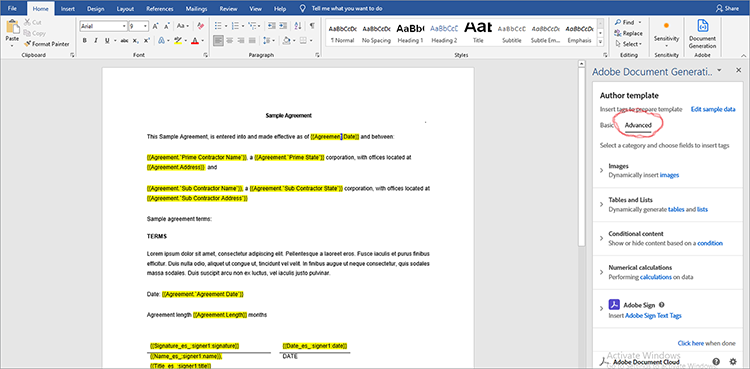
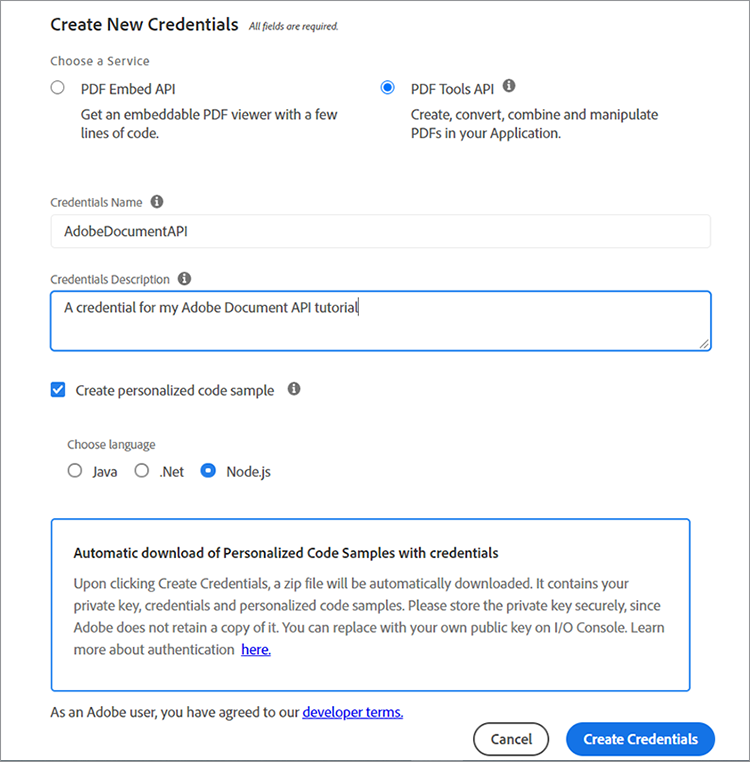

# 管理法律合同


数字化带来了挑战。 如今，大多数组织都有多种类型 [法律合同](https://www.adobe.io/apis/documentcloud/dcsdk/legal-contracts.html) 他们必须创建、编辑、批准并由不同方签名。 这些法律合同通常需要独特的定制和品牌推广。 签名后，组织可能还需要将它们保存为受保护的格式，以确保它们的安全。 要完成所有这些任务，他们需要强大的文档生成和管理解决方案。

许多解决方案都提供一些文档生成功能，但无法自定义数据输入和条件逻辑，例如仅适用于特定情况的子句。 随着公司法律模板的内容不断扩大，手动更新这些模板将具有挑战性并且容易出错。 实现这些过程自动化的需求十分巨大。

## 您可以学到的内容

在本实际操作教程中，探索 [[!DNL Adobe Acrobat Services] API](https://www.adobe.io/apis/documentcloud/dcsdk/doc-generation.html) 生成文档中的自定义输入字段。 另外，了解如何轻松将这些生成的文档转换为受保护的可移植文档格式(PDF)，以防止数据处理。

本教程涉及在探索合同转换为PDF时的一些编程。 为了有效地跟进， [Microsoft Word](https://www.microsoft.com/en-us/download/office.aspx) 和 [Node.js](https://nodejs.org/) 应该安装在你的电脑上。 对Node.js和 [ES6语法](https://www.w3schools.com/js/js_es6.asp) 也是建议的。

## 相关API和资源

* [Adobe文档生成API](https://www.adobe.io/apis/documentcloud/dcsdk/doc-generation.html)

* [PDF嵌入API](https://www.adobe.com/devnet-docs/dcsdk_io/viewSDK/index.html)

* [Adobe Sign API](https://www.adobe.io/apis/documentcloud/sign.html)

* [项目代码](https://github.com/agavitalis/adobe_legal_contracts.git)

## 创建模板文档

您可以使用Microsoft Word应用程序或通过下载Adobe的 [示例Word模板](https://www.adobe.io/apis/documentcloud/dcsdk/doc-generation.html#sample-blade)的 不过，如果不使用一些辅助工具(例如 [Adobe文档生成标记插件](https://www.adobe.io/apis/documentcloud/dcsdk/docs.html?view=docgen-addin) 用于Microsoft Word。

Document Generation Tagger是Microsoft Word插件，使用标签实现无缝文档自定义。 它允许在文档模板中创建动态字段，这些字段使用JSON数据动态填充。


要说明文档生成标记的用法，请安装此加载项，然后创建JSON数据模型，该模型可用于为简单的法律合同文档添加标记。

通过单击 **插入** 选项卡，然后单击 **我的加载项**&#x200B;的 在Office加载项菜单中，搜索“Adobe文档生成”，然后单击 **添加** 并遵循这个过程。 您可在上述屏幕截图中查看这些步骤。

在为Word加载项安装“文档生成标记”后，创建一个简单的JSON数据模型来标记合法文档。

若要继续，请打开您选择的任意编辑器，创建一个名为Agreement.json的文件，然后将下面的代码片段粘贴到您创建的JSON文件中。

```
{
"Agreement": {
"Date": "1/24/2021",
"Prime Contractor Name": "Ogbonna Vitalis Corp",
"Prime State": "Lagos",
"Address": "Maryland Ave, Lagos State, Ng",
"Sub Contractor Name": "Vivvaa Soln",
"Sub Contractor State": "California",
"Sub Contractor Address": "Molusi Avenue, Dallas Texas, CA",
"Agreement Date": "1/24/2021",
"Length": 5
}
}
```

保存此JSON文档后，将其导入到Document Generation Tagger加载项。 通过单击 **文档生成** 在Word屏幕右上方的“Adobe”组中，如以下屏幕截图所示。


这将显示一个视频以引导您。 您可以观看或通过单击直接转到标记字段 **开始使用**&#x200B;的 单击后 **开始使用**，则会显示上传表单。 单击 **上传JSON文件** 并选择您刚刚创建的JSON文件。 导入完成后，单击 **生成标签** 来生成标签。

导入并生成标签后，您可以将这些标签添加到文档中。 要添加标签，请将光标放在要显示标签的精确位置。 然后，从Document Generation API中选择一个标签并单击 **插入文本**&#x200B;的 下面的屏幕截图概述了此过程。


除了使用导入的JSON数据模型创建的基本标签外，您还可以将高级功能用于更多选项，如图像、条件逻辑、计算、重复元素和条件短语。 您可以通过单击 **高级** 在“文档生成标记”面板中。 您可以在下面的屏幕捕获中看到这一点。



这些高级功能与基本标签没有区别。 要包含条件逻辑，请选择要填充的文档部分。 然后，配置决定标签插入的规则。

要进一步说明（例如在协议中），您只需有条件地加入一个部分。 在“选择内容类型”字段中，选择 **部分。** 在“选择记录”字段中，选取用于确定是否显示条件节的选项。 选择所需的条件运算符并在“值”字段中设置要测试的值。 然后单击 **插入条件。** 下面的屏幕截图说明了此过程。


对于计算，请选择“算术”或“聚集”，然后根据可用的模板标记包括要使用的相关的第一条记录、运算符和第二条记录。 然后单击 **插入计算**&#x200B;的

此外，法律合同往往要求当事各方签字。 您可以使用“数字计算”部分正下方的Adobe Sign文本标记插入电子签名。 要包含电子签名，您必须指定收件人的数量，请选择 **签名者**，并从下拉列表中相应输入字段类型。 完成后，单击 **插入Adobe Sign文本标记** 完成整个过程。

为确保数据完整性，请将法律文档以受保护的格式保存。 使用 [!DNL Acrobat Services] API，您可以快速将文档转换为PDF格式。 您可以构建一个简单的Node.js快速应用程序，将Document Generation API集成到该应用程序中，然后使用此简单应用程序将加标签的文档从Word转换为PDF格式。

## 项目设置

首先，为Node.js应用程序设置文件夹结构。 在此示例中，调用此简单应用程序AdobeLegalContractAPI。 您可以检索源代码 [此处](https://github.com/agavitalis/adobe_legal_contracts.git)的

### 目录结构

创建一个名为AdobeLegalContractAPI的文件夹，并在您选择的编辑器中打开它。 创建一个基本Node.js应用程序，该应用程序将 ```npm init``` 命令：

```
###Directory Structure
AdobeLegalContractAPI
-----config
----------default.json
-----controllers
----------createPDFController.js
----------previewController.js
-----models
----------document.js
-----routes
----------web.js
-----services
-----------upload.js
-----uploads
-----views
-----index.js
```

以上是适用于您的应用程序的简单Node.js应用程序结构。 现在，继续安装必要的npm包。

### 包安装

使用npm install命令安装所需的包，如以下代码片断中所示：

```
npm install express body-parser morgan multer hbs path config mongoose
```

安装程序包后，请确保package.json文件的内容与下面的代码片段类似：

```
###package.json
{
"name": "adobelegalcontractapi",
"version": "1.0.0",
"description": "",
"main": "index.js",
"directories": {
"test": "test"
},
"dependencies": {
"body-parser": "^1.19.0",
"config": "^3.3.6",
"express": "^4.17.1",
"hbs": "^4.1.1",
"mongoose": "^5.12.1",
"morgan": "^1.10.0",
"multer": "^1.4.2",
"path": "^0.12.7"
},
"devDependencies": {},
"scripts": {
"start": "node index.js"
},
"repository": {
"type": "git",
"url": "https://github.com/agavitalis/adobe_legal_contracts.git"
},
"author": "Ogbonna Vitalis",
"license": "ISC",
"bugs": {
"url": "https://github.com/agavitalis/adobe_legal_contracts/issues"
},
"homepage": "https://github.com/agavitalis/adobe_legal_contracts#readme"
}
```

在这些代码片段中，您安装了应用程序依赖项，包括视图的Handlebars模板引擎。

本教程的主要重点是使用 [[!DNL Acrobat Services] API](https://www.adobe.io/apis/documentcloud/dcsdk/) 将文档转换为PDF。 因此，如何构建此Node.js应用程序没有分步过程。 但是，您可以在以下位置检索完整的工作Node.js应用程序代码： [GitHub](https://github.com/agavitalis/adobe_legal_contracts.git)的

## 集成 [!DNL Adobe Acrobat Services] Node.js应用程序中的API

[!DNL Adobe Acrobat Services] API是一种基于云的可靠服务，旨在实现文档的无缝操作。 它提供三个API:

* Adobe PDF Services API

* Adobe PDF Embed API

* Adobe文档生成API

您需要凭据才能使用 [!DNL Acrobat Services] API(不同于您的PDF嵌入API凭据)。 如果您没有有效的凭据， [注册](https://www.adobe.com/go/dcsdks_credentials?ref=getStartedWithServicesSDK) 并完成下面屏幕截图中所示的工作流程。 享受 [6个月免费试用然后按使用量付费](https://www.adobe.io/apis/documentcloud/dcsdk/pdf-pricing.html)，每个文档交易只需0.05美元。



注册过程完成后，代码示例会自动下载到您的PC以帮助您开始。 您可以提取此代码示例并跟着操作。 别忘了将提取的代码示例中的pdftools-api-credentials.json和private.key文件复制到Node.js项目的根目录。 访问之前需要提供凭据 [!DNL Acrobat Services] API端点。 您还可以使用您的个性化凭据下载SDK示例，以便不必更新示例代码中的密钥。

现在，通过运行 ```npm install \--save @adobe/documentservices-pdftools-node-sdk``` 使用应用程序根目录中的终端发出命令。 成功安装后，您可以使用 [!DNL Acrobat Services] 用于在应用程序中操作文档的API。

## 创建PDF文档

[!DNL Acrobat Services] API支持从Microsoft Office文档（Word、Excel和PowerPoint）和其他文档创建PDF [支持的文件格式](https://opensource.adobe.com/pdftools-sdk-docs/release/latest/howtos.html#create-a-pdf) 例如.txt、.rtf、.bmp、.jpeg、 gif、.tiff和.png。 您可以使用Acrobat Service API轻松将法律合同从任何其他文件格式转换为PDF。

Adobe文档生成API支持转换为Word文件或PDF。 例如，您可以使用Word模板生成合同，包括标记密文以标记编辑的文本。 然后，将其转换为PDF，使用PDF服务API使用密码保护文档，发送文档以供签名等。

要基于可用的PDF文件格式创建文档文件，可通过以下方式上传要转换的文档 [!DNL Acrobat Services]的

设计的上传表单会显示在下面的屏幕截图中，您可以在 [GitHub](https://github.com/agavitalis/adobe_legal_contracts.git)的


现在，将以下代码片段添加到控制器/createPDFController.js文件中。 此代码将检索已上传的文档并将其转换为PDF。 [!DNL Acrobat Services] 将原始上载文件和转换后的文件保存在不同的文件夹中。

```
###controllers/createPDFController.js
const PDFToolsSdk = require('@adobe/documentservices-pdftools-node-sdk');
const Document = require('../models/document');
/*
* GET / route to show the createPDF form.
*/
function createPDF(req, res) {
//catch any response on the url
let response = req.query.response
res.render('index', { response })
}
/*
* POST /createPDF to create a new PDF File.
*/
function createPDFPost(req, res) {
let filePath = req.file.path;
let fileName = req.file.filename;
try {
// Initial setup, create credentials instance.
const credentials = PDFToolsSdk.Credentials
.serviceAccountCredentialsBuilder()
.fromFile("pdftools-api-credentials.json")
.build();
// Create an ExecutionContext using credentials and create a new operation instance.
const executionContext = PDFToolsSdk.ExecutionContext.create(credentials),
createPdfOperation = PDFToolsSdk.CreatePDF.Operation.createNew();
// Set operation input from a source file.
const input = PDFToolsSdk.FileRef.createFromLocalFile(filePath);
createPdfOperation.setInput(input);
// Execute the operation and Save the result to the specified location.
createPdfOperation.execute(executionContext)
.then(async(result) => {
let newFileName = `createPDFFromDOCX-${Math.random() * 171}.pdf`
let newFilePath = require('path').resolve('./') + `\\output\\${newFileName}`
await result.saveAsFile(`views/output/${newFileName}`)
//Creates a new document
let newDocument = new Document({
documentName: newFileName,
url: newFilePath
});
//Save it into the DB.
newDocument.save((err, docs) => {
if (err) {
res.send(err);
}
else {
res.redirect('/?response=PDF Successfully created')
}
});
})
.catch(err => {
if (err instanceof PDFToolsSdk.Error.ServiceApiError
|| err instanceof PDFToolsSdk.Error.ServiceUsageError) {
console.log('Exception encountered while executing operation', err);
} else {
console.log('Exception encountered while executing operation', err);
}
});
} catch (err) {
console.log('Exception encountered while executing operation', err);
}
}
//export all the functions
module.exports = { createPDF, createPDFPost };
```

上面的代码片断需要文档模型和 [!DNL Acrobat Services] 您之前安装的节点SDK。 有两种功能：

* createPDF显示上载文档表单。

* createPDFPost将上载的文档转换为PDF。

这些函数将转换后的PDF文档保存到视图/输出目录中，您可以在此下载文档到您的电脑。

您也可以使用免费的PDF嵌入API预览变形的PDF文件。 使用PDF嵌入API，可以生成Adobe凭据 [此处](https://www.adobe.com/go/dcsdks_credentials) (与您的 [!DNL Acrobat Services] 凭据)并注册允许的域以访问API。 按照此过程为应用程序生成PDF嵌入API凭据。 您还可以查看演示 [此处](https://documentcloud.adobe.com/view-sdk-demo/index.html#/view/FULL_WINDOW/Bodea%20Brochure.pdf)，您可以从中轻松生成代码以帮助您快速入门。

返回到应用程序，在应用程序的视图文件夹中创建list.hbs和preview.hbs文件，并将下面的代码片段分别粘贴到list.hbs和preview.hbs文件中。

```
###views/list.hbs
<!DOCTYPE html>
<html lang="en">
<head>
<title>Adobe Legal Contract</title>
<!-- Meta tags -->
<meta charset="UTF-8">
<meta name="viewport" content="width=device-width,
initial-scale=1.0">
<meta http-equiv="X-UA-Compatible" content="ie=edge">
<!-- //Meta tags -->
<link
href=".min.css" rel="stylesheet" integrity="sha384-eOJMYsd53ii+scO/
bJGFsiCZc+5NDVN2yr8+0RDqr0Ql0h+rP48ckxlpbzKgwra6" crossorigin="anonymous">
<link rel="stylesheet" href="css/style.css" type="text/css"
media="all" /><!-- Style-CSS -->
<link href="css/font-awesome.css" rel="stylesheet" /><!--
font-awesome-icons -->
</head>
<body>
<section>
<div class="form-36-mian section-gap">
<div class="wrapper">
<div class="container">
<div class="row">
{{#each documents}}
<div class="col-md-4 mb-2">
<div class="card" style="width:
18rem;">

<div class="card-body">
<h5
class="card-title">{{documentName}}</h5>
<a
href="/downloadPDF/{{_id}}" class="btn btn-primary"><i class="fa
fa-download" aria-hidden="true"></i> Download</a>
<a
href="/previewPDF/{{_id}}" class="btn btn-info"><i class="fa fa-eye"
aria-hidden="true"></i> Preview</a>
</div>
</div>
</div>
{{/each}}
</div>
</div>
<!-- copyright -->
<div class="copy-right">
<p>(c) 2021 Vitalis</p>
</div>
<!-- //copyright -->
</div>
</div>
</section>
</body>
</html>
###views/preview.hbs
<!DOCTYPE html>
<html lang="en">
<head>
<title>[!DNL Adobe Acrobat Services] PDF Embed API</title>
<meta charset="utf-8" />
<meta http-equiv="X-UA-Compatible" content="IE=edge,chrome=1" />
<meta id="viewport" name="viewport" content="width=device-width,
initial-scale=1" />
</head>
<body style="margin: 0px">
<input type="hidden" id="pdfDocumentName"
value={{document.documentName}} />
<input type="hidden" id="pdfDocumentUrl" value={{document.url}} />
<div id="adobe-dc-view"></div>
<script
src="https://documentcloud.adobe.com/view-sdk/main.js"></script>
<script type="text/javascript">
let pdfDocumentName =
document.getElementById("pdfDocumentName").value;
let pdfDocumentUrl =
document.getElementById("pdfDocumentUrl").value;
document.addEventListener("adobe_dc_view_sdk.ready", function
() {
var adobeDCView = new AdobeDC.View({ clientId:
"XXXXXXXXXXXXXXXX", divId: "adobe-dc-view" });
adobeDCView.previewFile({
content: { location: { url:
`http://localhost:5000/output/${pdfDocumentName}` } },
metaData: { fileName: pdfDocumentName }
}, {});
});
</script>
</body>
</html>
```

此外，创建controller/previewController.js文件并将下面的代码片段粘贴到该文件中。

```
const Document = require('../models/document');
/*
* GET /listFiles route to show PDF file lists.
*/
async function listFiles(req, res) {
let documents = await Document.find({});
res.render('lists', { documents })
}
/*
* GET /previewPDF route to show PDF file in AdobeEmbedAPI.
*/
async function previewPDF(req, res) {
//catch any response on the url
let documentId = req.params.documentId
let document = await Document.findOne({_id:documentId});
res.render('preview', { document })
}
/*
* GET /downloadPDF To Download PDF Documents.
*/
async function downloadPDF(req, res) {
let documentId = req.params.documentId
let document = await Document.findOne({_id:documentId});
res.download(document.url);
}
//export all the functions
module.exports = {listFiles, previewPDF, downloadPDF };
```

在上面的控制器文件中，有三个函数：listFiles、previewPDF和downloadPDF。 listFiles函数列出到目前为止使用 [!DNL Acrobat Services] API。 previewPDF功能允许您使用PDF嵌入API预览PDF文件，而downloadPDF功能允许您将生成的PDF文件下载到您的电脑。 下面的屏幕截图显示了使用PDF嵌入API预览PDF的示例。


## 摘要

在本实际操作教程中，您使用Document Generation Tagger Microsoft Word加载项为文档添加了标签。 然后，集成 [!DNL Acrobat Services] 将API转换为Node.jsPDF并将加标签的文档转换为可下载的应用程序格式，不过您也可以直接创建法律合同以进行PDF。 最后，您使用Adobe PDF Embed API预览生成的PDF以供验证和签名。

完整的应用程序使标记更容易 [法律合同模板](https://www.adobe.io/apis/documentcloud/dcsdk/legal-contracts.html) 使用动态字段将其转换为PDF、预览并签署 [!DNL Acrobat Services] API。 您的团队可以自动将正确的合同发送给每个客户，而不是花时间创建独特的合同，然后花更多时间发展您的业务。

组织使用 [!DNL Adobe Acrobat Services] API的完整性和易用性。 最棒的是，你可以尽情地 [6个月免费试用然后按使用量付费](https://www.adobe.io/apis/documentcloud/dcsdk/pdf-pricing.html)的 您只需为使用的内容付费。 此外，PDF嵌入API始终是免费的。

是否准备好通过改善文档流程来提高工作效率？ [开始使用](https://www.adobe.io/apis/documentcloud/dcsdk/gettingstarted.html) 今天。
