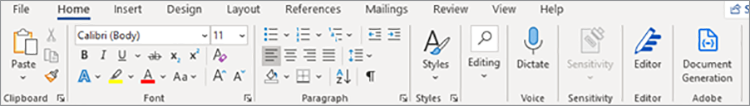

# 创建NDA


组织与外部投稿人协作以构建其服务和产品。 保密协议(NDA)是这些协作活动中的重要组成部分。 它要求所有各方不得泄露任何可能损害任何一方的机密信息。

最广泛使用的NDA格式是PDF文档。 组织准备并发送给所有相关方NDA。 然后，当每个人签名后，他们就会启动合同。 在高速团队中，手动PDF创建会减慢进度。

## 您可以学到的内容

本实际操作教程介绍如何为您的公司创建专门的Microsoft Word NDA模板。 适用于Microsoft Word的Adobe免费插件， [AdobeDocument Generation标记器](https://opensource.adobe.com/pdftools-sdk-docs/docgen/latest/wordaddin.html#add-in-demo)，插入“标记”以输入动态值。 了解如何将JSON数据传递到模板并创建动态PDF。 根据您的业务要求和目标，可以通过电子邮件将生成的PDF发送给协作者，或在其浏览器中向其显示文档。 只需对Node.js、JavaScript、Express.js、HTML和CSS有一些经验即可跟进。

## 相关的API和资源

与 [!DNL Adobe Acrobat Services]，可以使用动态数据动态生成PDF文档。 [!DNL Acrobat Services] 提供了一套PDF工具，包括用于自动化的AdobeDocument Generation API [NDA创建](https://www.adobe.io/apis/documentcloud/dcsdk/nda-creation.html).

* [Document Generation APIAdobe](https://www.adobe.io/apis/documentcloud/dcsdk/doc-generation.html)

* [Adobe Sign API](https://www.adobe.io/apis/documentcloud/sign.html)

* [AdobeDocument Generation标记器](https://opensource.adobe.com/pdftools-sdk-docs/docgen/latest/wordaddin.html#add-in-demo)

* [项目代码](https://github.com/afzaal-ahmad-zeeshan/adobe-docugen-sample)

* [[!DNL Acrobat Services] 键](https://opensource.adobe.com/pdftools-sdk-docs/release/latest/index.html#getcred)

## 创建JSON模型

Microsoft Word模板依赖于JSON模型，因此您首先创建它。 在本教程中，您将使用包含公司详细信息（如联系信息）的基本JSON结构。

```
{
"vendor": {
"companyName": "GlobalCorp",
"street": "123 Any Street",
"street2": "",
"city":"Anywhere",
"state":"CA",
"primaryContact": {
"firstName":"John",
"lastName":"Doe",
"email":"john-doe@example.com",
"phone":"123-456-7890"
}
},
"authorizedSigner": {
"firstName": "Sarah",
"lastName": "Rose",
"email": "sarah@example.com",
"phone":"555-555-1234"
}
}
```

可在Microsoft Word中使用此结构生成模板。 此数据可以来自任何数据源，只要它是JSON格式即可。 为简单起见，可以在Node.js应用程序中创建多个文件，但用例可能需要数据库连接来提取供应商信息。

## 创建Microsoft Word模板

在Microsoft Word文档中创建NDA模板。 Adobe PDF Services API要求Microsoft Word文档包含标签，服务可以从JSON文档注入值。 尽管模板对于所有Adobe请求都是相同的，但JSON中的动态数据会发生变化。 在这种情况下，这些标签有助于使用单个Microsoft WordPDF为各供应商创建模板文档，并通过自动化NDA文档生成来加快流程。

您可以安装 [免费Document Generation Tagger插件](https://opensource.adobe.com/pdftools-sdk-docs/docgen/latest/wordaddin.html#add-in-demo) 到Microsoft Word。 如果您是组织的成员，则可以请求您的Microsoft Office管理员为所有人安装免费插件。

安装了该加载项后，可以在“主页”选项卡中的“Adobe”类别下找到它。 要打开选项卡，请选择 **Document Generation**：



在该选项卡中，您可以上传示例JSON文档。 本文档可以是一个示例，因为您只能将其用于创建Microsoft Word模板。


选择 **生成标签** 查看可在模板中使用的项目。 以下是从JSON结构中提取的属性，可在模板中使用：


这些是来自 `authorizedSigner` 字段。 其他字段将被折叠，您可以在Microsoft Word中展开视图。 该加载项还提供高级数据选项，如表、列表、计算值等。

## 创建标签

随时创建模板或导入 [现有模板](https://www.adobe.io/apis/documentcloud/dcsdk/doc-generation.html#sample-blade) 导入Microsoft Word。 设置文档后，通过单击加载项中的相应标记，将标记添加到每个字段。

Microsoft Word文件中的以下模板：


此文件包含多个标签。 运行程序时，这些字段将填充供应商信息。

Document Generation Tagger与Adobe Sign API集成。 由于这种集成，您可以自动创建Sign文本标记，以便生成的文档可以发送到Adobe Sign以供签名。

## 为供应商生成NDA

在示例应用程序中，您为输入和输出准备了文件夹。 如前所述，您使用JSON文件，以便有两个文件显示系统中的可用供应商。 文件显示在浏览器上打印的表格中：

```
<h1><b>NDA</b>: Generate for vendor.</h1>
<hr />
<p>Following ({{files.length}}) vendors are ready, select to generate NDA and deliver for signature:</p>
<form method="POST">
<ul>
{{#each files }}
<li><input type="checkbox" name="vendor" value="{{this}}" id="file-{{@index}}" /> <label for="file-{{@index}}">{{this}}</label></li>
{{/each}}
</ul>
<input type="submit" value="Create NDA" />
</form>
```

此代码在浏览器中生成以下用户界面(UI)：


当管理员选择某人时，该应用程序将使用Adobe PDF服务随时随地生成NDA。

```
async function compileDocFile(json, inputFile, outputPdf) {
try {
// configurations
const credentials = adobe.Credentials
.serviceAccountCredentialsBuilder()
.fromFile("./src/pdftools-api-credentials.json")
.build();
// Capture the credential from app and show create the context
const executionContext = adobe.ExecutionContext.create(credentials);
// create the operation
const documentMerge = adobe.DocumentMerge,
documentMergeOptions = documentMerge.options,
options = new documentMergeOptions.DocumentMergeOptions(json, documentMergeOptions.OutputFormat.PDF);
const operation = documentMerge.Operation.createNew(options);
// Pass the content as input (stream)
const input = adobe.FileRef.createFromLocalFile(inputFile);
operation.setInput(input);
// Async create the PDF
let result = await operation.execute(executionContext);
await result.saveAsFile(outputPdf);
} catch (err) {
console.log('Exception encountered while executing operation', err);
}
}
```

在Express路由器中使用此代码：

```
// Create one report and send it back
try {
console.log(`[INFO] generating the report...`);
const fileContent = fs.readFileSync(`./public/documents/raw/${vendor}`, 'utf-8');
const parsedObject = JSON.parse(fileContent);
await pdf.compileDocFile(parsedObject, `./public/documents/template/Adobe-NDA-Sample.docx`, `./public/documents/processed/output.pdf`);
console.log(`[INFO] sending the report...`);
res.status(200).render("preview", { page: 'nda', filename: 'output.pdf' });
} catch(error) {
console.log(`[ERROR] ${JSON.stringify(error)}`);
res.status(500).render("crash", { error: error });
}
```

您可以查看 [完整示例代码](https://github.com/afzaal-ahmad-zeeshan/adobe-docugen-sample) 在GitHub上。

此代码在对的API调用中使用JSON文档和Microsoft Word模板 [!DNL Adobe Acrobat Services] SDK。 在响应中，您将收到输出并将其保存到应用程序的文件系统中。 您可以使用免费工具，通过电子邮件将生成的文档转发给客户，或在浏览器中向客户显示预览 [Adobe PDF Embed API](https://www.adobe.io/apis/documentcloud/dcsdk/pdf-embed.html).

此调用将创建以下NDA文档：


[!DNL Adobe Acrobat Services] API插入内容以创建PDF文档。 如果没有这些工具，您可能必须编写代码来处理Office文档并使用原始PDF文件格式。 在Adobe PDF服务的帮助下，您只需调用一个API即可完成所有这些步骤。

现在使用 [ADOBE SIGN API](https://www.adobe.io/apis/documentcloud/sign.html) 以请求签署NDA，并将最终签署的文档发送给所有各方。 Adobe Sign通知您 [使用Webhook](https://www.adobe.io/apis/documentcloud/sign/docs.html#!adobedocs/adobe-sign/master/webhooks.md). 侦听此Webhook，您可以获取NDA的状态。

要更深入地解释Adobe Sign流程， [查阅文档](https://www.adobe.io/apis/documentcloud/sign/docs.html) 或阅读此深入博文。

## 后续步骤

在本实际操作教程中，我们将使用AdobeDocument Generation Tagger通过Microsoft Word模板和JSON数据文件动态生成PDF文档。 此加载项帮助 [自动创建NDA](https://www.adobe.io/apis/documentcloud/dcsdk/nda-creation.html) 针对各方进行自定义，然后使用Sign API收集签名。

您可以使用这些技巧动态创建您自己的NDA或其他文档，从而腾出团队的时间专注于高效工作。 探索 [[!DNL Adobe Acrobat Services]](https://www.adobe.io/apis/documentcloud/dcsdk/pdf-tools.html) 查找适合您选择的语言和运行时的API和SDK，以便您可以将PDF函数直接添加到应用程序中以快速创建PDF文档。 [开始使用](https://www.adobe.io/apis/documentcloud/dcsdk/gettingstarted.html) 免费试用6个月
[即付即用](https://www.adobe.io/apis/documentcloud/dcsdk/pdf-pricing.html) 每个单据交易只需$0.05。
