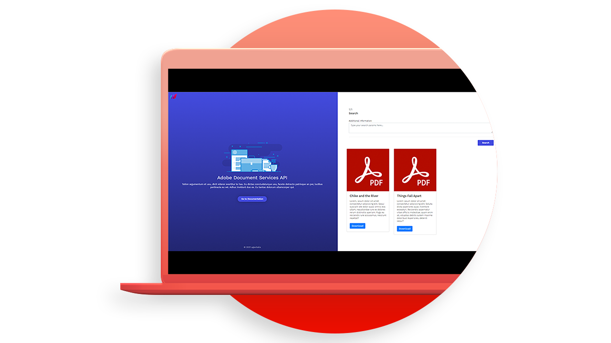

# [!DNL Adobe Acrobat Services] API用例

## [!DNL Adobe Acrobat Services]个API可以为我做什么？

了解[!DNL Adobe Acrobat Services] API如何通过这些实际操作用例改变您的业务。

### [!DNL Acrobat Services]个API

<table style="table-layout:fixed">
<tr>
  <td>
    
    

    <a href="automatelegalworkflows.md"><strong>自动执行法律工作流程</strong></a>
    

    <em>了解如何使用条件内容自动执行法律工作流程</em>
     
  </td>
  <td>
      
      

      <a href="employeeonboarding.md"><strong>更新员工入职培训</strong></a>
      

      <em>了解如何使员工入职培训现代化</em>
       
  </td>
  <td>
      
      

      <a href="acceleratesales.md"><strong>加速销售过程</strong></a>
      

      <em>了解如何通过集成文档体验来加快销售速度</em>
       
    </td>
    <td>
      
      

      <a href="sales.md"><strong>管理销售提案和合同</strong></a>
      

      <em>了解如何构建高效的工作流程以自动化和简化销售提案</em>
       
    </td>
</tr>
<tr>
  <td>
    
    

    <a href="nda.md"><strong>创建NDA</strong></a>
    

    <em>了解如何为协作创建动态NDAPDF</em>
     
  </td>
  <td>
    
    

    <a href="legal.md"><strong>管理法律合同</strong></a>
    

    <em>了解如何使用自定义数据输入自动生成和保护法律文档</em>
     
  </td>
  <td>
    
    

    <a href="offer.md"><strong>管理员工优惠函</strong></a>
    

    <em>了解如何生成可发送给新员工以供其签名的聘用信</em>
     
  </td>
  <td>
    
    

    <a href="searching.md"><strong>搜索和索引</strong></a>
    

    <em>了解如何从扫描文档创建可搜索的PDF文件</em>
     
  </td>
</tr>
<tr>
  <td>
    
    

    <a href="reviews.md"><strong>审阅和批准</strong></a>
    

    <em>了解如何为跨团队协作构建文档审阅和批准工作流程</em>
     
  </td>
  <td>
    
    

    <a href="reportcreation.md"><strong>报表创建和编辑</strong></a>
    

    <em>了解如何在您的网站上为客户生成PDF报告</em>
     
  </td>
  <td>
    
    

    <a href="jobposting.md"><strong>职位发布</strong></a>
    

    <em>了解如何为求职者和雇主开发流畅一致的Web体验</em>
     
  </td>
  <td>
    
    

    <a href="educationcollab.md"><strong>学生 — 教师协作</strong></a>
    

    <em>了解如何创建在线学习平台，让教师和学生能够轻松地在PDF中共享资源</em>
     
  </td>
</tr>
<tr>
  <td>
    
    

    <a href="AgreementWorkflowsNodejs.md"><strong>Node.js中的协议工作流</strong></a>
    

    <em>[!DNL Adobe Acrobat Services] API可轻松地将PDF功能合并到您的Web应用程序中</em>
     
  </td>
  <td>
    
    

    <a href="HRAgreementWorkflowsJava.md"><strong>Java中的HR文档工作流</strong></a>
    

    <em>[!DNL Adobe Acrobat Services] API可轻松地将PDF功能合并到您的HR Web应用程序中</em>
     
  </td>
  <td>
    
    

    <a href="FinanceWorkflowsJava.md"><strong>在Java中管理财务文档工作流</strong></a>
    

    <em>[!DNL Adobe Acrobat Services]提供所有必要的工具、服务和功能，以处理和提取PDF财务文档中的数据</em>
     
  </td>
  <td>
    
    

     
  </td>
</tr>
</table>

### Document Generation API

<table style="table-layout:fixed">
<tr>
  <td>
    
    

    <a href="invoices.md"><strong>处理发票</strong></a>
    

    <em>了解如何自动生成、用密码保护和提供客户发票</em>
     
  </td>
  <td>
    
    

     
  </td>
  <td>
    
    

     
  </td>
  <td>
    
    

     
  </td>
</tr>
</table>

### 嵌入式APIPDF

<table style="table-layout:fixed">
<tr>
   <td>
    
    

    <a href="ddppdfembedapi.md"><strong>数字文档发布</strong></a>
    

    <em>了解如何使用Adobe PDF Embed API在网页内显示嵌入的PDF文档</em>
     
  </td>
  <td>
    
    

     
  </td>
  <td>
    
    

     
  </td>
  <td>
    
    

     
  </td>
</tr>
</table>