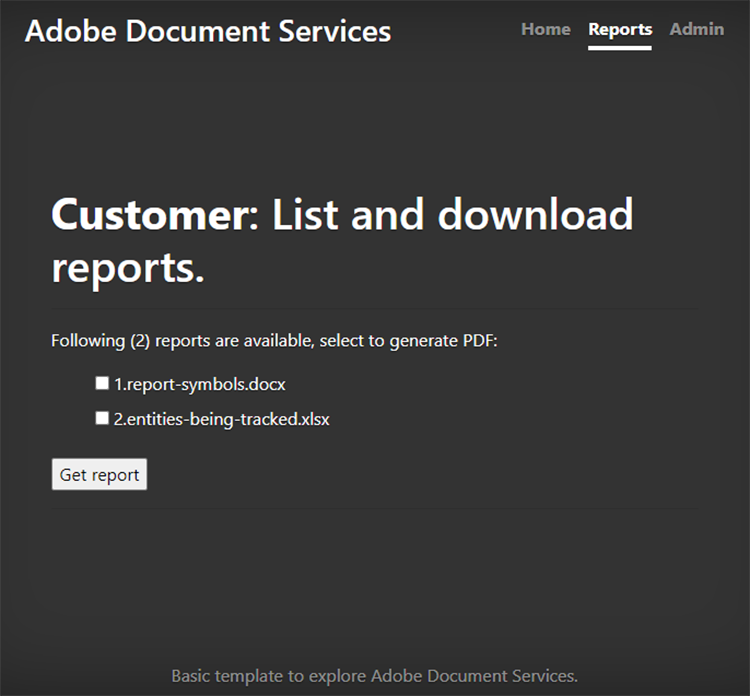

# 创建和编辑报告


金融、教育、营销和其他行业使用PDF与客户和利益相关者共享数据。 使用PDF，可以轻松共享包含表格、图形和交互式内容的丰富文档，并且格式每个人都可以查看。 [!DNL Adobe Acrobat Services]个API可帮助这些公司从Microsoft Word、Microsoft Excel、图形和其他多种文档格式生成可共享的PDF报告。

假设您[运行社交媒体跟踪公司](https://www.adobe.io/apis/documentcloud/dcsdk/on-demand-report-creation.html)。 您的客户登录到您的站点受密码保护的部分，以查看其营销活动分析。 通常，他们想要与他们的执行官、股东、捐赠者或其他利益相关者共享这些数据。 可下载的PDF文档非常适合您的客户分享数字、图表等。

通过将[PDF服务API](https://www.adobe.io/apis/documentcloud/dcsdk/pdf-tools.html)合并到您的网站，您可以随时为每个客户生成PDF报告。 您可以创建PDF，然后将其合并到一个方便客户下载并传递给其利益干系人的报告中。

## 您可以学到的内容

在本实际操作教程中，了解如何在Node.js和Express.js环境(仅包含一些JavaScript、HTML和CSS)中使用PDF服务SDK，快速轻松地向现有网站添加面向PDF的功能。 此网站包含管理员上传报告的页面、客户查看可用报告列表并选择要转换为PDF的文档的区域，以及下载系统生成的PDF的有用端点。

## 相关的API和资源

* [PDF服务API](https://opensource.adobe.com/pdftools-sdk-docs/release/latest/index.html)

* [PDF的嵌入API](https://www.adobe.com/devnet-docs/dcsdk_io/viewSDK/index.html)

## 客户营销活动报告信息板

>[!NOTE]
>
>本教程与Node.js最佳实践或如何保护Web应用程序无关。 网站的某些区域公开供公众使用，并且文档命名可能不便于制作。 要讨论设计此类系统的可能最佳方法，请咨询您的设计师和工程师。

这里，您有一个基本的Express.js Web应用程序，其中包含客户报告区域和管理员区域。 此应用程序可以展示社交媒体活动报告。 例如，它可以演示广告被单击的次数。


您可以从[GitHub存储库](https://github.com/afzaal-ahmad-zeeshan/express-adobe-pdf-tools)下载此项目。

现在，让我们探究如何发布这些报告。

## 正在上传报告

要保持简单，只需在此处使用基于文件系统的上传和处理。 在Express.js中，可以使用fs模块列出目录下的所有可用文件。

在同一页面上，允许管理员将报告文件上传到服务器以供客户查看。 这些文件可以有很多种格式，例如Microsoft Word、Microsoft Excel、HTML和[其他数据格式]https://opensource.adobe.com/pdftools-sdk-docs/release/latest/howtos.html#create-a-pdf)，包括图形文件。 管理员页面如下所示：


>[!NOTE]
>
>密码可保护您的URL，或使用npm的护照包来保护身份验证和授权层后面的应用程序。

当管理员选择并上传文件时，该文件将移至其他人可以访问它的公共存储库。 使用同一存储库从管理页面发布文档并列出客户的可用营销报告。 此代码为：

```
router.get('/', (req, res) => {
try {
let files = fs.readdirSync('./public/documents/raw') // read the files
res.status(200).render("reports", { page: 'reports', files: files });
} catch (error) {
res.status(500).render("crash", { error: error });
}
});
```

此代码列出所有文件并呈现文件列表视图。

## 选择报告

在用户端，您有一个表单，可供客户选择他们要包含在社交媒体营销活动报告中的文档。 为简单起见，在您的示例页面上，只显示文档名称和用于选择文档的复选框。 客户可以选择单个报告或在单个PDF文档中合并多个报告。

要获取更高级的用户界面，您还可以在此处显示报告预览。



## 生成PDF报告

使用PDF服务SDK根据您的数据输入创建PDF报告。 数据（如上面的屏幕快照所示）可能来自各种数据格式，例如Microsoft Word、Microsoft Excel、HTML、图形等。 首先为PDF服务SDK安装npm包。

```
$ npm install --save @adobe/documentservices-pdftools-node-sdk
```

在开始之前，您必须具有API凭据，[免费Adobe](https://opensource.adobe.com/pdftools-sdk-docs/release/latest/index.html#getcred)。 使用您的[!DNL Acrobat Services]帐户[可免费使用六个月，然后即可即付即用](https://www.adobe.io/apis/documentcloud/dcsdk/pdf-pricing.html)，每笔文档交易仅需\$0.05。

下载存档文件并解压缩JSON文件以获取凭据和私钥。 在示例项目中，将该文件放在src目录中。


现在，您已经设置了凭据，接下来就可以编写PDF转换任务。 在本演示中，您必须对应用程序执行两项操作：

* 将原始文档转换为PDF文件

* 在单个报表中合并多个PDF文件

运行任何操作的整体过程都类似。 唯一的区别在于你使用的服务。 在下面的代码中，将原始PDF转换为文档文件：

```
async function createPdf(rawFile, outputPdf) {
try {
// configurations
const credentials = adobe.Credentials
.serviceAccountCredentialsBuilder()
.fromFile("./src/pdftools-api-credentials.json")
.build();
// Capture the credential from app and show create the context
const executionContext = adobe.ExecutionContext.create(credentials),
operation = adobe.CreatePDF.Operation.createNew();
// Pass the content as input (stream)
const input = adobe.FileRef.createFromLocalFile(rawFile);
operation.setInput(input);
// Async create the PDF
let result = await operation.execute(executionContext);
await result.saveAsFile(outputPdf);
} catch (err) {
console.log('Exception encountered while executing operation', err);
}
}
```

在上面的代码中，您将阅读凭据并创建执行上下文。 PDF服务SDK要求执行上下文对您的请求进行身份验证。

然后，您可以运行创建PDF操作，将原始文档转换为PDF格式。 最后，使用`outputPdf`参数复制PDF报表。 在代码示例中，您可以在src/helpers/pdf.js文件下找到此代码。 在本教程的后面部分，您将导入PDF模块并调用此方法。

如上一节所示，您的客户可以转到下一页以选择要转换为PDF的报告：


当客户选择其中一个或多个报告时，即会创建PDF文件。

首先，我们来看看单个PDF文件的实际效果。 当用户选择单个报告时，您只需将其转换为PDF并提供下载链接。

```
try {
console.log(`[INFO] generating the report...`);
await pdf.createPdf(`./public/documents/raw/${reports}`, `./public/documents/processed/output.pdf`);
console.log(`[INFO] sending the report...`);
res.status(200).render("download", { page: 'reports', filename: 'output.pdf' });
} catch(error) {
console.log(`[ERROR] ${JSON.stringify(error)}`);
res.status(500).render("crash", { error: error });
}
```

此代码会创建一个报告并与客户共享下载URL。 以下是输出网页：


以下是输出PDF：


客户可以选择多个文件以生成合并报告。 当客户选择多个文档时，您可以执行两项操作：第一项操作为每个文档创建一个部分PDF，第二项操作将文档合并为单个PDF报表。

```
async function combinePdf(pdfs, outputPdf) {
try {
// configurations
const credentials = adobe.Credentials
.serviceAccountCredentialsBuilder()
.fromFile("./src/pdftools-api-credentials.json")
.build();
// Capture the credential from app and show create the context
const executionContext = adobe.ExecutionContext.create(credentials),
operation = adobe.CombineFiles.Operation.createNew();
// Pass the PDF content as input (stream)
for (let pdf of pdfs) {
const source = adobe.FileRef.createFromLocalFile(pdf);
operation.addInput(source);
}
// Async create the PDF
let result = await operation.execute(executionContext);
await result.saveAsFile(outputPdf);
} catch (err) {
console.log('Exception encountered while executing operation', err);
}
}
```

此方法位于src/helpers/pdf.js文件下，并在模块导出过程中显示。

```
try {
console.log(`[INFO] creating a batch report...`);
// Create a batch report and send it back
let partials = [];
for (let index in reports) {
const name = `partial-${index}-${reports[index]}`;
await pdf.createPdf(`./public/documents/raw/${reports[index]}`, `./public/documents/processed/${name}`);
partials.push(`./public/documents/processed/${name.replace('docx', 'pdf').replace('xlsx', 'pdf')}`);
}
await pdf.combinePdf(partials, `./public/documents/processed/output.pdf`);
console.log(`[INFO] sending the combined report...`);
res.status(200).render("download", { page: 'reports', filename: 'output.pdf' });
} catch(error) {
console.log(`[ERROR] ${JSON.stringify(error)}`);
res.status(500).render("crash", { error: error });
}
```

此代码为多个输入文档生成已编译的报告。 唯一添加的函数是`combinePdf`方法，该方法采用PDF文件路径名列表并返回单个输出PDF。

现在，您的社交媒体信息板客户可以从其帐户选择相关报告，并将其作为一个便捷PDF下载。 此信息板允许他们以普遍易于打开的格式显示管理层和其他利益相关者通过数据、表格和图表展示其活动的成功。

## 后续步骤

本实际操作教程逐步介绍了如何使用PDF服务API帮助客户将相关报告下载为易于共享的PDF。 您创建了一个Node.js应用程序，以展示PDF服务API对PDF报告和阅读服务的强大功能。 该应用程序演示了您的客户如何下载单个报告PDF或将多个文档合并为单个文档报告。

此Adobe支持的应用程序可帮助您的[社交媒体仪表板客户](https://www.adobe.io/apis/documentcloud/dcsdk/on-demand-report-creation.html)获取和共享他们所需的报告，而无需担心收件人的设备上是否都安装了Microsoft Office或其他软件。 您可以在自己的应用程序中使用相同的技巧来帮助用户查看、合并和下载文档。 或者，查看Adobe的许多其他API，以添加和跟踪签名等。

若要开始，请申请您的免费[[!DNL Adobe Acrobat Services]](https://www.adobe.io/apis/documentcloud/dcsdk/gettingstarted.html)帐户，然后为您的员工和客户创建引人入胜的报告体验。 在您的营销活动扩展过程中，免费使用您的帐户6个月，然后[即付即用](https://www.adobe.io/apis/documentcloud/dcsdk/pdf-pricing.html)，每次文档交易仅需\ 0.05美元。
