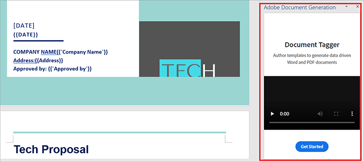
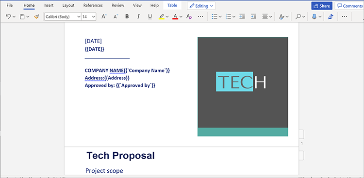

# 管理销售提案和合同


销售提案是企业争取客户的第一步。 就跟所有事物一样，第一印象是最后的。 因此，您与客户的第一次互动设定了他们对您的业务的期望。 建议书必须简洁、准确、方便。

合同和建议书的文件结构中包含不同类型的数据。 它们同时包含动态数据（客户名称、报价金额等）和静态数据（样板文本，例如公司功能、团队配置文件和标准SOW条款）。 创建模板文档（如销售提案）通常涉及单调的任务，如在样板模板中手动替换项目详细信息。 在本教程中，您将使用动态数据和工作流程为以下各项构建高效的流程： [创建销售方案](https://www.adobe.io/apis/documentcloud/dcsdk/sales-proposals-and-contracts.html).

## 您可以学到的内容

在本实际操作教程中，了解如何使用多种工具实现动态数据和工作流程，其中最重要的是 [!DNL Adobe Acrobat Services] API。 这些API用于为您和您的企业提供更方便的销售提案和合同。 本教程演示了如何自动创建、合并和显示PDF文档的实用技巧。 手动执行这些任务既费时又费力。 利用 [!DNL Acrobat Services] API，您可以缩短用于这些任务的时间。

## 相关的API和资源

* [Microsoft Word](https://www.office.com/)

* [Node.js](https://nodejs.org/en/)

* [npm](https://www.npmjs.com/get-npm)

* [[!DNL Acrobat Services] API](https://www.adobe.io/apis/documentcloud/dcsdk/)

* [Document Generation APIAdobe](https://www.adobe.io/apis/documentcloud/dcsdk/doc-generation.html)

* [Adobe Sign API](https://www.adobe.io/apis/documentcloud/sign.html)

* [AdobeDocument Generation标记器](https://opensource.adobe.com/pdftools-sdk-docs/docgen/latest/wordaddin.html#add-in-demo)

## 解决问题

安装好工具后，您就可以开始解决问题了。 这些建议具有每个客户端特有的静态内容和动态内容。 出现瓶颈的原因是，每次提出建议书时都需要这两种类型的数据。 输入静态文本非常耗时，因此您要将其自动化，并且只能手动处理来自每个客户端的动态数据。

首先，在中创建数据捕获表单 [Microsoft Forms](https://www.office.com/launch/forms?auth=1) （或您首选的表单生成器）。 此表单用于来自添加到销售提案中的客户机的动态数据。 填写此表单并提出问题，从客户那里获取所需的详细信息 — 例如，公司名称、日期、地址、项目范围、定价以及其他评论。 要构建您自己的框架，请使用此 [窗体](https://forms.office.com/Pages/ShareFormPage.aspx id=DQSIkWdsW0yxEjajBLZtrQAAAAAAAN__rtiGj5UNElTR0pCQ09ZNkJRUlowSjVQWDNYUEg2RC4u&amp;sharetoken=1AJeMavBAzzzxuISRKmUy)。 目标是让潜在客户填写表单，然后将他们的响应导出为JSON文件，这些文件将传递到您工作流程的下一个部分。

某些表单构建者仅允许您将数据导出为CSV文件。 所以，你可能会发现 [转化](http://csvjson.com/csv2json) 将生成的CSV文件转化为JSON文件。

每个销售计划书都会重复使用静态数据。 因此，您可以使用Microsoft Word中的销售提案模板来提供静态文本。 您可以使用此 [模板](https://1drv.ms/w/s!AiqaN2pp7giKkmhVu2_2pId9MiPa?e=oeqoQ2)，但您可以创建自己的云文档，或使用 [Adobe模板](https://www.adobe.io/apis/documentcloud/dcsdk/doc-generation.html).

现在，您需要一些功能来同时获取客户的JSON格式动态数据和Microsoft Word模板中的静态文本，以便为客户制作独一无二的销售提案。 该 [!DNL Acrobat Services] API用于合并两者，并生成可签名的PDF。

为此，可以使用标签。 标签是易于使用的字符串，可以表示数字、单词、数组，甚至是复杂对象。 标记充当动态数据的占位符，在本例中，动态数据是在表单中输入的客户端数据。 将标签插入模板后，您可以将表单字段从JSON文件映射到Word模板。

## 使用标记

打开您的销售方案模板，然后选择 **插入** 选项卡。 在 **加载项** 组，选择 **获取加载项**. 然后，选择 **AdobeDocument Generation加载项** 添加它。 添加后，您会在 **主页** 选项卡 **Adobe** 组。

在 **主页** 选项卡 **Adobe** 组，选择 **Document Generation** 以开始为文档添加标签。 在窗口右侧的面板中会显示一个有用的演示视频。



选择 **开始使用**. 然后要求您提供示例数据。 粘贴或上传表单响应JSON文件，如下所示。


选择 **生成标签** 以从您粘贴或上传的JSON文件中获取字段列表。 右侧边栏上的标签如下所示。


生成标签后，您可以将其插入到文档中。 标签将添加到文档中的光标位置。 如上所示，您应添加 **项目范围** 标记位于右下方 **项目范围** 副标题。 这样，当客户在表单中输入项目的范围时，他们的响应将低于 **项目范围** 副标题，替换刚刚添加的标签。 添加完标签后，您文档的一部分应该如下面的屏幕截图所示。



## 使用API

转至 [!DNL Acrobat Services] API [主页](https://www.adobe.io/apis/documentcloud/dcsdk/doc-generation.html). 要开始使用 [!DNL Acrobat Services] API，您需要应用程序的凭据。 一直向下滚动并选择 **开始免费试用** 以创建凭据。 您可以使用这些服务 [免费试用6个月，然后按需付费](https://www.adobe.io/apis/documentcloud/dcsdk/pdf-pricing.html) 每次文档交易只需支付0.05 USD，因此您只需支付所需的费用。

选择 **PDF服务API** ，并填写如下所示的其他详细信息。


创建凭据后，将获得一些代码示例。 选择首选语言（本教程使用Node.js）。 您的API凭据位于zip文件中。 将文件提取到PDFToolsSDK-Node.jsSamples。

首先，创建一个名为auto-doc\*\*的空文件夹。\*\*在该文件夹中，运行以下命令以初始化Node.js项目： `npm init`. 将项目命名为“auto-doc”*.*

在文件夹中。/PDFToolsSDK-Node.jsSamples/adobe-dc-pdf-tools-sdk-node-samples，有一个名为pdftools-api-credentials.json的文件。 将其和private.key移至自动文档文件夹。 它包含您的API凭据。 此外，在自动文档文件夹中，创建一个名为“resources”的子文件夹。 每当生成销售建议时，它都会保留从客户端收到的JSON格式数据。 在同一文件夹中，保存来自Microsoft Word的销售提案模板。

现在，您可以开始创造魔法了！ 由于在本教程中使用了Node.js，因此必须安装Node.js [!DNL Acrobat Services] SDK。 为此，请在auto-doc文件夹中，运行yarn add @adobe/documentservices-pdftools-node-sdk。

现在创建一个名为merge.js的文件，并将以下代码粘贴到该文件中。

```
javascript
const PDFToolsSdk = require('@adobe/documentservices-pdftools-node-sdk'),
fs = require('fs');
try {
// Initial setup, create credentials instance.
const credentials = PDFToolsSdk.Credentials
.serviceAccountCredentialsBuilder()
.fromFile("pdftools-api-credentials.json")
.build();
// Setup input data for the document merge process
const jsonString = fs.readFileSync('resources/Proposal.json'),
jsonDataForMerge = JSON.parse(jsonString);
// Create an ExecutionContext using credentials
const executionContext = PDFToolsSdk.ExecutionContext.create(credentials);
// Create a new DocumentMerge options instance
const documentMerge = PDFToolsSdk.DocumentMerge,
documentMergeOptions = documentMerge.options,
options = new documentMergeOptions.DocumentMergeOptions(jsonDataForMerge, documentMergeOptions.OutputFormat.PDF);
// Create a new operation instance using the options instance
const documentMergeOperation = documentMerge.Operation.createNew(options)
// Set operation input document template from a source file.
const input = PDFToolsSdk.FileRef.createFromLocalFile('resources/Proposal.docx');
documentMergeOperation.setInput(input);
// Execute the operation and Save the result to the specified location.
documentMergeOperation.execute(executionContext)
.then(result => result.saveAsFile('output/Proposal.pdf'))
.catch(err => {
if (err instanceof PDFToolsSdk.Error.ServiceApiError
|| err instanceof PDFToolsSdk.Error.ServiceUsageError) {
console.log('Exception encountered while executing operation', err);
} else {
console.log('Exception encountered while executing operation', err);
}
});
} catch (err) {
console.log('Exception encountered while executing operation', err);
}
```

此代码借助您使用以下工具创建的标签，从Microsoft表单获取您的JSON文件 [!DNL Acrobat Services]. 然后，它会将数据与您在Microsoft Word中创建的销售提案模板合并，以生成一个全新的PDF。 PDF将保存在新创建的中。/output文件夹。

此外，代码还使用 [ADOBE SIGN API](https://www.adobe.io/apis/documentcloud/sign.html) 让两家公司签署生成的销售提案。 有关此API的详细说明，请参阅此博客文章。

## 后续步骤

一开始您有一个需要自动化的低效、繁琐的流程。 您从为每个客户端手动创建文档到创建简化的自动化工作流程 [销售计划书流程](https://www.adobe.io/apis/documentcloud/dcsdk/sales-proposals-and-contracts.html).

使用Microsoft Forms，您可以从客户那里获得关键数据，这些数据将纳入客户独特的建议中。 您已在Microsoft Word中创建了一个销售提案模板，用于提供您每次都不想重新创建的静态文本。 然后您使用 [!DNL Acrobat Services] API ，用于合并表单和模板中的数据，从而以更高效的方式为您的客户创建销售提案PDF。

本实际操作教程只是对这些API可行性的一个大概了解。 要发现更多解决方案，请访问 [[!DNL Adobe Acrobat Services]](https://www.adobe.io/apis/documentcloud/dcsdk/gettingstarted.html) API页面。 所有这些工具均可免费使用6个月。 然后，对于以下协议，只需为每笔单据交易支付$0.05 [即付即用](https://www.adobe.io/apis/documentcloud/dcsdk/pdf-pricing.html) 计划，因此您只需在团队为您的销售渠道添加更多潜在客户时付费。
