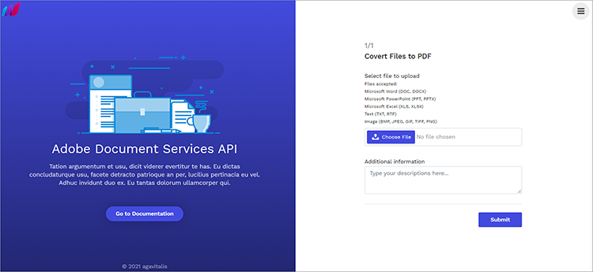
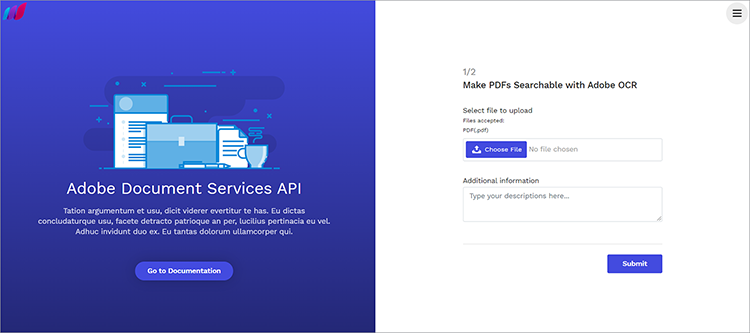

# 搜索和索引


企业必须经常将其硬拷贝文档和扫描文件数字化。 考虑此[方案](https://docs.google.com/document/d/11jZdVQAw-3fyE3Y-sIqFFTlZ4m02LsCC/edit)。 一家律师事务所有数千份法律合同，他们扫描这些合同是为了创建数字文件。 他们想确定这些法律合同中是否有任何合同有特定的条款或补充条款，是否必须加以修订。 出于合规性目的，准确性是必需的。 解决方案是清点数字文档，使文本可搜索，并创建索引以查找此信息。

对于大多数公司来说，创建数字归档文件以检索信息以进行编辑或下游操作是一个噩梦。

## 您可以学到的内容

此实际操作教程探索了如何利用[!DNL Adobe Acrobat Services] API的功能轻松存档和数字化文档。 您可以通过构建Express NodeJS应用程序，然后集成[!DNL Acrobat Services]个API以进行归档、数字化和文档转换来探索这些功能。

若要跟进，您需要安装[Node.js](https://nodejs.org/)，并且对Node.js和[ES6语法](https://www.w3schools.com/js/js_es6.asp)有基本了解。

## 相关的API和资源

* [PDF服务API](https://opensource.adobe.com/pdftools-sdk-docs/release/latest/index.html)

* [项目代码](https://github.com/agavitalis/AdobeDocumentServicesAPIs.git)

## 项目设置

首先，设置应用程序的文件夹结构。 您可以在[此处](https://github.com/agavitalis/AdobeDocumentAPI.git)检索源代码。

## 目录结构

创建一个名为AdobeDocumentServicesAPIs的文件夹，然后在您选择的编辑器中打开它。 使用以下文件夹结构创建具有`npm init`命令的基本NodeJS应用程序：

```
AdobeDocumentServicesAPIs
config
default.json
controllers
createPDFController.js
makeOCRController.js
searchController.js
models
document.js
output
.gitkeep
routes
web.js
services
upload.js
views
index.hbs
ocr.hbs
search.hbs
index.js
```

您正在使用MongoDB作为此应用程序的数据库。 因此，要进行配置，请将默认数据库配置放置在config/文件夹中，方法是：将下面的代码片段粘贴到该文件夹的default.json文件中，然后添加数据库的URL。

```
### config/default.json and config/dev.json
{ "DBHost": "YOUR_DB_URI" }
```

## 包安装

现在，使用npm install命令安装一些程序包，如下面的代码片段所示：

```
{
    "name": "adobedocumentservicesapis",
    "version": "1.0.0",
    "description": "",
    "main": "index.js",
    "directories": {
    "test": "test"
    },
    "dependencies": {
    "body-parser": "^1.19.0",
    "config": "^3.3.6",
    "express": "^4.17.1",
    "hbs": "^4.1.1",
    "mongoose": "^5.12.1",
    "morgan": "^1.10.0",
    "multer": "^1.4.2",
    "path": "^0.12.7"
    },
    "devDependencies": {},
    "scripts": {
    "start": "set NODE_ENV=dev && node index.js"
    },
    "repository": {
    "type": "git",
    "url": "git+https://github.com/agavitalis/AdobeDocumentServicesAPIs.git"
    },
    "author": "Ogbonna Vitalis",
    "license": "ISC",
    "bugs": {
    "url": "https://github.com/agavitalis/AdobeDocumentServicesAPIs/issues"
    },
    "homepage": "https://github.com/agavitalis/AdobeDocumentServicesAPIs#readme"
}
```

```
###bash
npm install express mongoose config body-parser morgan multer hbs path pdf-parse
Ensure that the content of your package.json file is similar to this code snippet:
###package.json
{
```

这些代码片段会安装应用程序依赖项，包括视图的手柄模板引擎。 在scripts标记中，可以配置应用程序的运行时参数。

## 正在集成[!DNL Acrobat Services] API

[!DNL Acrobat Services]包括三个API：

* Adobe PDF Services API

* Adobe PDF Embed API

* Document Generation APIAdobe

这些API通过一组基于云的Web服务自动生成、操作和转换PDF内容。

要获取凭据，您需要[注册](https://www.adobe.com/go/dcsdks_credentials?ref=getStartedWithServicesSDK)并完成工作流。 PDFEmbed API可免费使用。 PDF服务API和Document Generation API免费提供六个月。 试用结束后，您可以[即用即付](https://www.adobe.io/apis/documentcloud/dcsdk/pdf-pricing.html)，每个文档交易只需$0.05。 您只需随着公司发展和处理更多合同付费。


完成注册后，代码示例将下载到包含您的API凭据的电脑。 提取此代码示例，并将private.key和pdftools-api-credentials.json文件放在应用程序的根目录中。

现在，通过使用应用程序根目录中的终端运行` npm install --save @adobe/documentservices-pdftools-node-sdk `命令来安装[PDF服务Node.js SDK](https://www.npmjs.com/package/@adobe/documentservices-pdftools-node-sdk)。

## 创建PDF

[!DNL Acrobat Services]支持从Microsoft OfficePDF（Word、Excel和PowerPoint）和其他[支持的文件格式](https://opensource.adobe.com/pdftools-sdk-docs/release/latest/howtos.html#create-a-pdf)(如.txt、.rtf、.bmp、.jpg、.gif、.tiff和.png)创建文档。

要从支持的文件格式创建PDF文档，请使用此表单上传文档。 您可以在[GitHub](https://github.com/agavitalis/AdobeDocumentServicesAPIs.git)上访问表单的HTML和CSS文件。



现在，将以下代码片段添加到controllers/createPDFController.js文件。 此代码检索文档并将其转换为PDF。

原始文件和转换后的文件保存在应用程序内的文件夹中。

```
const PDFToolsSdk = require('@adobe/documentservices-pdftools-node-sdk');
/*
* GET / route to show the createPDF form.
*/
function createPDF(req, res) {
//catch any response on the url
let response = req.query.response
res.render('index', { response })
}
/*
* POST /createPDF to create a new PDF File.
*/
function createPDFPost(req, res) {
let filePath = req.file.path;
let fileName = req.file.filename;
try {
// Initial setup, create credentials instance.
const credentials = PDFToolsSdk.Credentials
.serviceAccountCredentialsBuilder()
.fromFile("pdftools-api-credentials.json")
.build();
// Create an ExecutionContext using credentials and create a new operation
instance.
const executionContext = PDFToolsSdk.ExecutionContext.create(credentials),
createPdfOperation = PDFToolsSdk.CreatePDF.Operation.createNew();
// Set operation input from a source file.
const input = PDFToolsSdk.FileRef.createFromLocalFile(filePath);
createPdfOperation.setInput(input);
// Execute the operation and Save the result to the specified location.
createPdfOperation.execute(executionContext)
.then((result) => {
result.saveAsFile('output/createPDFFromDOCX.pdf')
//download the file
res.redirect('/?response=PDF Successfully created')
})
.catch(err => {
if (err instanceof PDFToolsSdk.Error.ServiceApiError
|| err instanceof PDFToolsSdk.Error.ServiceUsageError) {
console.log('Exception encountered while executing operation',
err);
} else {
console.log('Exception encountered while executing operation',
err);
}
});
} catch (err) {
console.log('Exception encountered while executing operation', err);
}
}
//export all the functions
module.exports = { createPDF, createPDFPost };
```

此代码片段需要[PDF服务Node.js SDK](https://www.npmjs.com/package/@adobe/documentservices-pdftools-node-sdk)。 使用函数：

* createPDF，显示上传文档表单

* createPDFPost ，用于将上传的文档转换为PDF

转换后的PDF文档保存在输出目录中，而原始文件保存在上载目录中。

## 使用文本识别

光学字符识别(OCR)将图像和扫描的文档转换为可搜索的文件。 您可以将[!DNL Acrobat Services]个API、图像和扫描文档转换为可搜索的PDF。 在执行OCR操作后，文件变为可编辑并可搜索。 您可以将文件的内容存储在数据存储中，以便索引和其他用途。

回想一下，对于许多文件管理和信息处理至关重要的公司来说，搜索和索引扫描文档非常重要。 OCR功能消除了这些难题。

要实施此功能，必须设计类似于上述上载表单的上传表单。 这一次，您可将表单限制为PDF文件，因为您只能对PDF文档使用OCR功能。

以下是该示例的上传表单：



现在，要处理上传的PDF并执行一些OCR操作，请将下面的代码片段添加到controllers/makeOCRController.js文件。 此代码在上传的文件上执行OCR过程，然后将文件保存到应用程序的文件系统中。

```
const fs = require('fs')
const pdf = require('pdf-parse');
const mongoose = require('mongoose');
const Document = require('../models/document');
const PDFToolsSdk = require('@adobe/documentservices-pdftools-node-sdk');
/*
* GET /makeOCR route to show the makeOCR form.
*/
function makeOCR(req, res) {
//catch any response on the url
let response = req.query.response
res.render('ocr', { response })
}
/*
* POST /makeOCRPost to create a new PDF File.
*/
function makeOCRPost(req, res) {
let filePath = req.file.path;
let fileName = req.file.filename;
try {
// Initial setup, create credentials instance.
const credentials = PDFToolsSdk.Credentials
.serviceAccountCredentialsBuilder()
.fromFile("pdftools-api-credentials.json")
.build();
// Create an ExecutionContext using credentials and create a new operation
instance.
const executionContext = PDFToolsSdk.ExecutionContext.create(credentials),
ocrOperation = PDFToolsSdk.OCR.Operation.createNew();
// Set operation input from a source file.
const input = PDFToolsSdk.FileRef.createFromLocalFile(filePath);
ocrOperation.setInput(input);
// Execute the operation and Save the result to the specified location.
ocrOperation.execute(executionContext)
.then(async (result) => {
let newFileName = `createPDFFromDOCX-${Math.random() * 171}.pdf`;
await result.saveAsFile(`output/${newFileName}`);
let documentContent = fs.readFileSync(
require("path").resolve("./") + `\\output\\${newFileName}`
);
pdf(documentContent)
.then(function (data) {
//Creates a new document
var newDocument = new Document({
documentName: fileName,
documentDescription: description,
documentContent: data.text,
url: require("path").resolve("./") + `\\output\\${newFileName}`
});
//Save it into the DB.
newDocument.save((err, docs) => {
if (err) {
res.send(err);
} else {
//If no errors, send it back to the client
res.redirect(
"/makeOCR?response=OCR Operation Successfully performed on
the PDF File"
);
}
});
})
.catch(function (error) {
// handle exceptions
console.log(error);
});
})
.catch(err => {
if (err instanceof PDFToolsSdk.Error.ServiceApiError
|| err instanceof PDFToolsSdk.Error.ServiceUsageError) {
console.log('Exception encountered while executing operation',
err);
} else {
console.log('Exception encountered while executing operation',
err);
}
});
} catch (err) {
console.log('Exception encountered while executing operation', err);
}
}
//export all the functions
module.exports = { makeOCR, makeOCRPost };
```

您需要[!DNL Acrobat Services]节点SDK以及mongoose、pdf-parse和fs模块和文档模型架构。 要将转换文件的内容保存到MongoDB数据库，这些模块是必需的。

现在创建两个功能：makeOCR以显示上传的表单，然后创建makeOCRPost来处理上传的文档。 将原始表单保存到数据库，然后将转换后的表单保存到应用程序的输出文件夹中。

在转换文件之前，将在每种情况下加载pdftools-api-credentials.json文件中Adobe提供的凭据。

>[!NOTE]
>
>OCR功能仅支持PDF文档。

此外，将下面的代码片段添加到应用程序的Modes/Document.js文件。

在代码片段中，定义一个单选模型，然后描述要存储在数据库中的文档属性。 此外，还可以为documentContent字段编制索引，以便轻松高效地搜索文本。

```
const mongoose = require("mongoose");
const Schema = mongoose.Schema;
//Document schema definition
var DocumentSchema = new Schema(
{
documentName: { type: String, required: false },
documentDescription: { type: String, required: false },
documentContent: { type: String, required: false },
url: { type: String, required: false },
status: {
type: String,
enum : ["active","inactive"],
default: "active"
}
},
{ timestamps: true }
);
//for text search
DocumentSchema.index({
documentContent: "text",
});
//Exports the DocumentSchema for use elsewhere.
module.exports = mongoose.model("document", DocumentSchema);
```

## 搜索文本

现在，您可以实现简单的搜索功能，以使用户能够执行一些简单的文本搜索。 您还可以添加下载功能，以便下载PDF文件。

此功能需要一个简单的表单和卡片来显示搜索结果。 您可以在[GitHub](https://github.com/agavitalis/AdobeDocumentServicesAPIs.git)上找到表单和卡片的设计。

下面的屏幕截图说明了搜索功能和搜索结果。 您可以下载任何搜索结果。


要实现搜索功能，请在应用程序的controller文件夹中创建searchController.js文件并粘贴以下代码片段：

```
const fs = require('fs')
const mongoose = require('mongoose');
const Document = require('../models/document');
/*
* GET / route to show the search form.
*/
function search(req, res) {
//catch any response on the url
let response = req.query.response
res.render('search', { response })
}
/*
* POST /searchPost to search the contents of your saved file.
*/
function searchPost(req, res) {
let searchString = req.body.searchString;
Document.aggregate([
{ $match: { $text: { $search: searchString } } },
{ $sort: { score: { $meta: "textScore" } } },
])
.then(function (documents) {
res.render('search', { documents })
})
.catch(function (error) {
let response = error
res.render('search', { response })
});
}
//export all the functions
module.exports = { search, searchPost, downloadPDF };
```

现在实施下载功能，以便能够下载用户搜索返回的文档。

## 正在下载文档

实现下载功能类似于您已经完成的操作。 在controllers/earchController.js文件中的searchPost函数后添加以下代码片段：

```
/*
* POST /downloadPDF To Download PDF Documents.
*/
async function downloadPDF(req, res) {
console.log("here")
let documentId = req.params.documentId
let document = await Document.findOne({_id:documentId});
res.download(download.link);
}
```

## 后续步骤

在本实际操作教程中，您将[!DNL Acrobat Services]个API集成到Node.js应用程序中，并且还使用该API实现了将文件转换为PDF的文档转换。 您添加了一个OCR功能，使图片和扫描文件可搜索。 然后，您已将文件保存到文件夹，以便可以下载它们。

接下来，您添加了一个搜索功能，用于搜索通过OCR转换为文本的文档。 最后，您实现了下载功能，可以轻松下载这些文件。 借助您完成的申请，法律公司可以更轻松地查找和处理特定文本。

强烈建议使用[!DNL Acrobat Services]进行文档转换，因为与其他服务相比，它稳健且易于使用。 您可以快速创建一个帐户，以开始使用[!DNL Acrobat Services] API的功能，进行文档转换和管理。

现在，您已深入了解如何使用[!DNL Acrobat Services] API，您可以通过练习来进一步提升技能。 您可以克隆本教程中使用的存储库，并尝试您刚刚学到的一些技能。 更棒的是，您可以尝试在探索[!DNL Acrobat Services] API的无限可能性的同时重建此应用程序。

准备好在自己的应用程序中启用文档共享和审阅了吗？ 注册您的[[!DNL Adobe Acrobat Services]](https://www.adobe.io/apis/documentcloud/dcsdk/gettingstarted.html)
开发人员帐户。 享受6个月的免费试用，然后随着您的业务增长，[即用即付](https://www.adobe.io/apis/documentcloud/dcsdk/pdf-pricing.html)只需\0.05 USD即可完成每个文档交易。
